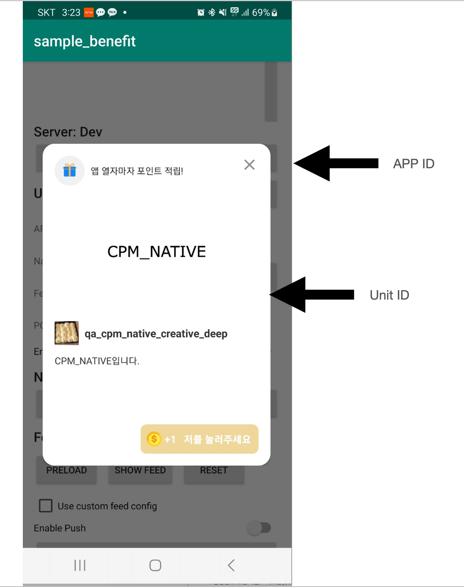
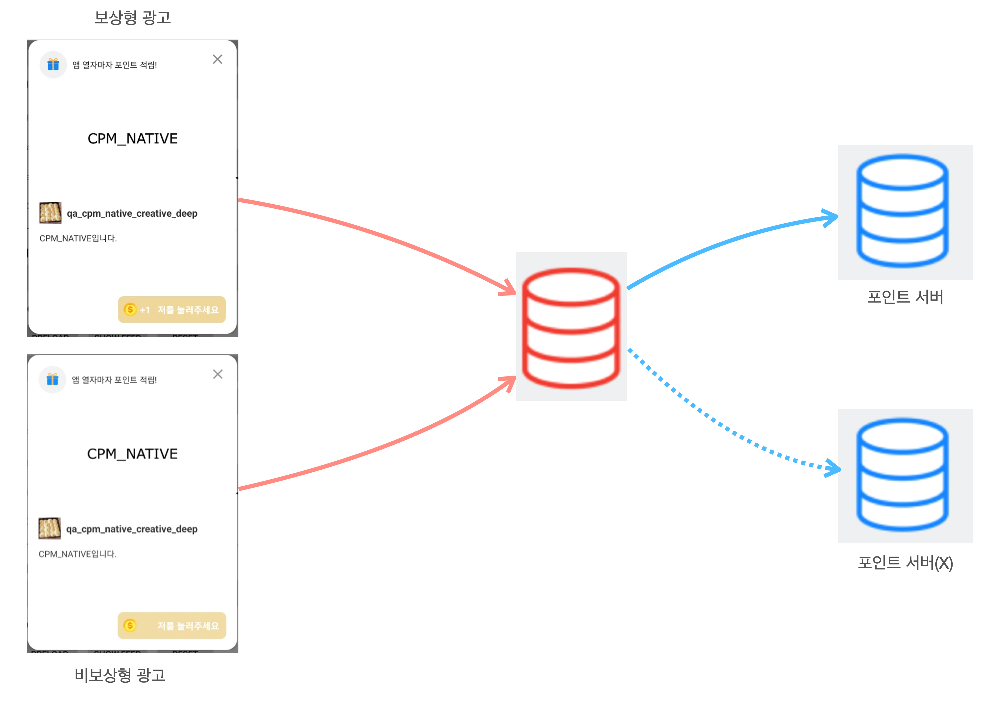

## 시작하기

### 기본요건
- Android 4.1 Jellybean (API 레벨 16) 이상
- Android Studio 3.2 이상
- Gradle 4.0.1 이상
- compileSdkVersion 31 이상
- AndroidX
- JDK 1.11

### 준비사항


Planet AD Android SDK를 연동하기 위해서 아래 사항을 준비해야 합니다.

|ID|설명|비고|
|-|-|-|
App ID|앱별 고유 식별자|발급이 필요한 경우는 Planet AD 담당자에게 문의 바랍니다.
Unit ID|광고 지면별 고유 식별자||

### 포인트 적립 서버 연동




SKP 광고는 참여 시 포인트를 지급하는 보상형 광고와 지급하지 않는 비보상형 광고가 있습니다.<br>
사용자가 보상형 광고에 참여하면 포인트 적립 요청을 처리할 수 있는 서버가 필요할 수 있습니다. 연동하는 방식에 따라 차이가 있으니, 아래 표를 확인하여 진행하시기 바랍니다.


|광고 포인트 지급 여부|자체 포인트 시스템 여부|설명|
|-|-|-|
지급하지 않음|-|비보상형 광고로 연동합니다. 서버 간 연동은 불필요합니다.
지급을 원함|없음|네이버페이 포인트 등 제3의 포인트 시스템을 이용하여 포인트를 부여할 수 있습니다.<br>PlanetAD 담당자에게 문의하시기 바랍니다.
||있음|포스트백 연동을 통해 참고하여 서버간 연동 진행할 수 있습니다.<br>세부 연동에 관련되서는 PlanetAD 담당자에게 문의하시기 바랍니다.

### SDK 설치

1. 프로젝트 레벨의 build.gradle 파일에 PlanetAD SDK 저장소를 설정하세요.
```
// 프로젝트 레벨의 build.gradle
allprojects {
    repositories {
        ...생략...
        // Planet AD 저장소
        maven { url "https://asia-northeast3-maven.pkg.dev/planetad-379102/planetad"
     
        }
        ...생략...
    }
}
```
2. 모듈 레벨의 build.gradle 파일에 PlanetAD SDK 라이브러리를 설정하세요.
```
// 모듈 레벨의 build.gradle
dependencies {
    ...생략...
    // Planet AD Benefit SDK
    implementation ("com.skplanet.sdk.ad:skpad-benefit:1.2.0")
     ...생략...
}
```
3. 모듈 레벨의 build.gradle 파일에 compileSdkVersion과 targetSdkVersion을 31로 업데이트하세요.
```
android {
    compileSdkVersion 31
    defaultConfig {
        targetSdkVersion 31
    }
}
```

이 단계에서 문제가 발생했다면 PlanetAD 담당 매니저에 문의하시기 바랍니다.

### SDK 초기화
#### APP ID 추가
<p>AndroidManifest.xml에 APP_ID 를 추가합니다.</p>
아래 예시의 app-pub-000000000000 중 숫자 부분(000000000000)을 발급받은 APP_ID로 대체합니다.<br><br>

예시) 발급받은 APP_ID 가 123456789123 일 경우, android:value="app-pub-123456789123"
```xml
<manifest>
    <application>
        <!-- Planet AD SDK App id -->
        <meta-data
            android:name="com.skplanet.APP_KEY"
            android:value="app-pub-000000000000" />
    </application>
</manifest>
```

#### SKPAdBenefit 초기화
Application의 onCreate에서 SKPAdBenefit을 초기화합니다.
```
public class App extends Application {
    @Override
    public void onCreate() {
        super.onCreate();
        // SKPAdBenefit 초기화
        final SKPAdBenefitConfig skpAdBenefitConfig = new SKPAdBenefitConfig.Builder(context)
        .build();
        SKPAdBenefit.init(this, skpAdBenefitConfig);
    }
}
```

#### 사용자 프로필 설정
<p>사용자 프로필은 광고 할당 요청 전에 등록해야 합니다. 필수 정보를 등록하지 않으면 광고 할당이 되지 않습니다.</p>
권장 정보를 제외할 경우에는 유저 정보 기반의 광고가 할당에서 제외됩니다.

|유저 프로필|설명|비고|
|-|-|-|
필수 userId|사용자 고유 식별자|<p>서비스 도중에 변하지 않는 값</p>앱 삭제 후 재설치 시 유저 ID 값이 변경되는 등, 고정된 유저 ID를 사용하지 못하는 경우 PlanetAD 담당자에게 문의바랍니다.
권장 gender|사용자의 성별|<li>남성: UserProfile.Gender.MALE</li><li>여성: UserProfile.Gender.FEMALE</li>
권장 birthYear|사용자의 출생연도|-

```
// 유저 정보를 등록합니다.
final UserProfile.Builder builder = new UserProfile.Builder(SKPAdBenefit.getUserProfile());
final UserProfile userProfile = builder
    .userId("USER_ID")
    .gender(UserProfile.Gender.MALE)
    .birthYear(1985)
    .build();
SKPAdBenefit.setUserProfile(userProfile);
 
 
 
// SDK에 등록한 사용자 프로필을 삭제합니다.
SKPAdBenefit.setUserProfile(null);
```

#### 광고 지면 추가
Planet AD Android SDK 연동을 위한 기본적인 설정은 완료하였습니다. 각각의 지면 별 여동 가이드에 따라 진행하시기 바랍니다.

##### Feed


Feed Type
리스트 형태의 광고 지면입니다.


#### Native


[Native 연동하기](./3_Native-basic.md)
커스텀 광고 지면입니다.
배너 타입의 광고도 Native 지면으로 연동할 수 있습니다. 지면 크기별 Native 광고 layout 가이드를 참고하시기 바랍니다.

#### Interstitial


[Interstitial 연동하기](./8_Interstital-basic.md)
전면 광고 지면입니다.

