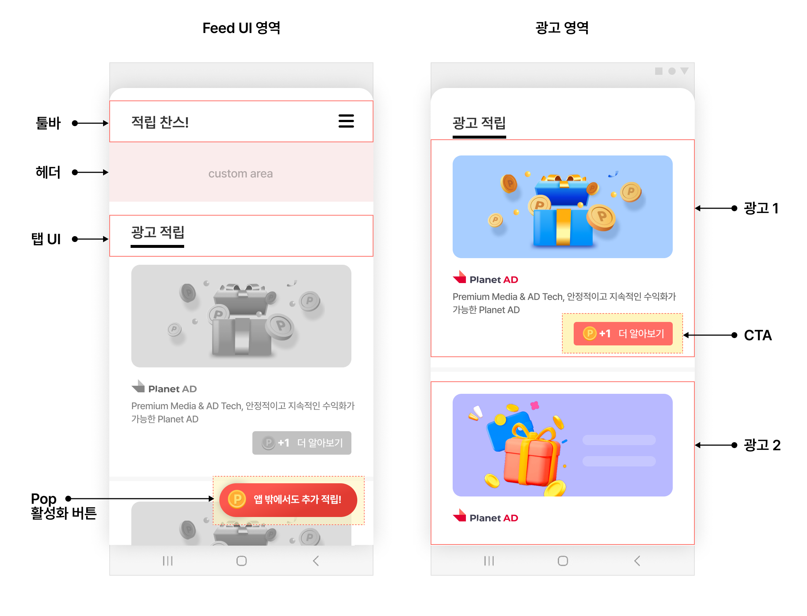
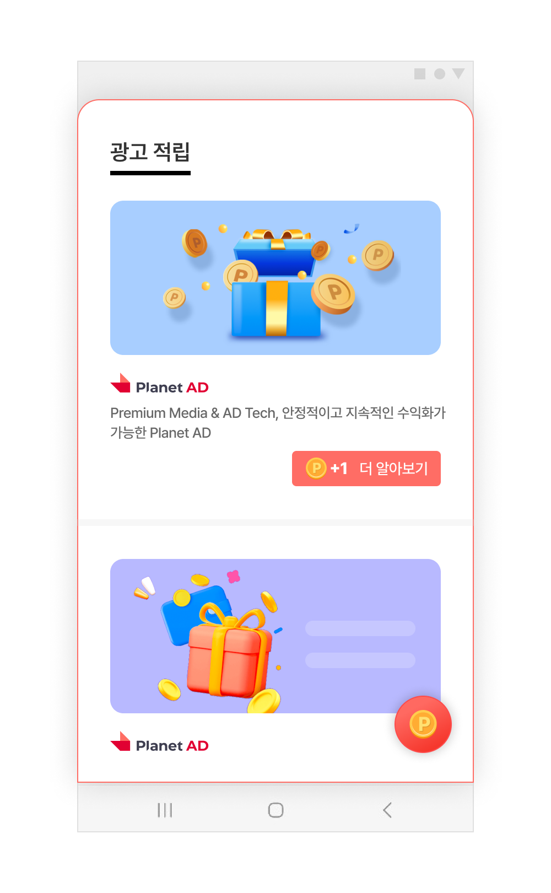
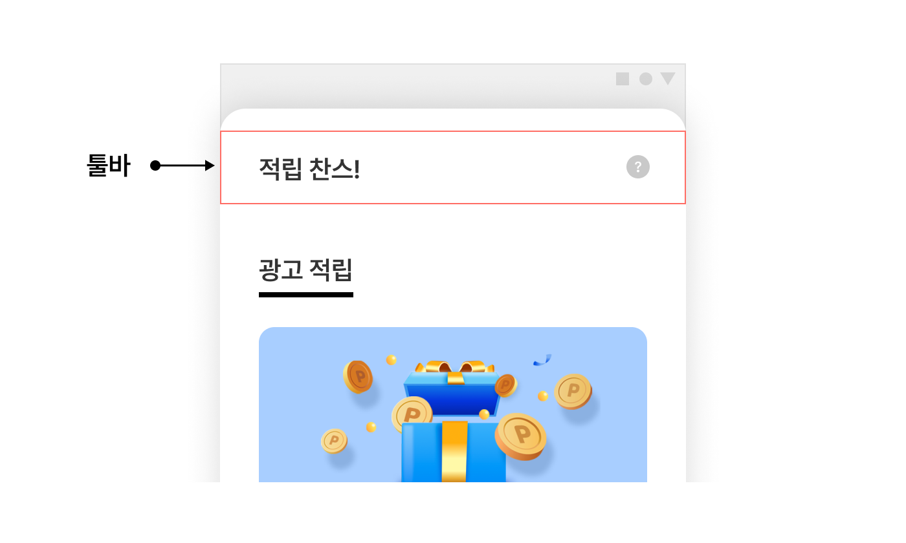
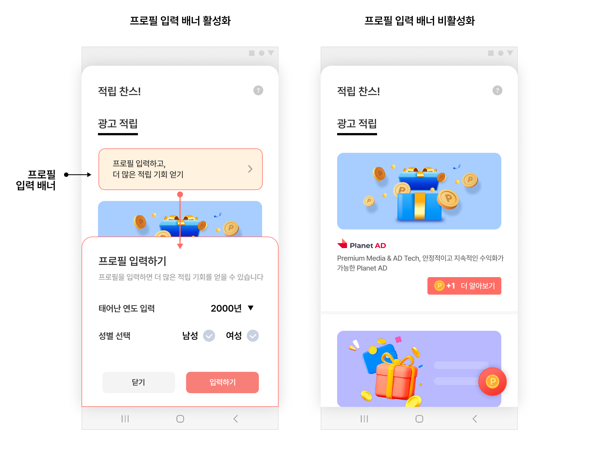
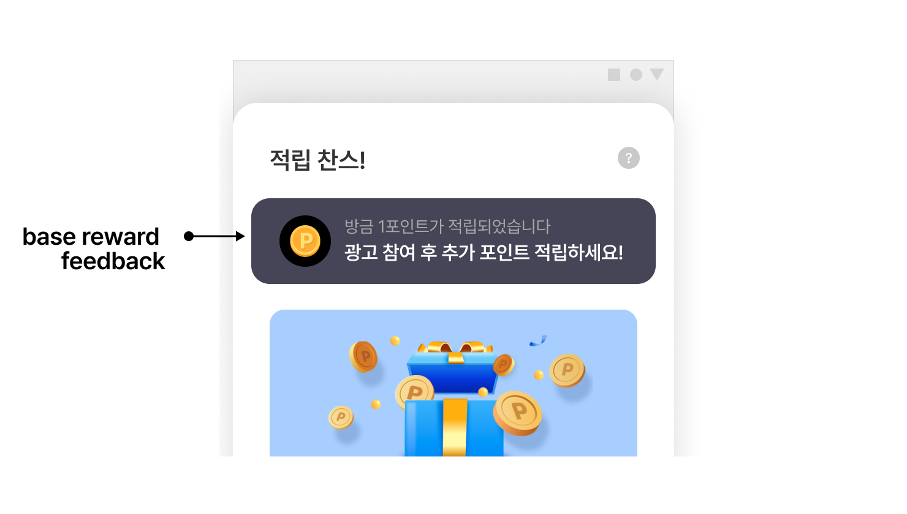
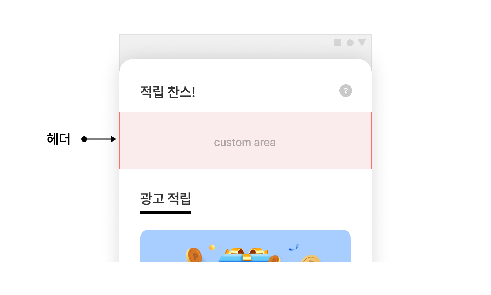
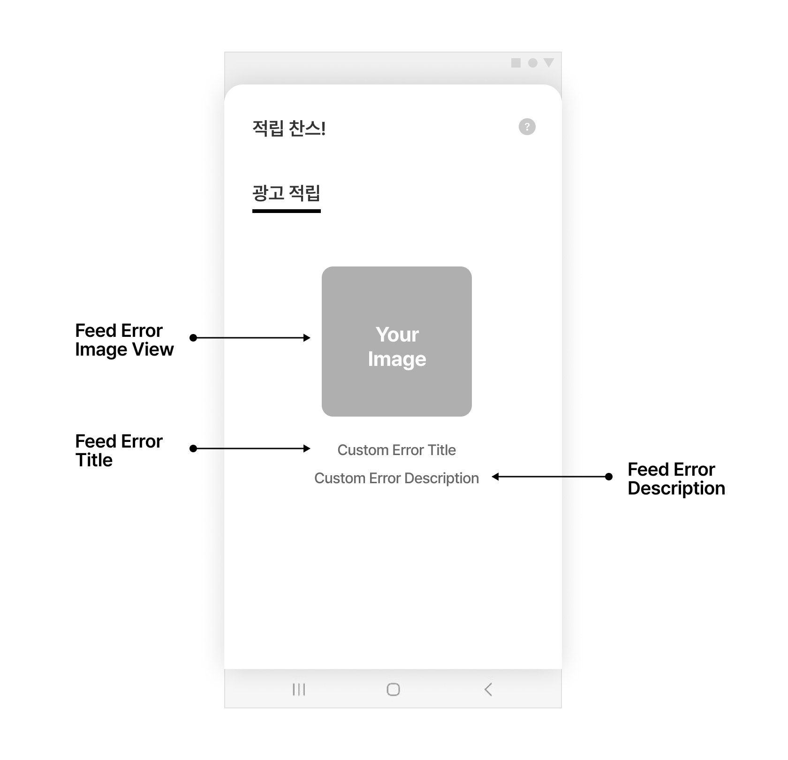

## Feed-고급설정

### 개요


이 문서에서 가이드 하는 내용은 SKPAd Android SDK의 Feed 지면의 기능을 설명하고 각 기능을 변경하는 방법을 설명합니다.<br>
이하 가이드에서 커스터마이징을 위해 구현 클래스를 정의합니다. 구현하는 클래스는 아래의 조건을 충족해야 합니다. 아래 조건을 충족하지 않는 경우 커스터마이징이 적용되지 않습니다.

- 구현 클래스는 내부 클래스(Inner 클래스)가 아니어야 합니다.
- 만일 내부 클래스로 생성을 해야 할 경우, public 정적(static) 클래스로 구현해야 합니다.


### Fragment로 Feed 연동



Feed 지면은 기본적으로 제공되는 액티비티로 제공됩니다. 더 다양한 연동 방식을 지원하기 위해 액티비티가 아닌 프래그먼트로 Feed 지면을 연동할 수 있습니다.<br> 프래그먼트를 추가하고자 하는 액티비티에 프래그먼트를 추가하고, 해당 액티비티의 onCreate에서 프래그먼트를 초기화합니다.<br>
다음은 FeedFragment를 연동하는 예시입니다.

```xml

<!-- your_activity_layout.xml -->
...생략...
<!-- FeedFragment 추가 -->
<fragment
    android:id="@+id/feed_fragment"
    android:name="com.skplanet.skpad.benefit.presentation.feed.FeedFragment"
    android:layout_width="match_parent"
    android:layout_height="match_parent" />
```
```java
...생략...
class YourActivity extends Actvity {
 
    private FeedHandler feedHandler;
 
    @Override
    public void onCreate() {
        super.onCreate();
        ...생략...
 
        // 광고를 새로 받기 위해 필요한 부분입니다.
        feedHandler = new FeedHandler(context, "YOUR_FEED_UNIT_ID");
 
        // FeedFragment 초기화
        final FeedFragment feedFragment = (FeedFragment) getSupportFragmentManager().findFragmentById(R.id.feed_fragment);
        if (feedFragment != null) {
            feedFragment.init(context, "YOUR_FEED_UNIT_ID");
        }
    }
    ...생략...
}
```


### 툴바 영역 자체 구현
Feed 툴바 영역의 디자인을 변경할 수 있습니다. 툴바 영역을 UI를 변경하는 방법은 2가지입니다. 아래 2가지 방법 중 하나를 선택하여 연동합니다.

- SDK에서 기본으로 제공하는 UI를 이용하는 방법
- 직접 구현한 Custom View를 이용하는 방법



#### SDK에서 기본으로 제공하는 UI를 이용하는 방법
SKPAd Android SDK에서 제공하는 기본 UI를 수정하여 타이틀 혹은 배경색을 변경할 수 있습니다. 다음은 기본 UI를 수정하여 툴바를 변경하는 예시입니다.<br><br>
DefaultFeedToolbarHolder의 상 클래스를 구현하고, 기본 UI(FeedToolbar)를 사용하여 타이틀 혹은 배경색을 변경합니다. 그리고 FeedConfig에 구현한 클래스를 추가합니다.

``` Java
public class YourFeedToolbarHolder extends DefaultFeedToolbarHolder {
    @Override
    public View getView(Activity activity, @NonNull final String unitId) {
        toolbar = new FeedToolbar(activity); // FeedToolbar 에서 제공하는 기본 Template 사용
        toolbar.setTitle("YourFeedToolbarHolder");
        toolbar.setIconResource(R.drawable.your_icon);
        toolbar.setBackgroundColor(Color.parseColor("#123456"));
        addInquiryMenuItemView(activity); // 문의하기 버튼은 이 함수를 통해 간단하게 추가 가능합니다.
        addSettingsMenuItemView(activity); // 세팅 버튼은 이 함수를 통해 간단하게 추가 가능합니다.
        addRightMenuItemView1(activity); // custom 버튼 추가
        return toolbar;
    }
 
    // custom 버튼 추가는 DefaultMenuLayout 를 사용하여 View 를 생성하고
    // toolbar.addRightMenuButton 를 사용하여 toolbar 에 추가합니다.
    private void addRightMenuItemView1(@NonNull final Activity activity) {
        MenuLayout menuLayout = new DefaultMenuLayout(activity, R.mipmap.ic_launcher);
        menuLayout.setOnClickListener(new View.OnClickListener() {
 
            @Override
            public void onClick(View v) {
                showInquiry(); // showInquiry 를 호출하여 문의하기 페이지로 연결합니다.
            }
        });
        toolbar.addRightMenuButton(menuLayout);
    }
}
```

```Java
final FeedConfig feedConfig = new FeedConfig.Builder(context, "YOUR_FEED_UNIT_ID")
    .feedToolbarHolderClass(YourFeedToolbarHolder.class)
    .build();
```

#### 직접 구현한 Custom View를 이용하는 방법
SKPAd Android SDK에서 제공하는 UI를 이용하지 않고 직접 구현하여 변경할 수 있습니다. 다음은 Custom View를 직접 생성하여 툴바를 변경하는 예시입니다.<br>
DefaultFeedToolbarHolder의 상속 클래스를 구현하고, Custom View(your_toolbar_header_layout)를 구현하여 툴바 영역에 View를 구현합니다. 그리고 FeedConfig에 구현한 클래스를 추가합니다.<br>

```java
public class YourFeedToolbarHolder extends DefaultFeedToolbarHolder {
    @Override
    public View getView(final Activity activity, @NonNull final String unitId) {
        final LayoutInflater inflater = (LayoutInflater) activity.getSystemService(Context.LAYOUT_INFLATER_SERVICE);
        return inflater.inflate(R.layout.your_toolbar_header_layout, null);
    }
 
    @Override
    public void onTotalRewardUpdated(int totalReward) {
    }
}
```

```java
final FeedConfig feedConfig = new FeedConfig.Builder(context, "YOUR_FEED_UNIT_ID")
    .feedToolbarHolderClass(YourFeedToolbarHolder.class)
    .build();
```

Custom View의 높이가 안드로이드 액티비티의 기본 액션바 높이와 다를 경우, 직접 구현한 View가 정상적으로 보이지 않을 수 있습니다. 이 경우에는 액티비티에 Theme 을 설정하여 액션바 높이를 수정해야 합니다.<br>
다음은 Theme을 설정하여 액션바의 높이를 수정하는 예시입니다.

```xml
// AndroidManifest.xml
...
<activity
    android:name="com.skplanet.skpad.benefit.presentation.feed.FeedBottomSheetActivity"
    android:theme="@style/CustomActivityTheme"
    tools:replace="android:theme"/>
...
```

```xml
// styles.xml
<style name="CustomActivityTheme" parent="Theme.SKPAd.RotatableBottomSheet">
    <item name="actionBarSize">DESIRED_ACTION_BAR_HEIGHT</item>
</style>
```

### 헤더 영역에 프로필 입력 배너 표시



사용자의 출생연도와 성별 정보를 설정하지 않으면 헤더 영역에 프로필 정보 입력 배너가 표시됩니다.<br>
사용자의 정보 제공 여부와 무관하게 배너를 표시하지 않을 수 있습니다. 이 기능을 사용하기 위해서는 FeedConfig.feedHeaderViewAdapterClass를 설정하지 않아야 합니다.<br>
다음은 FeedConfig를 수정하여 프로필 입력 배너를 표시하지 않는 예시입니다.

```java
final FeedConfig feedConfig = new FeedConfig.Builder(context, "YOUR_FEED_UNIT_ID")
    .profileBannerEnabled(false) // 프로필 배너 미노출
    .build();
```


### 적립 가능 금액 표시


헤더 영역에 SKPAd Android SDK 에서 기본으로 제공하는 UI를 사용해 "총 적립 가능 금액"을 사용자에게 보여줍니다.<br>
UI를 변경하기 위해서는 헤더 영역을 자체 구현해야 합니다. 헤더 영역을 자체 구현하는 방법은 아래 헤더 영역 자체 구현을 참고하시기 바랍니다.

```java
final FeedConfig feedConfig = new FeedConfig.Builder(context, "YOUR_FEED_UNIT_ID")
    .feedHeaderViewAdapterClass(DefaultFeedHeaderViewAdapter.class)
    .build();
```

### 헤더 영역 자체 구현


Feed 헤더 영역을 자유로이 활용할 수 있습니다. 예를 들어, Feed 영역을 설명하는 공간으로도 활용할 수 있습니다. (단, 헤더 영역을 필요에 따라 직접 구현한 UI 에 적립 가능한 금액을 표시할 수 있습니다. onBindView를 통해 지급 가능한 금액(reward)을 알 수 있습니다.<br>
다음은 헤더 영역을 변경하는 예시입니다.<br>
FeedHeaderViewAdapter의 구현 클래스를 구현하고, 구현한 Custom View(your_feed_header_layout)를 헤더영역에 구현합니다. 그리고 FeedConfig에 구현한 클래스를 추가합니다.

```
public class CustomFeedHeaderViewAdapter implements FeedHeaderViewAdapter {
    @Override
    public View onCreateView(final Context context, final ViewGroup parent) {
        final LayoutInflater inflater = (LayoutInflater) context.getSystemService(Context.LAYOUT_INFLATER_SERVICE);
        return inflater.inflate(R.layout.your_feed_header_layout, parent, false);
    }
 
    @Override
    public void onBindView(final View view, final int reward) {
        // Display total reward on the header if needed.
        val textView: TextView = view.findViewById(R.id.your_textview)
        textView.text = String.format("리워드 %d원", reward)
    }
 
    @Override
    public void onDestroyView() {
        // Use this this callback for clearing memory
    }
}
```

```
final FeedConfig feedConfig = new FeedConfig.Builder(context, "YOUR_FEED_UNIT_ID")
    .feedHeaderViewAdapterClass(CustomFeedHeaderViewAdapter.class)
    .build();
```

### 광고 UI 자체 구현
Feed 지면에서는 사용자가 UI를 변경하는 방법을 제공합니다.


다음은 광고의 디자인을 변경하는 방법을 설명하는 예시입니다.


|항목|설명|필수여부|비고|
|-|-|-|-|
광고 제목|광고의 제목|Mandatory|<li>최대 10자</li><li>생략 부호로 일정 길이 이상은 생략 가능</li>
광고 소재|이미지, 동영상 등 광고 소재|Mandatory|<li>com.skplanet.skpad.benefit.presentation.media.MediaView 사용 필수</li><li>종횡비 유지 필수</li><li>여백 추가 가능</li><li>이미지 사이즈 1200x627 [px]</li>
광고 설명|광고에 대한 상세 설명|Mandatory|<li>생략 부호로 일정 길이 이상은 생략 가능</li><li>최대 40자</li>
광고주 아이콘|광고주 아이콘 이미지|Mandatory|<li>종횡비 유지 필수</li><li>이미지 사이즈 80x80 [px]</li>
CTA 버튼|광고의 참여를 유도하는 버튼|Mandatory|<li>com.skplanet.skpad.benefit.presentation.media.CtaView 사용 필수</li><li>최대 7자</li><li>생략 부호로 일정 길이 이상은 생략 가능</li>
맞춤형 광고 정보 버튼|광고 표시 이유에 대한 가이드 기능을 제공|Mandatory|<li>com.skplanet.skpad.benefit.presentation.guide.AdInfoView 사용 필수</li><li>icon Image 교체 가능</li><li>필수 추가 필요</li>
문의하기 버튼|VOC대응을 위한 Planet AD Report Web Page로 이동하는 기능 제공| Optional |<li>com.skplanet.skpad.benefit.presentation.guide.InquiryView 사용 필수</li><li>icon Image 교체 가능</li>
광고 알림 문구|Sponsored view| Optional |예시) "광고", "ad", "스폰서", "Sponsored"

<p>광고용 NativeAdView의 규격에 맞는 레이아웃(your_feed_ad.xml)을 구현합니다.</p>

```xml
// your_feed_ad.xml
<com.skplanet.skp.benefit.presentation.nativead.NativeAdView
    android:id="@+id/native_ad_view" ...>
 
    // AdInfoView, InquiryView, MediaView와 CtaView는 NativeAdView의 하위 컴포넌트로 구현해야합니다.
 
    <LinearLayout ... >
        <com.skplanet.skp.benefit.presentation.media.MediaView
            android:id="@+id/mediaView" ... />
        <TextView
            android:id="@+id/textTitle" ... />
        <TextView
            android:id="@+id/textDescription" ... />
        <ImageView
            android:id="@+id/imageIcon" ... />
        <com.skplanet.skp.benefit.presentation.media.CtaView
            android:id="@+id/ctaView" ... />

        <com.skplanet.skpad.benefit.presentation.guide.AdInfoView
            android:id="@+id/information" ... />

        <com.skplanet.skpad.benefit.presentation.guide.InquiryView
            android:id="@+id/inquiryButton" ... />
    </LinearLayout>
 
</com.skplanet.skp.benefit.presentation.nativead.NativeAdView>
```


AdsAdapter의 상속 클래스를 구현합니다. 구현한 상속 클래스의 onCreateViewHolder에서 your_feed_ad.xml을 사용하여 NativeAdView를 생성합니다.<br>
그리고 FeedConfig에 구현한 YourAdsAdapter를 설정합니다. <br>
CTA 버튼 커스터마이징은 CTA 변경을 참고하시기 바랍니다. (아래 예시에서 아이콘을 그리기 위해 ImageLoader 라이브러리를 사용하였습니다.)

```
public class YourAdsAdapter extends AdsAdapter<AdsAdapter.NativeAdViewHolder> {
 
    @Override
    public NativeAdViewHolder onCreateViewHolder(ViewGroup parent, int viewType) {
        final LayoutInflater inflater = LayoutInflater.from(parent.getContext());
        final NativeAdView feedNativeAdView = (NativeAdView) inflater.inflate(R.layout.your_feed_ad, parent, false);
        return new NativeAdViewHolder(feedNativeAdView);
    }
 
    @Override
    public void onBindViewHolder(NativeAdViewHolder holder, NativeAd nativeAd) {
        super.onBindViewHolder(holder, nativeAd);
        final NativeAdView view = (NativeAdView) holder.itemView;
 
        final Ad ad = nativeAd.getAd();
         
        // create ad component
        final MediaView mediaView = view.findViewById(R.id.mediaView);
        final TextView titleView = view.findViewById(R.id.textTitle);
        final ImageView iconView = view.findViewById(R.id.imageIcon);
        final TextView descriptionView = view.findViewById(R.id.textDescription);
        final CtaView ctaView = view.findViewById(R.id.ctaView);
        final CtaPresenter ctaPresenter = new CtaPresenter(ctaView); // CtaView should not be null
        final AdInfoView adInfoView = view.findViewById(R.id.information)
        final InquiryView inquiryView = view.findViewById(R.id.inquiryButton)
 
        // data binding
        ctaPresenter.bind(nativeAd);
 
        if (mediaView != null) {
            mediaView.setCreative(ad.getCreative());
            mediaView.setVideoEventListener(new VideoEventListener() {
                // Override and implement methods         
            });
        }
         
        if (titleView != null) {
            titleView.setText(ad.getTitle());
        }
 
        if (iconView != null) {
            ImageLoader.getInstance().displayImage(ad.getIconUrl(), iconView);
        }
        if (descriptionView != null) {
            descriptionView.setText(ad.getDescription());
        }
 
        // clickableViews에 추가된 UI 컴포넌트를 클릭하면 광고 페이지로 이동합니다.
        final Collection<View> clickableViews = new ArrayList<>();
        clickableViews.add(ctaView);
        clickableViews.add(mediaView);
        clickableViews.add(titleView);
        clickableViews.add(descriptionView);
         
        // 광고 콜백 이벤트를 수신할 수 있습니다.
        // view.setNativeAd 보다 전에 호출해야 합니다.
        view.addOnNativeAdEventListener(new NativeAdView.OnNativeAdEventListener() {
             
            @Override
            public void onImpressed(final @NonNull NativeAdView view, final @NonNull NativeAd nativeAd) {
 
            }
 
            @Override
            public void onClicked(@NonNull NativeAdView view, @NonNull NativeAd nativeAd) {
                ctaPresenter.bind(nativeAd);
            }
 
            @Override
            public void onRewardRequested(@NonNull NativeAdView view, @NonNull NativeAd nativeAd) {
 
            }
 
            @Override
            public void onRewarded(@NonNull NativeAdView nativeAdView, @NonNull NativeAd nativeAd, @Nullable RewardResult rewardResult) {
 
            }
 
            @Override
            public void onParticipated(final @NonNull NativeAdView view, final @NonNull NativeAd nativeAd) {
                ctaPresenter.bind(nativeAd);
            }
        });
         
        view.setMediaView(mediaView);
        view.setClickableViews(clickableViews);
        view.setNativeAd(nativeAd);

        view.setAdInfoView(adInfoView);
        view.setInquiryView(inquiryView);
    }
}
```

```
final FeedConfig feedConfig = new FeedConfig.Builder(context, "YOUR_FEED_UNIT_ID")
    .adsAdapterClass(YourAdsAdapter.class)
    .build();
```


### 기본 포인트 지급 안내 UI 자체 구현


사용자가 Feed 지면에 접근하면 일정 주기로 기본 포인트를 지급합니다. 기본 포인트 지급 알림 UI는 위의 이미지와 같습니다. <br>
기본 포인트 지급 알림 UI를 수정하여 좀 더 사용자 경험을 개선할 수 있습니다.<br>
다음은 기본 포인트 지급 알림 UI 를 수정하는 예시입니다.
```
public class YourFeedFeedbackHandler extends DefaultFeedFeedbackHandler {
    
   @Override
   @NotNull
   public View getBaseRewardNotificationView(@NotNull Context context, int reward) {
        View view = LayoutInflater.from(context).inflate(R.layout.your_layout, null); 
        return view
   }
}
```
```
final FeedConfig feedConfig = new FeedConfig.Builder(context, "YOUR_FEED_UNIT_ID")
      .feedFeedbackHandler(YourFeedFeedbackHandler.class)
      .build();
```

### 광고 미할당 안내 디자인 자체 구현하기
Feed 지면에 진입한 시점에 노출할 광고가 없다면 광고 미할당 안내 UI가 표시됩니다. 미할당 안내 디자인은 자체 구현하여 변경할 수 있습니다.



광고 미할당 안내 디자인을 직접 구현하려면 다음의 절차를 따르세요.

1. Feed 지면에 광고가 할당되지 않았을 때의 화면에 추가할 에러 이미지(feedErrorImageView), 타이틀(feedErrorTitle), 상세 설명(feedErrorDescription) 레이아웃을 작성하세요.
```
<!-- custom_feed_error_view.xml -->
 
<LinearLayout xmlns:android="http://schemas.android.com/apk/res/android"
    android:layout_width="match_parent"
    android:layout_height="wrap_content"
    android:gravity="center_vertical"
    android:orientation="vertical"
    android:padding="40dp">
 
    <ImageView
        android:id="@+id/feedErrorImageView"
        android:layout_width="match_parent"
        android:layout_height="wrap_content"/>
 
    <TextView
        android:id="@+id/feedErrorTitle"
        android:layout_width="wrap_content"
        android:layout_height="wrap_content"
        android:layout_gravity="center_horizontal"
        android:layout_marginTop="32dp"
        android:textColor="@color/bz_text_emphasis"
        android:textSize="16sp" />
 
    <TextView
        android:id="@+id/feedErrorDescription"
        android:layout_width="wrap_content"
        android:layout_height="wrap_content"
        android:layout_gravity="center_horizontal"
        android:layout_marginTop="8dp"
        android:textAlignment="center"
        android:textColor="@color/bz_text_description"
        android:textSize="14sp" />
 
</LinearLayout>
```

2. FeedErrorViewHolder를 구현하는 커스텀 클래스 CustomErrorView를 새로 생성하고, 자동 완성되는 GetView() 메소드를 다음과 같이 구현하세요.

```
public class CustomErrorView extends FeedErrorViewHolder {
    @NonNull
    @Override
    public View getErrorView(@NonNull Activity activity) {
        // TODO: 1번에서 생성한 custom_feed_error_view 레이아웃을 inflate
        View errorView = activity.getLayoutInflater().inflate(R.layout.custom_feed_error_view, null, false);
        final ImageView errorImageView = errorView.findViewById(R.id.feedErrorImageView);
        final TextView errorTitle = errorView.findViewById(R.id.feedErrorTitle);
        final TextView errorDescription = errorView.findViewById(R.id.feedErrorDescription);
 
        errorImageView.setImageResource(R.drawable.bz_ic_feed_profile_coin); // 에러 이미지 설정
        errorTitle.setText("타이틀: 광고가 없습니다. "); // 에러 타이틀 텍스트 설정
        errorDescription.setText("디스크립션: 할당된 광고가 없습니다!"); // 에러 상세 텍스트 설정
         
        return errorView;
    }
}
```
3. FeedConfig의 feedErrorViewHolderClass 속성에 이전 단계에서 생성한 CustomErrorView 클래스를 추가하세요.
```
// Feed 지면 초기화
// TODO: feedErrorViewHolderClass 속성에 2번에서 생성한 CustomErrorView 클래스를 설정합니다.
final FeedConfig feedConfig = new FeedConfig.Builder(YOUR_FEED_UNIT_ID)
                .feedErrorViewHolderClass(CustomErrorView.class)
                .build();
```
