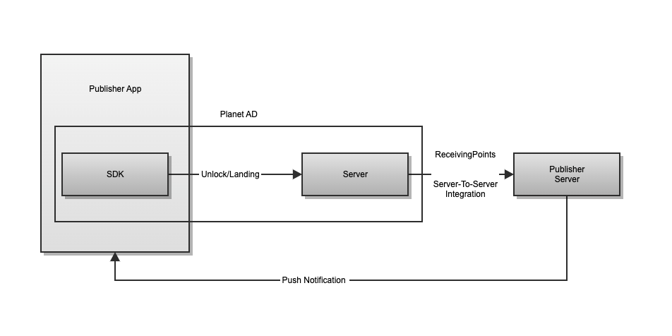

## 기본 설정

### 시작하기 전에

#### 안내 사항

본 문서는 SKP AD Screen SDK를 퍼블리셔의 안드로이드 어플리케이션에 연동하기 위한 가이드입니다. 아래의 안내사항을 숙지 후 연동을 진행해주세요.

연동 작업 전 SKP 담당 매니저와 사전 협의가 완료되어야 합니다.

[잠금화면을 통한 수익 창출](https://play.google.com/intl/ko_ALL/about/monetization-ads/ads/lockscreen)에 대한 구글 정책을 반드시 확인 후 연동을 진행합니다.

잠금화면 앱은 잠금화면 기능만을 수행해야 하므로 이 외의 목적을 가진 어플리케이션에는 잠금화면을 넣을 수 없습니다.

서비스 출시 이전에 연동이 완료된 앱의 apk 파일을 SKP빌 BD 매니저에게 전달 후 승인 과정을 거쳐야 합니다.

#### Requirements

||항목|세부내용|비고|
| :- | - | - | - |
|1|안드로이드 지원 버전|Android 4.0.3 (API Level 15) 이상 Android 10 정식 지원||
|2|[Google Play의 대상 API 레벨 요구사항을 충족](https://developer.android.com/distribute/best-practices/develop/target-sdk)|<p>SKPADScreen SDK의 대응:</p><p>targetSdkVersion 28 사용 compileSdkVersion 29 이상 사용</p>|<p>정책 적용 시점</p><p>신규 앱: 2019년 8월 1일 기존 앱: 2019년 11월 1일</p>|
|3|AndroidX 적용|[AndroidX 사용하기](https://developer.android.com/jetpack/androidx/migrate?hl=ko) 참조||
|4|targetSdkVersion 29 지원|SKP AD screen SDK 최신 버전에서는 targetSdkVersion 29 사용 가능||
|5|Kotlin 버전|1\.5 이상 사용||

Lockscreen Activity의 style에 windowTranslucent, windowIsFloating, windowSwipeToDismiss 중 1개 이상이 true로 설정되어 있을 경우 Android OS 8.0 버전에서 크래시가 발생할 수 있으므로 확인이 필요합니다. 

이에 해당된다면 아래 내용을 확인해주세요.

<details>
  <summary>Android 8.0에서의 Lockscreen Activity의 특정 스타일로 인한 충돌 방지하기</summary>
<br>
Lockscreen Activity의 특정한 style 설정이 Android OS 8.0 버전에서 크래시가 발생할 수 있으므로 확인이 필요합니다.<br>

발생 조건: [Android API 26의 설정](https://android.googlesource.com/platform/frameworks/base/+/android-8.0.0_r36/core/java/android/app/Activity.java#986)으로 인해, 아래 조건 모두 충족 시 Crash 발생

+ 앱의 targetSdkVersion 이 27 이상<br>
+ 유저의 디바이스의 OS 버전이 8.0 (API 26)<br>
+ Lockscreen Activity에 적용된 style에 windowTranslucent, windowIsFloating, windowSwipeToDismiss 중 1개 이상이 true로 설정되어 있을 경우<br>

해결 방안
+ styles.xml 에서 windowTranslucent, windowIsFloating,windowSwipeToDismiss 중 true로 세팅된 항목을 제거 또는 false로 변경


```xml
<resources>
<style name="YourLockScreenTheme" parent="@style/AppTheme">
    <!-- Items below need to be removed or set to false on specific conditions-->
    <item name="android:windowIsTranslucent">false</item>
    <item name="android:windowIsFloating">false</item>
    <item name="android:windowSwipeToDismiss">false</item>

</style>
</resources>
```

</details>


#### Prerequisites

항목 세부내용 비고

||항목|세부내용|비고|
| :- | - | - | - |
|1|퍼블리셔 앱 로그인을 위한 API 서버|SKPAdScreen SDK에 유저 정보를 등록하기 위함||
|2|포인트 적립 요청 수신 API|PlanetAD 서버에서 퍼블리셔 서버로 포인트 적립 요청을 보낸 이후, 실제 포인트 지급을 처리할 퍼블리셔의 API 서버||
|3|연동을 위한 키값|<p>PlanetAD 매니저로부터 발급받은 아래 값들</p><p>app\_key : 퍼블리셔 앱의 키값 unitId : 광고 서빙을 위한 Unit ID||

### build.gradle , AndroidManifest.xml 설정

build.gradle 에 아래 코드에 보이는 저장소 및 디펜던시를 추가합니다.

```
repositories {
    maven { url "https://asia-northeast3-maven.pkg.dev/planetad-379102/planetad" }
}
 
dependencies {
    implementation ("com.skplanet.sdk.ad:skpad-screen:1.2.0") { changing = true }
}
```

AndroidManifest.xml에 아래 meta data를 추가하고 000000000000 부분에 app_key를 기입합니다.

```xml
<meta-data
    android:name="com.skplanet.APP_KEY"
    android:value="app-pub-000000000000" />
```

### 메소드 호출

연동 단계는 1) 초기화 → 2) 유저 정보 설정 → 3) 잠금화면 제어 설정 의 세 단계를 따라야 합니다.

##### 1) 초기화: init() 및 launch() 호출

|항목|코드|호출 위치|세부내용|
| :- | - | - | - |
|SKP AD Screen 초기화 필수|```SKPAdScreen.init(String unitId, Context context, Class lockerActivityClass, int imageResourceIdOnFail)```| <li>Application Class 의 onCreate()</li><li>모든 다른 메소드보다 항상 먼저 호출되도록 함</li><li>기존에 사용하던 Application Class가 없이 SKP AD Screen 연동을 위해 처음으로 Application Class를 생성할 경우 반드시 AndroidManifest.xml에 해당 Application Class를 등록해야 합니다.</li>|Parameters<li>unitId : SKPAdScreen SDK 사용을 위한 Unit ID로,SKP AD Screen 어드민에서 확인 가능합니다.</li><li>context : Application context 를 this 로 입력합니다.</li><li>lockerActivityClass : 잠금화면 액티비티 클래스.<ul><li>잠금화면을 커스터마이징하지 않는 경우 SDK 내에서 제공하는 SimpleLockerActivity.class 를 설정합니다.</li><li>커스터마이징을 하는 경우 직접 구현한 액티비티 클래스를 설정합니다. 자세한 사항은 [UI 커스터마이징](./4_customizing.md) 문서의 설명을 참조하세요.</li><li>imageResourceIdOnFail : 네트워크 에러 발생 시 혹은 일시적으로 잠금화면에 보여줄 캠페인이 없을 경우 보여주게 되는 이미지를 앱 내 리소스에 포함시켜야 하며, 이 이미지의 리소스 아이디를 설정합니다.</li></ul>|
SKP AD Screen 시작 필수|```SKPAdScreen.getInstance().launch()```|앱 실행 시 처음 실행되는 액티비티에 추가||

###### Sample Code
```Java
public class App extends Application {

    @Override
    public void onCreate() {
        super.onCreate();
        ...

        SKPAdScreen.init("Unit ID", this, SimpleLockerActivity.class, R.drawable.image_on_fail);
    }
}
```

##### 2) 유저 정보 설정

연령, 성별, 지역 등 타게팅 정보를 설정하지 않는 경우 타게팅이 설정된 광고가 보이지 않으므로, 유저가 볼 수 있는 전체 광고의 수량이 줄어들게 됩니다. 설정이 불가할 경우 PlanetAD 담당 매니저와 논의 부탁드립니다.

|항목|코드|호출 위치|세부내용|
| :- | - | - | - |
|사용자 정보 설정을 위한 객체|```SKPAdScreen.getInstance().getUserProfile()```|SKPAdScreen.getInstance().activate() 호출 전에 반드시 유저 정보를 설정해야 함|유저 정보 설정할 수 있는 Class 인 UserProfile 호출|
|유저 식별값 필수|```setUserId(String userId)```||userId<li>유저에게 적립금을 지급하기 위한 필수적인 설정값</li><li>매체사에서 유저를 구분할 수 있는 식별값</li><li>매체사 포인트 적립 포스트백 API 연동 요청 시에 전달됨</li><li>앱 재설치 또는 일정 주기에 따라 userId 가 변화할 경우,반드시 BD 매니저와 사전 논의 필요</li>|
|유저 연령 권장|```setBirthYear(int birthYear)```|| 유저의 출생년도를 4자리 숫자로 입력하여 나이 설정|
|유저 성별 권장|```setGender(String gender)```|| 미리 정의된 String 을 통해 형식에 맞추어 성별 설정<li>UserProfile.USER_GENDER_MALE : 남성</li><li>UserProfile.USER_GENDER_FEMALE : 여성</li>|
|유저 지역 권장|```setRegion(String region)```|| "시/도 + 공백 + 시/군/구" 형식으로 설정<li>사용가능한 시/도 및 시/군/구 정보</li><li>예시: "서울특별시 관악구", "제주특별자치도 제주시"</li>|
이 외 선택|커스텀 타게팅 문서 참고|| 매체사에서 원하는 유저 정보로 타게팅 가능

##### 3) 잠금화면 제어

|항목|코드|호출 위치|세부내용|
|:-|-|-|-|
SKP AD Screen 활성화 필수|```SKPAdScreen.getInstance().activate()```|<p>SKP AD Screen 활성화 시점 <li>activate()를 처음 잠금화면 활성화 시 호출하면, 이후부터 자동으로 잠금화면 사이클이 관리 되기 때문에 deactivate()를 호출하기 전에 다 시 호출할 필요는 없음</li>|이 함수가 호출된 이후부터 잠금화면에 SKP AD Screen이 나타남
SKP AD Screen 비활성화 필수|```SKPAdScreen.getInstance().deactivate()```|SKP AD Screen 비활성화 시점|이 함수가 호출되면 더 이상 잠금화면에 SKPAdScreen이 나타나지 않음
유저 로그아웃 필수|```SKPAdScreen.getInstance().logout()```|유저가 로그아웃하는 시점|이 함수는 deactivate() 를 호출하며, SKPAdScreen에서 사용하는 유저 정보를 디바 이스에서 삭제함
SKPAdScreen이 화면에서 사라 지는 시간 설정 권장|```SKPAdScreen.getInstance().setSettings(SKPAdScreen. Settings.FINISH_IN_SEC, int set_seconds)```|SKPAdScreen.init() 이후에 호출|<p>SKPAdScreen 액티비티가 화면에 뜬 뒤 일정 시간 동안 유저의 활동이 없을 경우 SKPAdScreen이 화면에서 사라짐</p><li><p>Parameters</p></li><ul><li>set\_seconds : 유저의 활동이 없는 경우 SKPAdScreen이 화면에서 사 라지게 될 시간 (초 단위)</li></ul><li>상세 동작 예시</li><ul><li>미설정 시: 60초 동안 유저 활동이 없을 경우 동작 <li>set_seconds = 30 : 30초 동안 유 저 활동이 없을 경우 동작</li><li> set_seconds = 0 : 해당 기능 미동작</li></ul>
|잠금화면을 활성화한 후 실제로 잠금화면이 처음 준비가 된 시 점 확인 선택|```SKPAdScreen.getInstance().activate(OnReadyListener listener)```||활성화한 후 실제로 잠금화면이 처음 준비가 완료된 시점을 알고 싶을 때, 아래의 interface 를 구현하여 activate() 메소드의 파라미터로 넘깁니다. <br><br>public interface OnReadyListener { <br> &nasp; void onReady(); // This will be called when the first lockscreen is ready to be shown.<br>}|
Notification 커스텀 선택|서비스 노티피케이션 문서 참고||SKPAdScreen을 활성화한 후 Notification area 에 생성된 Notification의 icon, text 등을 수정하고자 하는 경우|
|잠금 화면 광고 할당Callback|'''SKPAdScreen.getInstance().setAllocationListener(OnAllocationListener listener)'''|SKPAdScreen.init() 이후에 호출|<p>잠금화면이 활성화 된 이후 광고 할당이 완료 되는 시점에 호출되는 Callback</p>Callback Instance의 유지 필요

### 기본 보안기능 화면 속성 수정

SKPAdScreen.init()된 직후 메소드를 호출하여 보안기능 화면 속성을 수정합니다.
+ backgroundResourceId(int resourceId): Swipe mode 보안화면에 나오는 배경화면을 지정
+ backgroundImageScaleType(enum ImageView.ScaleType): Swipe mode 보안화면에 지정한 배경화면의 정렬값 설정 (기본값: FIT_XY)
+ backgroundColor(int Color): Swipe mode 보안화면의 배경색 설정 (기본값: Color.WHITE)
+ backgroundDimAlpha(float): Swipe mode 보안화면에는 시계와 액션 안내 텍스트의 가독성을 높이기 위하여 알파값이 적용된 검은색 화면의 알파값을 조절 (기본값: 0.7)

+ showClock(boolean): 시계의 노출/미노출을 세팅 (기본값: true)

+ showDescription(boolean): 유저 액션 안내 텍스트의 노출/미노출을 세팅 (기본값: true)

##### Sample Code

```java
SKPAdScreen.init("app_key", this, SimpleLockerActivity.class, R.drawable.image_on_fail, Constants.useGDPR? SKPAdScreen.PrivacyPolicy.GDPR :SKPAdScreen.PrivacyPolicy.NONE);

SKPAdScreen.getInstance().setSecurityConfiguration(
        new SecurityConfiguration.Builder().
                backgroundResourceId(R.drawable.your_drawable).
                backgroundImageScaleType(ImageView.ScaleType.FIT_CENTER).
                backgroundColor(Color.WHITE).
                backgroundDimAlpha(0.7f).
                showClock(true).
                showDescription(true).
                build());
```


### "다른 앱 위에 그리기" 권한 얻기

[안드로이드 10부터 변경된 정책](https://developer.android.com/guide/components/activities/background-starts)에 따라, 잠금화면을 띄우기 위해서는 "다른 앱 위에 그리기" 권한 획득이 필요합니다. 따라서 사용자에게 해당 권한 요청에 대한 메시지를 잠금화면과 In-App에서 노출해 권한 획득을 도울 수 기능을 제공합니다.

##### 1) 잠금화면 안내 메시지

+ 앱에서 추가 코드를 작성할 필요없이 자동으로 적용
+ Android 8 (Oreo) 미만이거나 해당 권한이 이미 획득되어 있는 경우에는 팝업을 보여주지 않음
+ 6시간 간격으로 노출

##### 2) In-App 안내 메시지

```boolean SKPAdScreen#showOverlayPermissionGuideDialogIfNeeded(Activity)```

+ 유저에게 "다른 앱 위에 그리기" 권한 획득을 요청하는 메시지의 팝업 다이얼로그를 띄우는 인터페이스
+ 앱의 메인 화면이 생성될 때나(MainActivity의 OnCreate()), 사용자가 잠금화면을 활성화했을 때 해당 팝업을 보여주는 것을 권장
+ 리턴 값은 팝업 다이얼로그가 발생했는지 아닌지를 알려주는 boolean 값

```
public class MainActivity extends Activity {

        @Override
        protected void onCreate(Bundle savedInstanceState) {
            // (생략)
            SKPAdScreen.getInstance().showOverlayPermissionGuideDialogIfNeeded(MainActivity.this);
        }
}
```

+ 팝업에서 확인 클릭 시 해당 권한을 획득할 수 있는 안드로이드 설정 화면으로 이동하고, 권한 획득시 자동으로 이전 화면으로 전환
+ Android 8 (Oreo) 미만이거나 해당 권한이 이미 획득되어 있는 경우에는 팝업을 보여주지 않음

### 포인트 적립 포스트백 연동 - Server-to-Server 연동

SKPAdScreen은 포인트 적립이 발생했을 때 직접 유저들에게 포인트를 지급하는 것이 아닙니다. SKPAdScreen 서버에서는 매체사 서버로 포인트 적립 요청을 보낼 뿐이며, 실제 지급은 매체사 서버에서 처리합니다.

+ 프로세스
  1. 매체사 포인트 적립 포스트백 API 연동 문서를 참고하여 포스트백 수신 서버 구축
  2. Endpoint url을 PlanetAD 매니저에게 전달

포인트 적립 알림 푸시를 유저에게 보내고 싶은 경우에는 포인트 적립 요청을 받고 매체사에서 직접 푸시를 전송합니다.

#### 포인트 적립 요청 흐름


SKPAdScreen의 UI 및 동작을 커스터마이징하고 싶다면 [고급 설정 문서](./4_customizing.md)를 참고하여 구현합니다.


