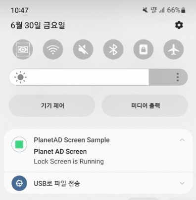

## 서비스 노티피케이션

#### SKP AD Screen이 동작하기 위해서는 SKP AD Screen 잠금화면 서비스가 [Foreground Service](http://developer.android.com/guide/components/services.html#Foreground)로 실행됩니다. 
#### Foreground Service 실행 중인 경우는 반드시 서비스 노티피케이션을 보여주도록 되어있기 때문에, 아래와 같이 해당 노티피케이션의 설정을 수정 가능하도록 지원하고 있습니다.

#### 참고) 안드로이드 OS 8.0 버전 이상에서는 백그라운드에서 실행 중인 모든 앱에 대해 시스템 노티피케이션이 노출됩니다.
-  "백그라운드에서 실행 중"이라고 함은 앱 화면에서 벗어나 인터랙션은 없으나 아직 종료하지 않았거나, 앱을 종료하였더라도 백그라운드에서 계속 실행되는 상태를 지칭합니다.
#### 해당 노티피케이션은 안드로이드 OS 단에서 띄우는 부분이므로 별도로 커스텀이 불가합니다. 다만 유저 단에서 시스템 노티피케이션을 끌 수 있습니다. ([참고 링크](https://android.gadgethacks.com/how-to/android-8-1-oreo-lets-you-hide-running-background-drawing-over-other-apps-notifications-0180752/))

## Usage
|항목|코드 & 호출 위치|세부내용|예시|
| - | - | - | - |
|서비스 노티피케이 션 커스터 마이징 권장|LockerServiceNotificationConfig 클래스를 통해 접근 (getter) 및 변경(setter) 반드시 SKPAdScreen.init() 다음에 호출해야 함|
Parameters
<li>String Title : 노티피케이션의 상단 타이틀. 기본값은 앱 명칭</li><li>String Text : 노티피케이션의 하단 텍스트. 기본값은 빈 문자열("")</li><li>int SmallIcon : 노티피케이션의 작은 아이콘 이미지. 기본값은 앱 아이콘</li><li>int LargeIcon : 노티피케이션의 큰 아이콘 이미지. 기본값은 없음</li><li>boolean ShowAlways : 노티피케이션을 항상 보여줄지 유무. 위 설정 값들이 제대로 나오는지 테스트 목적으로도 사용 가능. 기본값은 false</li><li>intent Intent : 노티피케이션 클릭 시 실행될 인텐트. 기본값은 앱의 첫 액티비티(Launcher Activity)로 의 이동 인텐트|public class App extends Application {    @Override    public void onCreate() {    super.onCreate();     ....     SKPAdScreen.init("app_key", this, SimpleLockerActivity. class, R.drawable.image_on_fail, false);     // 노티피케이션 설정     LockerServiceNotificati onConfig config = SKPAdScreen.getInstance().getLockerServiceNotificationConfig();    config. setTitle("SampleTitle");     config.setText("SampleText");     config.setSmallIconResourceId(R.drawable.ic_noti_small);     config.setLargeIconResourceId (R.drawable.ic_noti_large);     // config.setShowAlways(true);     }     }
서비스 노티피케이션을 일시적으로 다른 노티피케이션으로 대체하기 선택|
서비스 노티피케이션이 노출되어 있는 상태에서 노티피케이션을 추가적으로 띄울 경우 (적립 알림 등), 한 앱에서 다수의 노티피케이션이 알림바에 나타나기 때문에 유저 경험 상 좋지 않을 수 있습니다. 해당 메소드를 통해 서비스 노티피케이션이 있던 곳에 새로운 노티피케이션을 띄우고, 다시 원래의 서비스 노티피케이션으로 돌아갈 수 있습니다.<li>퍼블리셔 측에서 빌드가 완료된 notification을 이 메소드의 파라미터로 전달</li><ul><li>해당 notification을 서비스 노티피케이션이 위치한 곳에 띄움</li></ul><li>이 메소드의 파라미터로 null을 전달하여 다시 호출<ul><li>다시 LockerServiceNotificationConfig에서 설정한 원래 상태의 서비스 노티피케이션으로 돌아감</li><ul>

