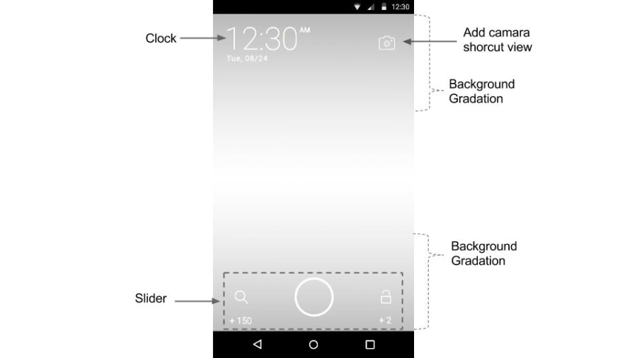
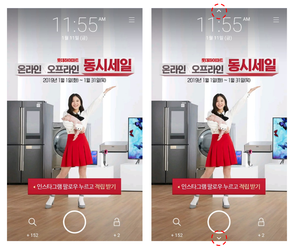

## UI 커스터마이징

잠금화면 기본 UI를 고도화하여 퍼블리셔가 원하는 대로 디자인을 수정하고 기능을 추가할 수 있습니다.<br>
잠금화면은 하나의 액티비티로 구성되며, 일반적인 액티비티와 마찬가지로 **1) 레이아웃을 만들어주고, 2) 액티비티 클래스 내에서 몇 가지 필수 함수들을 호출**  혹은 구현해주면 됩니다.

### 레이아웃 - View 구현
레이아웃에는 필수적으로 시계, 슬라이더가 포함되어 있어야 하며, 캠페인 이미지에 따라 뷰들의 가독성이 떨어지지 않게 하기 위해 배경 그라데이션을 추가하는 것이 좋습니다. 그 외에 커스텀 기능을 위한 뷰 (아래 그림의 카메라 shortcut 등) 를 추가할 수 있습니다.


시계, 버튼 등의 컴포넌트의 사이즈를 sp로 설정할 경우 유저의 폰트 크기 설정에 따라 잠금화면 레이아웃이 바뀔 수 있습니다. 따라서 sp 사용 시 모든 경우의 해상도를 고려하여 레이아웃을 그려야 하며, 유저의 폰트 크기 설정과 무관하게 화면을 구성하고자 한다면 dp로 사이즈를 명시하는 것을 권장합니다. (참고: [안드로이드 가이드 문서](https://developer.android.com/guide/topics/resources/more-resources?hl=ko#Dimension))

#### 시계
레이아웃에 뷰를 추가하고, 해당 뷰에 표시되는 값은 액티비티 내의 onTimeUpdated에서 처리합니다.

#### 슬라이더
<p>슬라이더를 구성하는 모든 이미지들을 변경할 수 있습니다.</p>


|슬라이더 속성|설명|
| - | - |
slider:sl_left_icon|슬라이더의 왼쪽 아이콘
slider:sl_right_icon|슬라이더의 오른쪽 아이콘
slider:sl_pointer|슬라이더의 가운데 이미지
slider:sl_pointer_drag|슬라이더의 가운데 눌렀을 때 이미지
slider:sl_radius|슬라이더 중심과 좌우 아이콘 중심까지의 반지름
slider:sl_text_size|슬라이더의 포인트 텍스트의 크기 (Default : 14sp)

##### 슬라이더 속성 사용 예제

```java
<com.skplanet.skpadscreen.sdk.widget.Slider
     android:id="@+id/locker_slider"
     android:layout_width="match_parent"
     android:layout_height="wrap_content"
     android:layout_alignParentBottom="true"
     android:layout_centerHorizontal="true"
     android:layout_marginBottom="8dp"
     slider:sl_left_icon="@drawable/locker_landing"
     slider:sl_pointer="@drawable/locker_slider_normal"
     slider:sl_pointer_drag="@drawable/locker_slider_drag"
     slider:sl_radius="128dp"
     slider:sl_right_icon="@drawable/locker_unlock"
     slider:sl_text_size="14sp" />
```
슬라이더의 좌측, 우측 아이콘 변경시에는 반드시 크기가 112 x 112 픽셀 이상인 이미지를 사용해야 합니다.

#### 뷰 추가
일반적인 뷰와 같이, 원하는 뷰를 레이아웃에 배치하고, 기능은 액티비티 내에서 구현합니다.

#### 배경 그라데이션
현재 보여지는 캠페인 이미지에 따라 시계 및 슬라이더의 가독성이 떨어질 수 있으므로 해당 UI 뒤에 배경 그라데이션을 넣어줍니다.

---
### 액티비티 클래스 - 기능 구현
- BaseLockerActivity를 상속받아서 잠금화면 액티비티 클래스를 생성
- 초기화 함수 (SKPAdScreen.init() API) 의 3번째 파라미터에 생성한 액티비티 클래스를 지정
  - 액티비티 내에서 구현해야하는 필수 요소: 슬라이더, 시계
  - 그 외: 선택에 따라 직접 구현

#### AndroidManifest.xml 설정
##### BaseLockerActivity를 상속받은 클래스 이름이 CustomLockerActivity인 경우

```xml
<manifest>
    <application>
        ...
        <activity
            android:name=".CustomLockerActivity"
            android:excludeFromRecents="true"
            android:launchMode="singleTask"
            android:screenOrientation="portrait"
            android:taskAffinity="${applicationId}.Locker"
            android:resizeableActivity="false" />
    </application>
</manifest>
```

- excludeFromRecents, launchMode, screenOrientation, taskAffinity 속성은 반드시 위의 값으로 설정되어야 합니다.
- android:resizeableActivity="false" 의 경우 일부 삼성 단말에서 잠금화면 액티비티 사이즈 조절이 가능한 현상을 막기 위함으로, optional 한 항목입니다.


### 시계
- 레이아웃에서 배치한 뷰를 시간 변화에 따라 업데이트 해줍니다. 시간이 분 단위로 업데이트 될때마다 BaseLockerActivity 내의 함수인 onTimeUpdated가 호출되므로 이를 오버라이딩하여 이 함수의 파라미터로 전달되는 시간 정보를 이용해 time, am/pm, date 등의 정보를 업데이트해야 합니다.
- 잠금화면 액티비티에서 onCurrentCampaignUpdated 와 onTimeUpdated 를 오버라이딩하여 구현하지 않으면 오류가 발생하므로 반드시 구현해야 합니다. 구체적 사용 예시는 샘플 내의 CustomLockerActivity.java 를 참고하세요.

### 슬라이더
<p>슬라이더는 잠금화면과 독립적인 뷰이기 때문에 잠금화면과의 연동을 위해서는 크게 두 가지 작업을 해야 합니다.</p>

|항목|코드|세부내용|
| - | - | - |
좌/우 슬라이더 선택에 따른 리스너 등록|<p>좌/우 선택에 따른 리스너 등록</p><li>Slider.setLeftOnSelectListener</li><li>Slider.setRightOnSelectListener</li>|<p>좌/우 선택 이벤트 발생 시 아래 함수 호출</p><li>잠금해제: unlock</li><li>링크이동: landing</li>
좌/우 포인트 업데이트|<li>캠페인 롤링 시, 캠페인이 변할 때마다 BaseLockerActivity 내의 함수인 onCurrentCampaignUpdated 가 호출됨</li><li>이를 오버라이딩하여, 해당 함수의 파라미터로 전달되는 campaign 정보를 이용하여 포인트 정보 업데이트 해야함</li><ul><li>Slider.setLeftText</li><li>Slider.setRightText</li><ul>|캠페인 롤링 시 각가의 캠페인에 따라 화면에 표시되는 좌/우 포인트 변경이 필요함


### ELSE
이 외의 UI 커스터마이징은 아래 내용을 참고해주세요.

#### 전/후 페이지 유무 표시
잠금화면 터치 시 화면 상하단에 화살표 등으로 전/후 페이지 유무를 표시할 수 있습니다. 이를 위해서는 setPageIndicators 를 호출하여 표시할 뷰를 지정해줍니다.

- protected void setPageIndicators(View previous, View next)
  - Parameters
    - previous : 이전 페이지가 존재할 경우 표시할 뷰
    - next : 이후 페이지가 존재할 경우 표시할 뷰

```java
setPageIndicators(
    findViewById(R.id.locker_arrow_top),
    findViewById(R.id.locker_arrow_bottom)
);
```



#### 유저의 액션에 따라 Unlock/Landing 아이콘 바꾸기
기본적으로 제공되는 SimpleLockerActivity에서 양쪽 슬라이드 아이콘은 사용자 액션에 따라 세개의 다른 아이콘이 보여지도록 설정되어 있습니다. 아래 예시를 참고하여 유저 액션에 따라 아이콘을 바꾸어 보여줄 수 있습니다.
예를 들면 좌측 locker_landing 아이콘의 경우, 아래처럼 상태 값에 따라 다른 아이콘이 나타나고 있습니다.
```xml
<?xml version="1.0" encoding="utf-8"?>
<selector xmlns:android="http://schemas.android.com/apk/res/android">
    <item
        android:drawable="@drawable/bs_locker_landing_selected"
        android:state_enabled="true"
        android:state_selected="true"/>
    <item
        android:drawable="@drawable/bs_locker_landing_enabled"
        android:state_enabled="true"
        android:state_selected="false"/>
    <item
        android:drawable="@drawable/bs_locker_landing_disabled"
        android:state_enabled="false"/>
</selector>
```

- 첫번째 아이템 : 중앙 슬라이더가 클릭 됐을 때
- 두번째 아이템 : 중앙 슬라이더가 좌측으로 밀어져서 랜딩이 일어나기 바로 직전
- 세번째 아이템 : 아무 액션도 없을 때 입니다.


#### 잠금화면 캠페인 전화 효과
잠금화면 카드 UI(피드 UI 참고)에서 상하로 swipe 하면서 롤링할 때에, 소재가 전환되는 효과를 변경할 수 있습니다.

- protected void setPageTransformer(ViewPager.PageTransformer transformer)
  - ViewPager.PageTransformer : 퍼블리셔가 구현한 PageTransformer를 전달합니다. 설정 방법은 [안드로이드 가이드 문서](https://developer.android.com/reference/android/support/v4/view/ViewPager.PageTransformer?hl=ko#transformPage(android.view.View,%20float))를 참고합니다.

```java
setPageTransformer(new ViewPager.PageTransformer() {
    @Override
    public void transformPage(View page, float position) {
        if (Build.VERSION.SDK_INT >= 11) {
            int pageHeight = page.getHeight();
            if (0 <= position && position <= 1) {
                page.setTranslationY(pageHeight * -position + (position * pageHeight / 4));
            }
        }
    }
});
```
