# SKP AD Android SDK 연동 가이드

## 목차
- [기본 설정](#시작하기)
- [광고 지면 - Feed](#Feed-기본설정)
    - [Feed-기본 설정](#Feed-기본설정)
    - [Feed-고급 설정](#Feed-고급설정)
- [광고 지면 - Native](#Native-기본설정)
    - [Native-기본 설정](#Native-기본설정)
    - [Native-고급 설정](#Native-고급설정)
- [광고 지면 - 기본 설정](#POP-기본설정)
    - [POP-기본 설정](#POP-기본설정)
    - [POP-고급 설정](#POP-고급설정)
    - [POP-Customizing](#POP-Customizing)
- [광고 지면 - Interstial](#Interstial-기본설정)
    - [Interstial-기본 설정](#Interstial-기본설정)
    - [Interstial-고급 설정](#Interstial-고급설정)
    - [Interstial-Customizing](#Interstial-Customizing)
- [디자인 커스터마이징](#디자인-커스터마이징)
- [Web Android SDK 연동 가이드](#Web-Android-SDK-연동-가이드)
- [광고 노출과 관련한 콜백 변화](#광고-노출-클릭-참여와-관련한-콜백-변화)
- [맞춤형 광고에 대한 고지와 VOC 지원](#맞춤형-광고에-대한-고지와-VOC-지원)
    - [맞춤형 광고를 위한 고지 추가하기](#맞춤형-광고를-위한-고지-추가하기)
    - [유저 VOC (문의하기) 사용하기](#유저-문의하기-사용하기)
    - [유저 VOC (문의하기) 관련 주의사항](#문의하기-기능-주의사항)
- [Android 14 Foreground Service 정책 대응](#Android-14-Foreground-Service-정책-대응)


---

## 시작하기


### 기본요건
- Android 4.1 Jellybean (API 레벨 16) 이상
- Android Studio 3.2 이상
- Gradle 4.0.1 이상
- compileSdkVersion 34 이상
- AndroidX
- JDK 8

### 준비사항
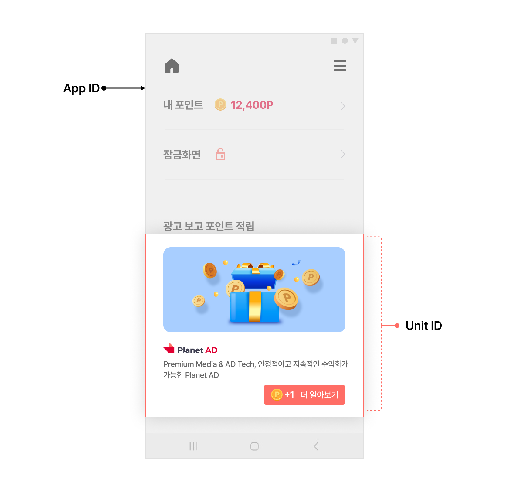

Planet AD Android SDK를 연동하기 위해서 아래 사항을 준비해야 합니다.

|ID|설명|비고|
|-|-|-|
App ID|앱별 고유 식별자|발급이 필요한 경우는 Planet AD 담당자에게 문의 바랍니다.
Unit ID|광고 지면별 고유 식별자||

### 포인트 적립 서버 연동


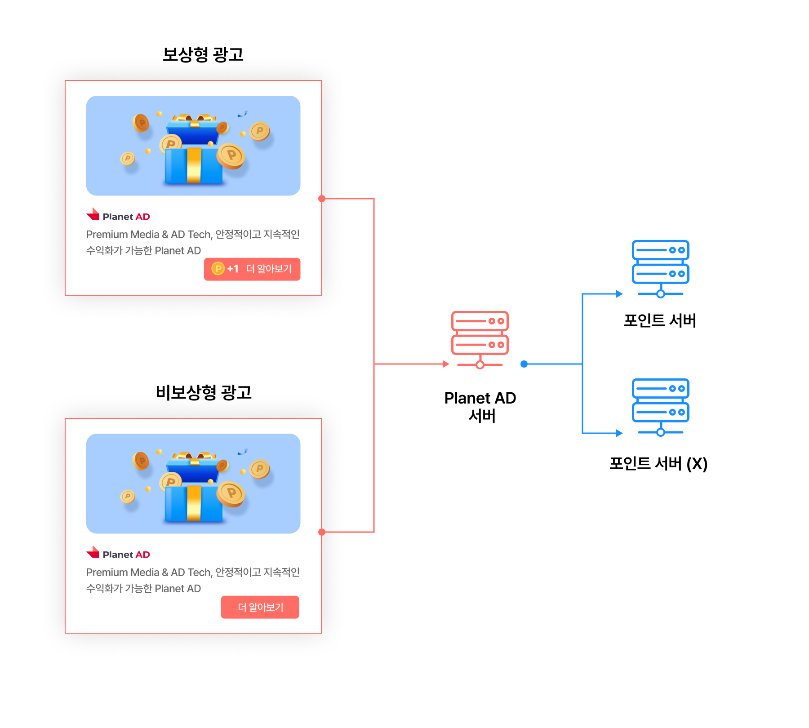

SKP 광고는 참여 시 포인트를 지급하는 보상형 광고와 지급하지 않는 비보상형 광고가 있습니다.<br>
사용자가 보상형 광고에 참여하면 포인트 적립 요청을 처리할 수 있는 서버가 필요할 수 있습니다. 연동하는 방식에 따라 차이가 있으니, 아래 표를 확인하여 진행하시기 바랍니다.


|광고 포인트 지급 여부|자체 포인트 시스템 여부|설명|
|-|-|-|
지급하지 않음|-|비보상형 광고로 연동합니다. 서버 간 연동은 불필요합니다. 
지급을 원함|없음|네이버페이 포인트 등 제3의 포인트 시스템을 이용하여 포인트를 부여할 수 있습니다.<br>PlanetAD 담당자에게 문의하시기 바랍니다.
||있음|포스트백 연동을 통해 참고하여 서버간 연동 진행할 수 있습니다.<br>세부 연동에 관련되서는 PlanetAD 담당자에게 문의하시기 바랍니다.

### SDK 설치

1. 프로젝트 레벨의 build.gradle 파일에 PlanetAD SDK 저장소를 설정하세요.
```
// 프로젝트 레벨의 build.gradle
allprojects {
    repositories {
        ...생략...
        // Planet AD 저장소
        maven { url "https://asia-northeast3-maven.pkg.dev/planetad-379102/planetad" }
        ...생략...
    }
}
```
2. 모듈 레벨의 build.gradle 파일에 PlanetAD SDK 라이브러리를 설정하세요.
```
// 모듈 레벨의 build.gradle
dependencies {
    ...생략...
    // Planet AD Benefit SDK
    implementation ("com.skplanet.sdk.ad:skpad-benefit:1.10.1")
     ...생략...
}
```
3. 모듈 레벨의 build.gradle 파일에 compileSdkVersion과 targetSdkVersion을 34로 업데이트하세요.
```
android {
    compileSdkVersion 34
    defaultConfig {
        targetSdkVersion 34
    }
}
```

이 단계에서 문제가 발생했다면 PlanetAD 담당 매니저에 문의하시기 바랍니다.

### SDK 초기화
#### APP ID 추가
<p>AndroidManifest.xml에 APP_ID 를 추가합니다.</p>
아래 예시의 app-pub-000000000000 중 숫자 부분(000000000000)을 발급받은 APP_ID로 대체합니다.<br><br>

예시) 발급받은 APP_ID 가 123456789123 일 경우, android:value="app-pub-123456789123"
```xml
<manifest>
    <application>
        <!-- Planet AD SDK App id -->
        <meta-data
            android:name="com.skplanet.APP_KEY"
            android:value="app-pub-000000000000" />
    </application>
</manifest>
```

#### SKPAdBenefit 초기화
Application의 onCreate에서 SKPAdBenefit을 초기화합니다.
```
public class App extends Application {
    @Override
    public void onCreate() {
        super.onCreate();
        // SKPAdBenefit 초기화
        final SKPAdBenefitConfig skpAdBenefitConfig = new SKPAdBenefitConfig.Builder(context)
        .build();
        SKPAdBenefit.init(this, skpAdBenefitConfig);
    }
}
```

#### 사용자 프로필 설정
<p>사용자 프로필은 광고 할당 요청 전에 등록해야 합니다. 필수 정보를 등록하지 않으면 광고 할당이 되지 않습니다.</p>
권장 정보를 제외할 경우에는 유저 정보 기반의 광고가 할당에서 제외됩니다.

|유저 프로필|설명|비고|
|-|-|-|
필수 userId|사용자 고유 식별자|<p>서비스 도중에 변하지 않는 값</p>앱 삭제 후 재설치 시 유저 ID 값이 변경되는 등, 고정된 유저 ID를 사용하지 못하는 경우 PlanetAD 담당자에게 문의바랍니다.
권장 gender|사용자의 성별|<li>남성: UserProfile.Gender.MALE</li><li>여성: UserProfile.Gender.FEMALE</li>
권장 birthYear|사용자의 출생연도|-

```
// 유저 정보를 등록합니다.
final UserProfile.Builder builder = new UserProfile.Builder(SKPAdBenefit.getUserProfile());
final UserProfile userProfile = builder
    .userId("USER_ID")
    .gender(UserProfile.Gender.MALE)
    .birthYear(1985)
    .build();
SKPAdBenefit.setUserProfile(userProfile);
 
 
 
// SDK에 등록한 사용자 프로필을 삭제합니다.
SKPAdBenefit.setUserProfile(null);
```

#### 광고 지면 추가
Planet AD Android SDK 연동을 위한 기본적인 설정은 완료하였습니다. 각각의 지면 별 여동 가이드에 따라 진행하시기 바랍니다.

##### Feed


Feed Type
리스트 형태의 광고 지면입니다.


#### Native
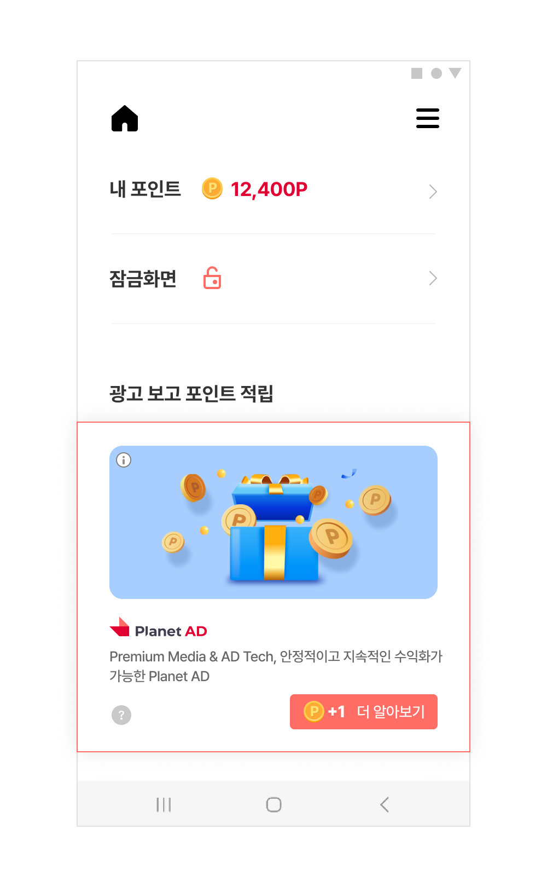

[Native 연동하기](#Native-기본설정)
커스텀 광고 지면입니다.
배너 타입의 광고도 Native 지면으로 연동할 수 있습니다. 지면 크기별 Native 광고 layout 가이드를 참고하시기 바랍니다.

#### Interstitial
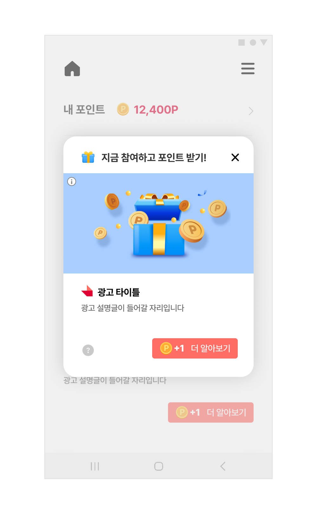

[Interstitial 연동하기](#Interstial-기본설정)
전면 광고 지면입니다.

## Feed 기본설정

### 개요
Feed 지면은 광고를 리스트 형식으로 제공하는 지면입니다.


### 준비 사항
- [시작하기](#시작하기) 적용 완료
- Feed 지면에 사용할 Unit ID (이하 YOUR_FEED_UNIT_ID)


### Feed 지면 초기화
<p>BuzzAdBenefitConfig에 FeedConfig를 추가합니다.</p>

```java
public class App extends Application {
    @Override
    public void onCreate() {
        super.onCreate();
        
        final FeedConfig feedConfig = new FeedConfig.Builder(context, "YOUR_FEED_UNIT_ID")
            .feedHeaderViewAdapterClass(DefaultFeedHeaderViewAdapter.class)
            .build();
            
        final BuzzAdBenefitConfig buzzAdBenefitConfig = new BuzzAdBenefitConfig.Builder(context)
            .setFeedConfig(feedConfig)
            .build();
            
        BuzzAdBenefit.init(this, buzzAdBenefitConfig);

        ...
    }
}
```

FeedConfig를 사용하여 Feed 지면의 기능과 디자인을 변경할 수 있으며, [고급 설정](#Feed-고급설정)을 참고하여 Feed 지면의 기능과 변경 방법을 확인할 수 있습니다.

### Feed 지면 표시


바텀시트 형태의 Feed지면을 표시합니다. 광고를 할당 받지 않은 상태에서는 Feed 지면이 사용자에게 노출된 후에 자동으로 할당받습니다.
- 단, 할당 받는 도중에는 "참여할 수 있는 광고가 없습니다." 라는 이미지가 보일 수 있습니다.
```java
final FeedHandler feedHandler = new FeedHandler(context, "YOUR_FEED_UNIT_ID");
feedHandler.startFeedActivity(this);
```

startFeedActivity()를 반복해서 호출하더라도 광고는 갱신되지 않고 동일한 광고가 보입니다. 새로운 광고를 할당하기 위해서는 FeedHandler 인스턴스를 다시 생성하거나, preload() 를 다시 호출해야합니다.
사용자에게 다른 형태로 Feed지면을 제공하기 위해서 프래그먼트로 Feed 연동을 참고하시기 바랍니다.

### 광고 할당 받기
preload를 호출하여 광고를 할당받을 수 있습니다. preload를 반복해서 호출하면 광고가 갱신됩니다.<br>
개인 정보 처리 방침에 동의하지 않고 preload를 호출하면 광고 할당을 할 수 없습니다. SDK에서 제공하는 개인 정보 처리 방침 UI를 이용하여 preload를 호출하기 이전에 개인 정보 처리 방침에 대해 동의를 받을 수 있습니다.<br>
다음은 광고 할당 후 Feed 지면을 표시하는 예시입니다. 다음과 같이 구현하면 사용자가 Feed 지면에 진입하기 전에 광고 할당이 보장되기 때문에 "참여할 수 있는 광고가 없습니다."는 이미지를 보이지 않습니다.

```java
final FeedHandler feedHandler = new FeedHandler(context, "YOUR_FEED_UNIT_ID");
feedHandler.preload(new FeedHandler.FeedPreloadListener() {
    @Override
    public void onPreloaded() {
        int feedAdSize = feedHandler.getSize(); // 광고의 개수
        int feedTotalReward = feedHandler.getTotalReward(); // 적립 가능한 총 포인트 금액
        feedHandler.startFeedActivity(context);
    }
 
    @Override
    public void onError(AdError error) {
        // 광고가 없을 경우 호출됩니다. error를 통해 원인을 알 수 있습니다
    }
});
```

## Feed 고급설정

### 개요
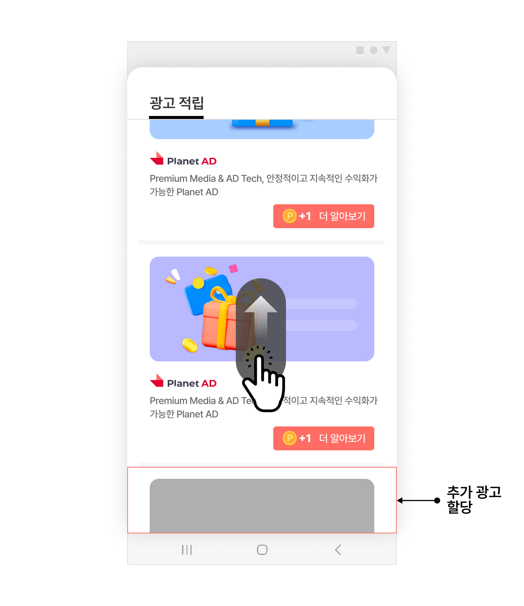

이 문서에서 가이드 하는 내용은 SKPAd Android SDK의 Feed 지면의 기능을 설명하고 각 기능을 변경하는 방법을 설명합니다.<br>
이하 가이드에서 커스터마이징을 위해 구현 클래스를 정의합니다. 구현하는 클래스는 아래의 조건을 충족해야 합니다. 아래 조건을 충족하지 않는 경우 커스터마이징이 적용되지 않습니다.

- 구현 클래스는 내부 클래스(Inner 클래스)가 아니어야 합니다.
- 만일 내부 클래스로 생성을 해야 할 경우, public 정적(static) 클래스로 구현해야 합니다.


### Fragment로 Feed 연동

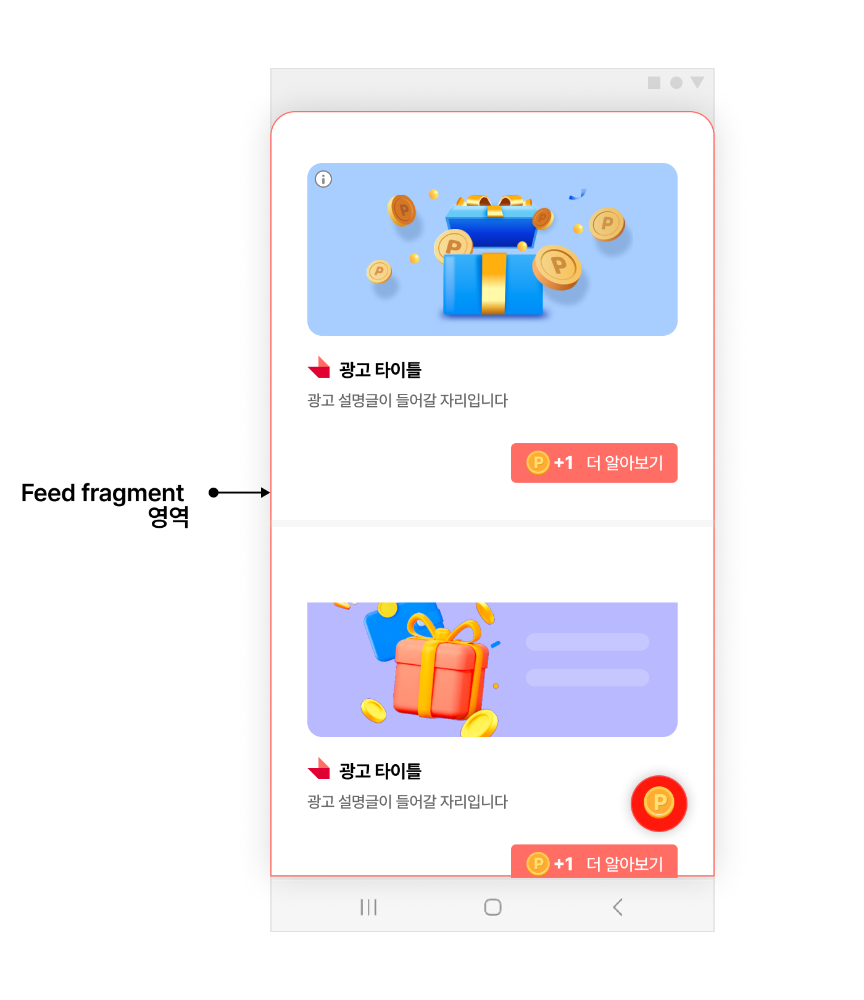

Feed 지면은 기본적으로 제공되는 액티비티로 제공됩니다. 더 다양한 연동 방식을 지원하기 위해 액티비티가 아닌 프래그먼트로 Feed 지면을 연동할 수 있습니다.<br> 프래그먼트를 추가하고자 하는 액티비티에 프래그먼트를 추가하고, 해당 액티비티의 onCreate에서 프래그먼트를 초기화합니다.<br>
다음은 FeedFragment를 연동하는 예시입니다.

```xml

<!-- your_activity_layout.xml -->
...생략...
<!-- FeedFragment 추가 -->
<fragment
    android:id="@+id/feed_fragment"
    android:name="com.skplanet.skpad.benefit.presentation.feed.FeedFragment"
    android:layout_width="match_parent"
    android:layout_height="match_parent" />
```
```java
...생략...
class YourActivity extends Actvity {
 
    private FeedHandler feedHandler;
 
    @Override
    public void onCreate() {
        super.onCreate();
        ...생략...
 
        // 광고를 새로 받기 위해 필요한 부분입니다.
        feedHandler = new FeedHandler(context, "YOUR_FEED_UNIT_ID");
 
        // FeedFragment 초기화
        final FeedFragment feedFragment = (FeedFragment) getSupportFragmentManager().findFragmentById(R.id.feed_fragment);
        if (feedFragment != null) {
            feedFragment.init(context, "YOUR_FEED_UNIT_ID");
        }
    }
    ...생략...
}
```


### 툴바 영역 자체 구현
Feed 툴바 영역의 디자인을 변경할 수 있습니다. 툴바 영역을 UI를 변경하는 방법은 2가지입니다. 아래 2가지 방법 중 하나를 선택하여 연동합니다.

- SDK에서 기본으로 제공하는 UI를 이용하는 방법
- 직접 구현한 Custom View를 이용하는 방법

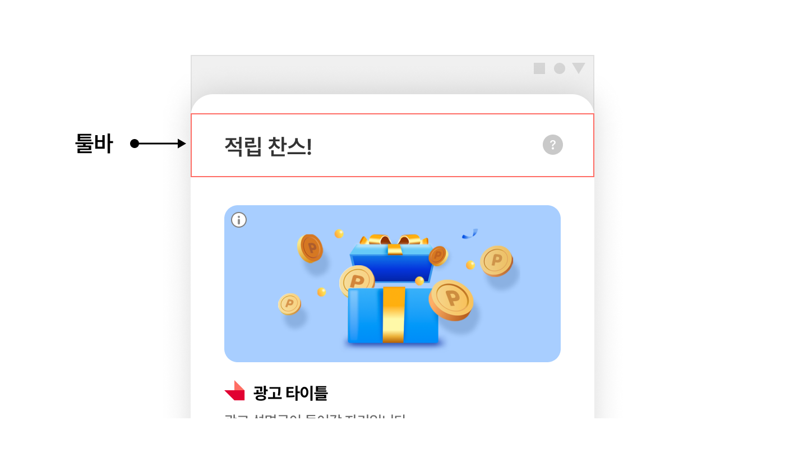

#### SDK에서 기본으로 제공하는 UI를 이용하는 방법
SKPAd Android SDK에서 제공하는 기본 UI를 수정하여 타이틀 혹은 배경색을 변경할 수 있습니다. 다음은 기본 UI를 수정하여 툴바를 변경하는 예시입니다.<br><br>
DefaultFeedToolbarHolder의 상 클래스를 구현하고, 기본 UI(FeedToolbar)를 사용하여 타이틀 혹은 배경색을 변경합니다. 그리고 FeedConfig에 구현한 클래스를 추가합니다.

``` Java
public class YourFeedToolbarHolder extends DefaultFeedToolbarHolder {
    @Override
    public View getView(Activity activity, @NonNull final String unitId) {
        toolbar = new FeedToolbar(activity); // FeedToolbar 에서 제공하는 기본 Template 사용
        toolbar.setTitle("YourFeedToolbarHolder");
        toolbar.setIconResource(R.drawable.your_icon);
        toolbar.setBackgroundColor(Color.parseColor("#123456"));
        addInquiryMenuItemView(activity); // 문의하기 버튼은 이 함수를 통해 간단하게 추가 가능합니다.
        addSettingsMenuItemView(activity); // 세팅 버튼은 이 함수를 통해 간단하게 추가 가능합니다.
        addRightMenuItemView1(activity); // custom 버튼 추가
        return toolbar;
    }
 
    // custom 버튼 추가는 DefaultMenuLayout 를 사용하여 View 를 생성하고
    // toolbar.addRightMenuButton 를 사용하여 toolbar 에 추가합니다.
    private void addRightMenuItemView1(@NonNull final Activity activity) {
        MenuLayout menuLayout = new DefaultMenuLayout(activity, R.mipmap.ic_launcher);
        menuLayout.setOnClickListener(new View.OnClickListener() {
 
            @Override
            public void onClick(View v) {
                showInquiry(); // showInquiry 를 호출하여 문의하기 페이지로 연결합니다.
            }
        });
        toolbar.addRightMenuButton(menuLayout);
    }
}
```

```Java
final FeedConfig feedConfig = new FeedConfig.Builder(context, "YOUR_FEED_UNIT_ID")
    .feedToolbarHolderClass(YourFeedToolbarHolder.class)
    .build();
```

#### 직접 구현한 Custom View를 이용하는 방법
SKPAd Android SDK에서 제공하는 UI를 이용하지 않고 직접 구현하여 변경할 수 있습니다. 다음은 Custom View를 직접 생성하여 툴바를 변경하는 예시입니다.<br>
DefaultFeedToolbarHolder의 상속 클래스를 구현하고, Custom View(your_toolbar_header_layout)를 구현하여 툴바 영역에 View를 구현합니다. 그리고 FeedConfig에 구현한 클래스를 추가합니다.<br>

```java
public class YourFeedToolbarHolder extends DefaultFeedToolbarHolder {
    @Override
    public View getView(final Activity activity, @NonNull final String unitId) {
        final LayoutInflater inflater = (LayoutInflater) activity.getSystemService(Context.LAYOUT_INFLATER_SERVICE);
        return inflater.inflate(R.layout.your_toolbar_header_layout, null);
    }
 
    @Override
    public void onTotalRewardUpdated(int totalReward) {
    }
}
```

```java
final FeedConfig feedConfig = new FeedConfig.Builder(context, "YOUR_FEED_UNIT_ID")
    .feedToolbarHolderClass(YourFeedToolbarHolder.class)
    .build();
```

Custom View의 높이가 안드로이드 액티비티의 기본 액션바 높이와 다를 경우, 직접 구현한 View가 정상적으로 보이지 않을 수 있습니다. 이 경우에는 액티비티에 Theme 을 설정하여 액션바 높이를 수정해야 합니다.<br>
다음은 Theme을 설정하여 액션바의 높이를 수정하는 예시입니다.

```xml
// AndroidManifest.xml
...
<activity
    android:name="com.skplanet.skpad.benefit.presentation.feed.FeedBottomSheetActivity"
    android:theme="@style/CustomActivityTheme"
    tools:replace="android:theme"/>
...
```

```xml
// styles.xml
<style name="CustomActivityTheme" parent="Theme.SKPAd.RotatableBottomSheet">
    <item name="actionBarSize">DESIRED_ACTION_BAR_HEIGHT</item>
</style>
```

### 헤더 영역에 프로필 입력 배너 표시

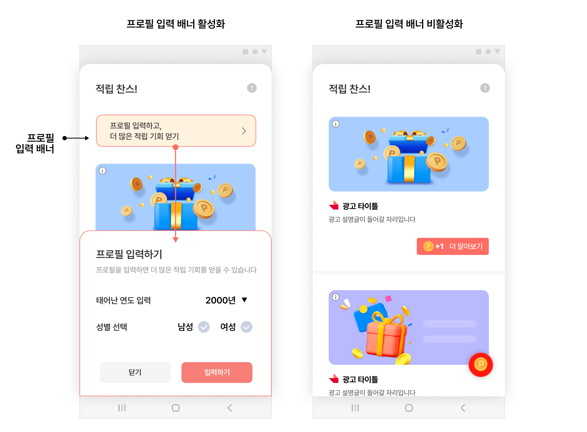

사용자의 출생연도와 성별 정보를 설정하지 않으면 헤더 영역에 프로필 정보 입력 배너가 표시됩니다.<br>
사용자의 정보 제공 여부와 무관하게 배너를 표시하지 않을 수 있습니다. 이 기능을 사용하기 위해서는 FeedConfig.feedHeaderViewAdapterClass를 설정하지 않아야 합니다.<br>
다음은 FeedConfig를 수정하여 프로필 입력 배너를 표시하지 않는 예시입니다.

```java
final FeedConfig feedConfig = new FeedConfig.Builder(context, "YOUR_FEED_UNIT_ID")
    .profileBannerEnabled(false) // 프로필 배너 미노출
    .build();
```


### 적립 가능 금액 표시
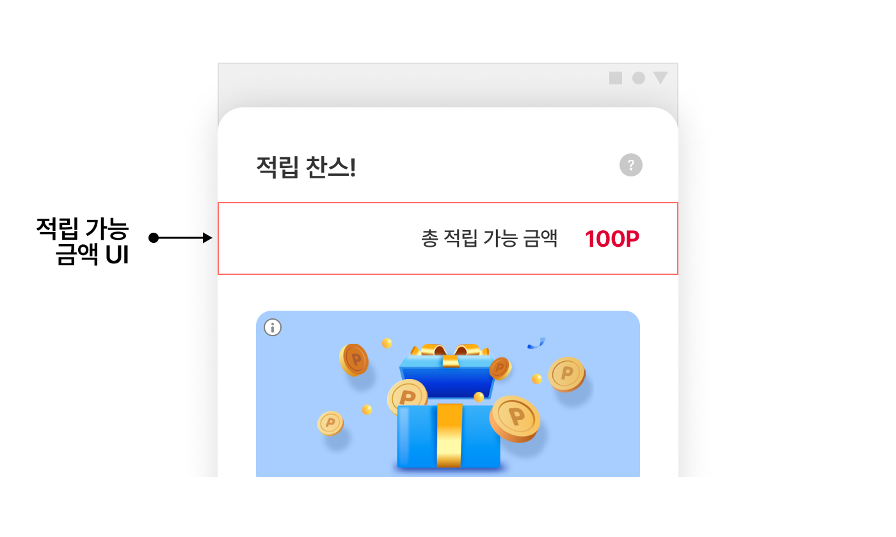

헤더 영역에 SKPAd Android SDK 에서 기본으로 제공하는 UI를 사용해 "총 적립 가능 금액"을 사용자에게 보여줍니다.<br>
UI를 변경하기 위해서는 헤더 영역을 자체 구현해야 합니다. 헤더 영역을 자체 구현하는 방법은 아래 헤더 영역 자체 구현을 참고하시기 바랍니다.

```java
final FeedConfig feedConfig = new FeedConfig.Builder(context, "YOUR_FEED_UNIT_ID")
    .feedHeaderViewAdapterClass(DefaultFeedHeaderViewAdapter.class)
    .build();
```

### 헤더 영역 자체 구현
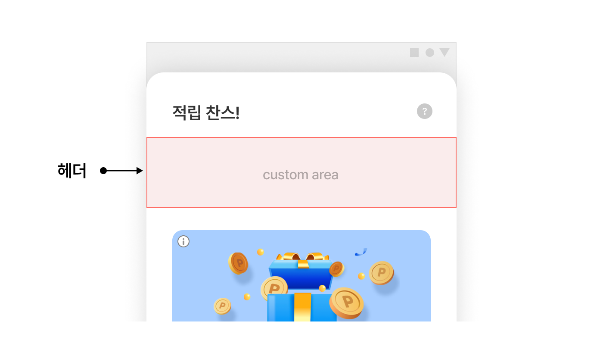

Feed 헤더 영역을 자유로이 활용할 수 있습니다. 예를 들어, Feed 영역을 설명하는 공간으로도 활용할 수 있습니다. (단, 헤더 영역을 필요에 따라 직접 구현한 UI 에 적립 가능한 금액을 표시할 수 있습니다. onBindView를 통해 지급 가능한 금액(reward)을 알 수 있습니다.<br>
다음은 헤더 영역을 변경하는 예시입니다.<br>
FeedHeaderViewAdapter의 구현 클래스를 구현하고, 구현한 Custom View(your_feed_header_layout)를 헤더영역에 구현합니다. 그리고 FeedConfig에 구현한 클래스를 추가합니다.

```
public class CustomFeedHeaderViewAdapter implements FeedHeaderViewAdapter {
    @Override
    public View onCreateView(final Context context, final ViewGroup parent) {
        final LayoutInflater inflater = (LayoutInflater) context.getSystemService(Context.LAYOUT_INFLATER_SERVICE);
        return inflater.inflate(R.layout.your_feed_header_layout, parent, false);
    }
 
    @Override
    public void onBindView(final View view, final int reward) {
        // Display total reward on the header if needed.
        val textView: TextView = view.findViewById(R.id.your_textview)
        textView.text = String.format("리워드 %d원", reward)
    }
 
    @Override
    public void onDestroyView() {
        // Use this this callback for clearing memory
    }
}
```

```
final FeedConfig feedConfig = new FeedConfig.Builder(context, "YOUR_FEED_UNIT_ID")
    .feedHeaderViewAdapterClass(CustomFeedHeaderViewAdapter.class)
    .build();
```

### 광고 UI 자체 구현
Feed 지면에서는 사용자가 UI를 변경하는 방법을 제공합니다.


다음은 광고의 디자인을 변경하는 방법을 설명하는 예시입니다.


|항목|설명|비고|
|-|-|-|
`필수` 광고 제목|광고의 제목|<li>최대 10자</li><li>생략 부호로 일정 길이 이상은 생략 가능</li>
`필수`광고 소재|이미지, 동영상 등 광고 소재|<li>com.skplanet.skpad.benefit.presentation.media.MediaView 사용 필수</li><li>종횡비 유지 필수</li><li>여백 추가 가능</li><li>이미지 사이즈 1200x627 [px]</li>
`필수` 광고 설명|광고에 대한 상세 설명|<li>생략 부호로 일정 길이 이상은 생략 가능</li><li>최대 40자</li>
`필수` 광고주 아이콘|광고주 아이콘 이미지|<li>종횡비 유지 필수</li><li>이미지 사이즈 80x80 [px]</li>
`필수` CTA 버튼|광고의 참여를 유도하는 버튼|<li>com.skplanet.skpad.benefit.presentation.media.CtaView 사용 필수</li><li>최대 7자</li><li>생략 부호로 일정 길이 이상은 생략 가능</li>
`필수` 맞춤형 광고 정보 버튼|광고 표시 이유에 대한 가이드 기능을 제공|<li>com.skplanet.skpad.benefit.presentation.guide.AdInfoView 사용 필수</li><li>icon Image 교체 가능</li><li>필수 추가 필요</li>
`권장` 문의하기 버튼|VOC대응을 위한 Planet AD Report Web Page로 이동하는 기능 제공|<li>com.skplanet.skpad.benefit.presentation.guide.InquiryView 사용 필수</li><li>icon Image 교체 가능</li>
`권장` 광고 알림 문구|Sponsored view|예시) "광고", "ad", "스폰서", "Sponsored"

<p>광고용 NativeAdView의 규격에 맞는 레이아웃(your_feed_ad.xml)을 구현합니다.</p>

```xml
// your_feed_ad.xml
<com.skplanet.skp.benefit.presentation.nativead.NativeAdView
    android:id="@+id/native_ad_view" ...>
 
    // AdInfoView, InquiryView, MediaView와 CtaView는 NativeAdView의 하위 컴포넌트로 구현해야합니다.
 
    <LinearLayout ... >
        <com.skplanet.skp.benefit.presentation.media.MediaView
            android:id="@+id/mediaView" ... />
        <TextView
            android:id="@+id/textTitle" ... />
        <TextView
            android:id="@+id/textDescription" ... />
        <ImageView
            android:id="@+id/imageIcon" ... />
        <com.skplanet.skp.benefit.presentation.media.CtaView
            android:id="@+id/ctaView" ... />

        <com.skplanet.skpad.benefit.presentation.guide.AdInfoView
            android:id="@+id/information" ... />

        <com.skplanet.skpad.benefit.presentation.guide.InquiryView
            android:id="@+id/inquiryButton" ... />
    </LinearLayout>
 
</com.skplanet.skp.benefit.presentation.nativead.NativeAdView>
```


AdsAdapter의 상속 클래스를 구현합니다. 구현한 상속 클래스의 onCreateViewHolder에서 your_feed_ad.xml을 사용하여 NativeAdView를 생성합니다.<br>
그리고 FeedConfig에 구현한 YourAdsAdapter를 설정합니다. <br>
CTA 버튼 커스터마이징은 CTA 변경을 참고하시기 바랍니다. (아래 예시에서 아이콘을 그리기 위해 ImageLoader 라이브러리를 사용하였습니다.)

```
public class YourAdsAdapter extends AdsAdapter<AdsAdapter.NativeAdViewHolder> {
 
    @Override
    public NativeAdViewHolder onCreateViewHolder(ViewGroup parent, int viewType) {
        final LayoutInflater inflater = LayoutInflater.from(parent.getContext());
        final NativeAdView feedNativeAdView = (NativeAdView) inflater.inflate(R.layout.your_feed_ad, parent, false);
        return new NativeAdViewHolder(feedNativeAdView);
    }
 
    @Override
    public void onBindViewHolder(NativeAdViewHolder holder, NativeAd nativeAd) {
        super.onBindViewHolder(holder, nativeAd);
        final NativeAdView view = (NativeAdView) holder.itemView;
 
        final Ad ad = nativeAd.getAd();
         
        // create ad component
        final MediaView mediaView = view.findViewById(R.id.mediaView);
        final TextView titleView = view.findViewById(R.id.textTitle);
        final ImageView iconView = view.findViewById(R.id.imageIcon);
        final TextView descriptionView = view.findViewById(R.id.textDescription);
        final CtaView ctaView = view.findViewById(R.id.ctaView);
        final CtaPresenter ctaPresenter = new CtaPresenter(ctaView); // CtaView should not be null
        final AdInfoView adInfoView = view.findViewById(R.id.information)
        final InquiryView inquiryView = view.findViewById(R.id.inquiryButton)
 
        // data binding
        ctaPresenter.bind(nativeAd);
 
        if (mediaView != null) {
            mediaView.setCreative(ad.getCreative());
            mediaView.setVideoEventListener(new VideoEventListener() {
                // Override and implement methods         
            });
        }
         
        if (titleView != null) {
            titleView.setText(ad.getTitle());
        }
 
        if (iconView != null) {
            ImageLoader.getInstance().displayImage(ad.getIconUrl(), iconView);
        }
        if (descriptionView != null) {
            descriptionView.setText(ad.getDescription());
        }
 
        // clickableViews에 추가된 UI 컴포넌트를 클릭하면 광고 페이지로 이동합니다.
        final Collection<View> clickableViews = new ArrayList<>();
        clickableViews.add(ctaView);
        clickableViews.add(mediaView);
        clickableViews.add(titleView);
        clickableViews.add(descriptionView);
         
        // 광고 콜백 이벤트를 수신할 수 있습니다.
        // view.setNativeAd 보다 전에 호출해야 합니다.
        view.addOnNativeAdEventListener(new NativeAdView.OnNativeAdEventListener() {
             
            @Override
            public void onImpressed(final @NonNull NativeAdView view, final @NonNull NativeAd nativeAd) {
 
            }
 
            @Override
            public void onClicked(@NonNull NativeAdView view, @NonNull NativeAd nativeAd) {
                ctaPresenter.bind(nativeAd);
            }
 
            @Override
            public void onRewardRequested(@NonNull NativeAdView view, @NonNull NativeAd nativeAd) {
 
            }
 
            @Override
            public void onRewarded(@NonNull NativeAdView nativeAdView, @NonNull NativeAd nativeAd, @Nullable RewardResult rewardResult) {
 
            }
 
            @Override
            public void onParticipated(final @NonNull NativeAdView view, final @NonNull NativeAd nativeAd) {
                ctaPresenter.bind(nativeAd);
            }
        });
         
        view.setMediaView(mediaView);
        view.setClickableViews(clickableViews);
        view.setNativeAd(nativeAd);

        view.setAdInfoView(adInfoView);
        view.setInquiryView(inquiryView);
    }
}
```

```
final FeedConfig feedConfig = new FeedConfig.Builder(context, "YOUR_FEED_UNIT_ID")
    .adsAdapterClass(YourAdsAdapter.class)
    .build();
```


### 기본 포인트 지급 안내 UI 자체 구현
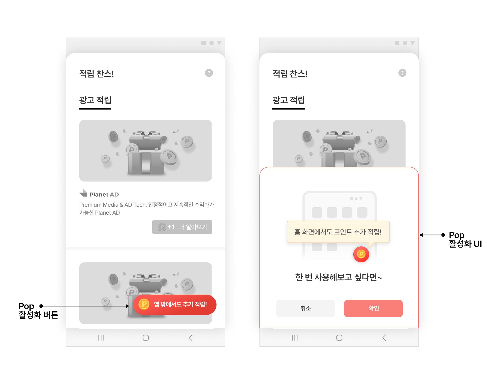

사용자가 Feed 지면에 접근하면 일정 주기로 기본 포인트를 지급합니다. 기본 포인트 지급 알림 UI는 위의 이미지와 같습니다. <br>
기본 포인트 지급 알림 UI를 수정하여 좀 더 사용자 경험을 개선할 수 있습니다.<br>
다음은 기본 포인트 지급 알림 UI 를 수정하는 예시입니다.
```
public class YourFeedFeedbackHandler extends DefaultFeedFeedbackHandler {
    
   @Override
   @NotNull
   public View getBaseRewardNotificationView(@NotNull Context context, int reward) {
        View view = LayoutInflater.from(context).inflate(R.layout.your_layout, null); 
        return view
   }
}
```
```
final FeedConfig feedConfig = new FeedConfig.Builder(context, "YOUR_FEED_UNIT_ID")
      .feedFeedbackHandler(YourFeedFeedbackHandler.class)
      .build();
```

### 광고 미할당 안내 디자인 자체 구현하기
Feed 지면에 진입한 시점에 노출할 광고가 없다면 광고 미할당 안내 UI가 표시됩니다. 미할당 안내 디자인은 자체 구현하여 변경할 수 있습니다.

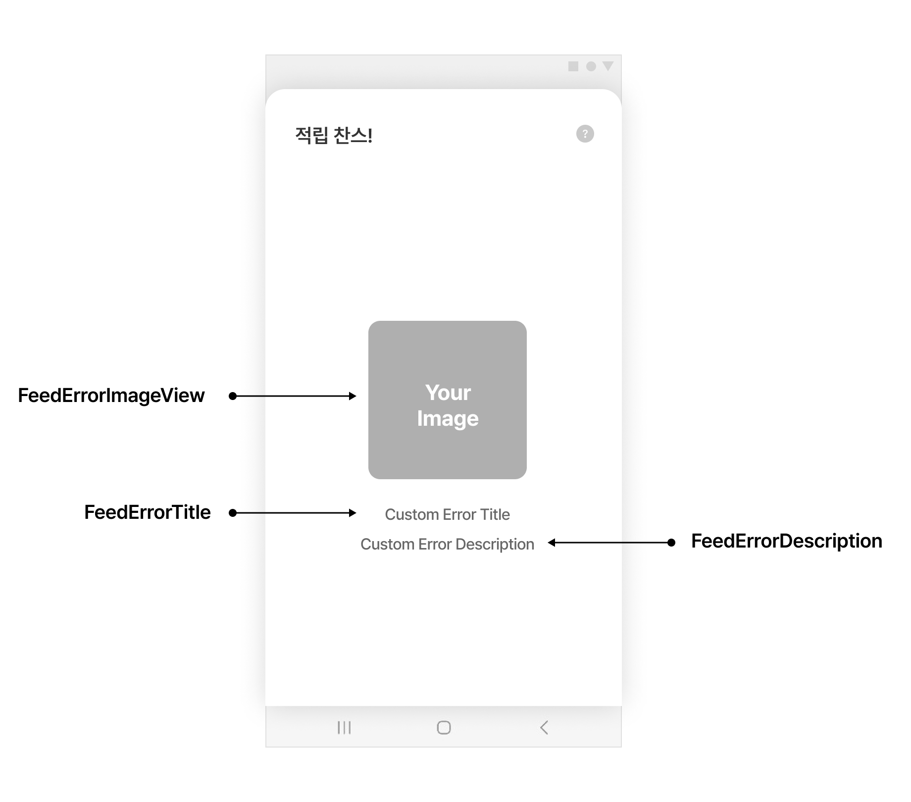

광고 미할당 안내 디자인을 직접 구현하려면 다음의 절차를 따르세요.

1. Feed 지면에 광고가 할당되지 않았을 때의 화면에 추가할 에러 이미지(feedErrorImageView), 타이틀(feedErrorTitle), 상세 설명(feedErrorDescription) 레이아웃을 작성하세요.
```
<!-- custom_feed_error_view.xml -->
 
<LinearLayout xmlns:android="http://schemas.android.com/apk/res/android"
    android:layout_width="match_parent"
    android:layout_height="wrap_content"
    android:gravity="center_vertical"
    android:orientation="vertical"
    android:padding="40dp">
 
    <ImageView
        android:id="@+id/feedErrorImageView"
        android:layout_width="match_parent"
        android:layout_height="wrap_content"/>
 
    <TextView
        android:id="@+id/feedErrorTitle"
        android:layout_width="wrap_content"
        android:layout_height="wrap_content"
        android:layout_gravity="center_horizontal"
        android:layout_marginTop="32dp"
        android:textColor="@color/bz_text_emphasis"
        android:textSize="16sp" />
 
    <TextView
        android:id="@+id/feedErrorDescription"
        android:layout_width="wrap_content"
        android:layout_height="wrap_content"
        android:layout_gravity="center_horizontal"
        android:layout_marginTop="8dp"
        android:textAlignment="center"
        android:textColor="@color/bz_text_description"
        android:textSize="14sp" />
 
</LinearLayout>
```

2. FeedErrorViewHolder를 구현하는 커스텀 클래스 CustomErrorView를 새로 생성하고, 자동 완성되는 GetView() 메소드를 다음과 같이 구현하세요.

```
public class CustomErrorView extends FeedErrorViewHolder {
    @NonNull
    @Override
    public View getErrorView(@NonNull Activity activity) {
        // TODO: 1번에서 생성한 custom_feed_error_view 레이아웃을 inflate
        View errorView = activity.getLayoutInflater().inflate(R.layout.custom_feed_error_view, null, false);
        final ImageView errorImageView = errorView.findViewById(R.id.feedErrorImageView);
        final TextView errorTitle = errorView.findViewById(R.id.feedErrorTitle);
        final TextView errorDescription = errorView.findViewById(R.id.feedErrorDescription);
 
        errorImageView.setImageResource(R.drawable.bz_ic_feed_profile_coin); // 에러 이미지 설정
        errorTitle.setText("타이틀: 광고가 없습니다. "); // 에러 타이틀 텍스트 설정
        errorDescription.setText("디스크립션: 할당된 광고가 없습니다!"); // 에러 상세 텍스트 설정
         
        return errorView;
    }
}
```
3. FeedConfig의 feedErrorViewHolderClass 속성에 이전 단계에서 생성한 CustomErrorView 클래스를 추가하세요.
```
// Feed 지면 초기화
// TODO: feedErrorViewHolderClass 속성에 2번에서 생성한 CustomErrorView 클래스를 설정합니다.
final FeedConfig feedConfig = new FeedConfig.Builder(YOUR_FEED_UNIT_ID)
                .feedErrorViewHolderClass(CustomErrorView.class)
                .build();
```

## Native 기본설정

### 개요
본 가이드는 PlanetAD Android SDK의 Native 지면을 연동하는 방법은 안내합니다. Native 지면은 광고 지면 레이아웃을 직접 구성한 후, SKP 서버로부터 광고 데이터를 할당받아 광고 지면에 표시합니다.


### 준비사항
- [시작하기](#시작하기) 적용 완료
- Native 지면에 사용할 Unit ID (이하 YOUR_NATIVE_UNIT_ID)

### 광고 레이아웃 구성
Native 지면은 광고 레이아웃을 자유롭게 구성하여 노출하는 지면입니다. Activity 또는 Fragment 레이아웃 내에 아래 구조에 맞게 Native 광고 레이아웃을 구성합니다.


|항목|설명|비고|
|-|-|-|
`필수` 광고 제목|광고의 제목|<li>최대 10자</li><li>생략 부호로 일정 길이 이상은 생략 가능</li>
`필수`광고 소재|이미지, 동영상 등 광고 소재|<li>com.skplanet.skpad.benefit.presentation.media.MediaView 사용 필수</li><li>종횡비 유지 필수</li><li>여백 추가 가능</li><li>이미지 사이즈 1200x627 [px]</li>
`필수` 광고 설명|광고에 대한 상세 설명|<li>생략 부호로 일정 길이 이상은 생략 가능</li><li>최대 40자</li>
`필수` 광고주 아이콘|광고주 아이콘 이미지|<li>종횡비 유지 필수</li><li>이미지 사이즈 80x80 [px]</li>
`필수` CTA 버튼|광고의 참여를 유도하는 버튼|<li>com.skplanet.skpad.benefit.presentation.media.CtaView 사용 필수</li><li>최대 7자</li><li>생략 부호로 일정 길이 이상은 생략 가능</li>
`필수` 맞춤형 광고 정보 버튼|광고 표시 이유에 대한 가이드 기능을 제공|<li>com.skplanet.skpad.benefit.presentation.guide.AdInfoView 사용 필수</li><li>icon Image 교체 가능</li><li>필수 추가 필요</li>
`권장` 문의하기 버튼|VOC대응을 위한 Planet AD Report Web Page로 이동하는 기능 제공|<li>com.skplanet.skpad.benefit.presentation.guide.InquiryView 사용 필수</li><li>icon Image 교체 가능</li>
`권장` 광고 알림 문구|Sponsored view|예시) "광고", "ad", "스폰서", "Sponsored"


광고 레이아웃의 최상위 컴포넌트는 NatvieAdView이며, 상기의 컴포넌트는 NativeAdView의 하위 컴포넌트로 구현해야 합니다.
다음은 NativeAdView의 레이아웃 예시입니다.

```
<com.skplanet.skpad.benefit.presentation.nativead.NativeAdView
    android:id="@+id/native_ad_view"
    ...생략... >
     
    // AdInfoView, InquiryView, MediaView와 CtaView는 NativeAdView의 하위 컴포넌트로 구현해야합니다.
   
    <com.skplanet.skpad.benefit.presentation.media.MediaView
        android:id="@+id/mediaView"
        ...생략... />
    <TextView
        android:id="@+id/textTitle"
        ...생략... />
    <TextView
        android:id="@+id/textDescription"
        ...생략... />
    <ImageView
        android:id="@+id/imageIcon"
        ...생략... />
    <com.skplanet.skpad.benefit.presentation.media.CtaView
        android:id="@+id/ctaView"
        ...생략... />
     <com.skplanet.skpad.benefit.presentation.guide.AdInfoView
        android:id="@+id/information" ... />

    <com.skplanet.skpad.benefit.presentation.guide.InquiryView
        android:id="@+id/inquiryButton" ... />

    ...생략...
</com.skplanet.skpad.benefit.presentation.nativead.NativeAdView>
```

Native 지면은 Activity 또는 Fragment에 구현해야 합니다. 만일 이와 다르게 구현해야 한다면 PlanetAD 매니저에 문의하시기 바랍니다.

### 광고 할당 요청

<p>광고를 표시하기 위해 광고 할당을 요청합니다.<p>

다음은 광고 할당 요청 예시입니다. populateAd()에 대해서는 아래 광고 표시를 참고하시기 바랍니다.

```
final NativeAdLoader loader = new NativeAdLoader("YOUR_NATIVE_UNIT_ID");
loader.loadAd(new NativeAdLoader.OnAdLoadedListener() {
    @Override
    public void onAdLoaded(@NonNull NativeAd nativeAd) {
        populateAd(nativeAd); // 아래 광고 표시 참조
    }
 
    @Override
    public void onLoadError(@NonNull AdError adError) {
        // 할당된 광고가 없으면 호출됩니다.
        Log.e(TAG, "Failed to load a native ad.", adError);
    }
});
```

### 광고 표시
할당받은 광고 데이터를 직접 구현한 광고 레이아웃(your_native_ad_view)에 추가합니다.

다음은 광고를 표시하는 예시입니다. (아래 예시에서는 ImageLoader 라이브러리를 사용하였습니다.)
```
public void populateAd(final NativeAd nativeAd) {
    final NativeAdView view = findViewById(R.id.your_native_ad_view);
 
    final Ad ad = nativeAd.getAd();
 
    final MediaView mediaView = view.findViewById(R.id.mediaView);
    final TextView titleTextView = view.findViewById(R.id.textTitle);
    final ImageView iconView = view.findViewById(R.id.imageIcon);
    final TextView descriptionTextView = view.findViewById(R.id.textDescription);
    final CtaView ctaView = view.findViewById(R.id.ctaView);
    final AdInfoView adInfoView = view.findViewById(R.id.information)
    final InquiryView inquiryView = view.findViewById(R.id.inquiryButton)

    final CtaPresenter ctaPresenter = new CtaPresenter(ctaView); // CtaView should not be null
    ctaPresenter.bind(nativeAd);
 
    if (mediaView != null) {
        mediaView.setCreative(ad.getCreative());
        mediaView.setVideoEventListener(new VideoEventListener() {
            // Override and implement methods
            // 고급 설정 참조
        });
    }
 
    if (titleTextView != null) {
        titleTextView.setText(ad.getTitle());
    }
 
    if (iconView != null) {
        ImageLoader.getInstance().displayImage(ad.getIconUrl(), iconView);
    }
 
    if (descriptionTextView != null) {
        descriptionTextView.setText(ad.getDescription());
    }
 
    // clickableViews에 추가된 UI 컴포넌트를 클릭하면 광고 페이지로 이동합니다.
    final List<View> clickableViews = new ArrayList<>();
    clickableViews.add(ctaView);
    clickableViews.add(mediaView);
    clickableViews.add(titleTextView);
    clickableViews.add(descriptionTextView);
 
    // Advanced : 광고 View를 Scale 해서 사용하는 경우에 한하여 적용
    // view.setScaleValue(SCALE_X_VALUE, SCALE_Y_VALUE);
 
    // 광고 콜백 이벤트를 수신할 수 있습니다.
    // view.setNativeAd 이전에 호출해야 합니다.
    // 중복하여 호출하면 2개 이상의 리스너가 등록됩니다.
     
    NativeAdView.OnNativeAdEventListener nativeAdEventListener = new NativeAdView.OnNativeAdEventListener() {
        @Override
        public void onImpressed(@NonNull NativeAdView view, @NonNull NativeAd nativeAd) {
   
        }
 
        @Override
        public void onClicked(@NonNull NativeAdView view, @NonNull NativeAd nativeAd) {
            ctaPresenter.bind(nativeAd);
            // 기획에 따른 추가적인 UI 처리
        }
 
        @Override
        public void onRewardRequested(@NonNull NativeAdView view, @NonNull NativeAd nativeAd) {
            // 기획에 따라 리워드 로딩 이미지를 보여주는 등의 처리
        }
 
        @Override
        public void onRewarded(@NonNull NativeAdView view, @NonNull NativeAd nativeAd, @Nullable RewardResult rewardResult) {
            // 리워드 적립의 결과 (RewardResult) SUCCESS, ALREADY_PARTICIPATED, MISSING_REWARD 등에 따라서 적절한 유저 커뮤니케이션 처리
        }
 
        @Override
        public void onParticipated(@NonNull NativeAdView view, @NonNull NativeAd nativeAd) {
            ctaPresenter.bind(nativeAd);
            // 기획에 따른 추가적인 UI 처리
        }
    };
    // 중복하여 addOnNativeAdEventListener를 호출하면 2개 이상의 리스너가 등록됩니다.
    // 하나의 리스너만 등록하기 위해서는 아래와 같이 리스너를 해제하거나, addOnNativeAdEventListener를 한번만 호출하기 위한 로직을 추가해야 합니다.
    view.removeOnNativeAdEventListener(nativeAdEventListener);
     
    view.addOnNativeAdEventListener(nativeAdEventListener);
     
    view.setClickableViews(clickableViews);
    view.setMediaView(mediaView);
    view.setNativeAd(nativeAd);


    view.setAdInfoView(adInfoView);
    view.setInquiryView(inquiryView);
}
```
광고의 상태별 콜백에 대해 커스터마이즈를 하는 경우에 [광고 노출/클릭/참여와 관련한 콜백 변화](#광고-노출-클릭-참여와-관련한-콜백-변화) 문서 참고하여 콜백의 정의 및 동작을 파악할 수 있습니다.

## Native 고급설정

### 개요
본 가이드는 Native 지면에서 추가적으로 제공하는 기능에 대하여 추가적으로 설명합니다. 필요에 따라 가이드를 참고하시어 더욱 고도화할 수 있습니다.

#### CtaView버튼 커스터마이징
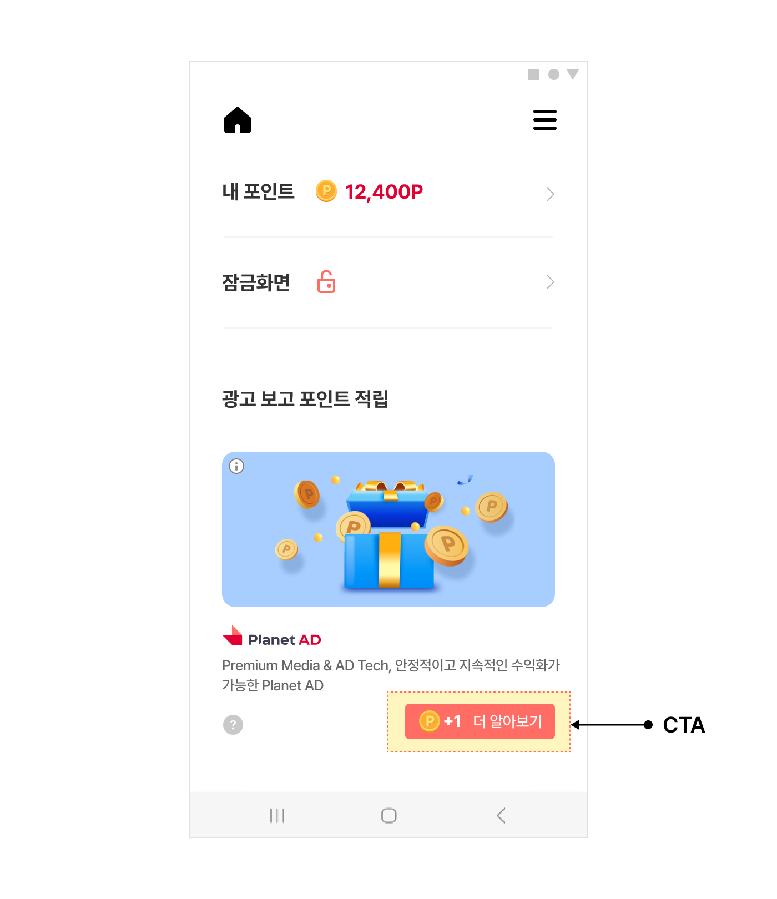

PlanetAD Android SDK 에서 기본으로 제공하는 CtaView UI 및 처리 로직을 사용하지 않고 구현을 원하는 경우에는 다음과 같이 수정할 수 있습니다.

```
public void populateAd(final NativeAd nativeAd) {
    final NativeAdView view = findViewById(R.id.native_ad_view);
 
    final Ad ad = nativeAd.getAd();
 
    // create ad component
    ...생략...
     
    final YourCtaView ctaView = view.findViewById(R.id.your_cta_view);
    updateCtaStatus(ctaView, nativeAd);
     
    ...생략...
 
    final List<View> clickableViews = new ArrayList<>();
    clickableViews.add(customizedCtaView);
     
    ...생략...
 
    nativeAdView.addOnNativeAdEventListener(new NativeAdView.OnNativeAdEventListener() {
        ...(생략)...
 
        @Override
        public void onClicked(@NonNull NativeAdView view, @NonNull NativeAd nativeAd) {
            updateCtaStatus(ctaView, nativeAd);;
        }
         
        @Override
        public void onParticipated(@NonNull NativeAdView view, @NonNull NativeAd nativeAd) {
            updateCtaStatus(ctaView, nativeAd);
        }
    });
}
 
// 기획에 따라 수정될 수 있는 예시 코드입니다.
void updateCtaStatus(YourCtaView ctaView, NativeAd nativeAd) {
    final String callToAction = nativeAd.getAd().getCallToAction();
    final int reward = nativeAd.getAvailableReward();
    final int totalReward = nativeAd.getAd().getReward();
    final boolean participated = nativeAd.isParticipated();
    final boolean isClicked = nativeAd.isClicked();
    final boolean isActionType = nativeAd.getAd().isActionType();
 
 
    if (isClicked && isActionType && !participated) {
        ctaView.setCtaText("참여 확인 중");
        ctaView.setRewardIcon(null);
        ctaView.setRewardText(null);
    } else {
        if (totalReward > 0 && participated) {
            ctaView.setRewardIcon(R.drawable.your_reward_received_icon);
            ctaView.setRewardText(null);
            ctaView.setCtaText("참여 완료");
        } else if (reward > 0) {
            ctaView.showRewardImage(R.drawable.your_reward_icon);
            ctaView.setRewardText(String.format(Locale.US, "+%,d", reward));
            ctaView.setCtaText(callToAction);
        } else {
            ctaView.showRewardImage(null);
            ctaView.setRewardText(null);
            ctaView.setCtaText(callToAction);
        }
    }
}
```

#### 한번에 여러 개의 광고 로드
한 번의 광고 요청으로 여러 개의 광고를 할당받을 수 있습니다. 최대 10개까지 가능합니다.<br>
다음은 NATIVE_ADS_COUNT를 지정하여 여러 개의 광고를 할당받는 예시입니다.
```
final NativeAdLoader loader = new NativeAdLoader("YOUR_NATIVE_AD_UNIT_ID");
loader.loadAds(new NativeAdLoader.OnAdsLoadedListener() {
    @Override
    public void onLoadError(@NonNull AdError adError) {
        ...
    }
 
    @Override
    public void onAdsLoaded(@NonNull Collection<NativeAd> collection) {
        ...
    }
}, NATIVE_ADS_COUNT);
```

#### 비디오 광고 리스너 등록
비디오형 광고에서 발생하는 이벤트를 수신할 수 있습니다.<br>
다음은 MediaView에 비디오 광고 이벤트 리스너를 등록하는 예시입니다.

```
mediaView.setVideoEventListener(new VideoEventListener() {
  @Override
  public void onVideoStarted() {
  }
 
  @Override
  public void onError(@NonNull VideoErrorStatus videoErrorStatus, @Nullable String errorMessage) {
    if (errorMessage != null) {
        Toast.makeText(mediaView.getContext(), errorMessage, Toast.LENGTH_SHORT).show();
    }
  }
 
  @Override
  public void onResume() {
  }
 
  @Override
  public void onPause() {
  }
 
  @Override
  public void onReplay() {
  }
 
  @Override
  public void onVideoEnded() {
    // 동영상 재생 완료시 필요한 처리
  }
 
  @Override
  public void onLanding() {
    // 동영상 광고 랜딩시 필요한 처리
  }
});
```

## POP 기본설정

### 개요
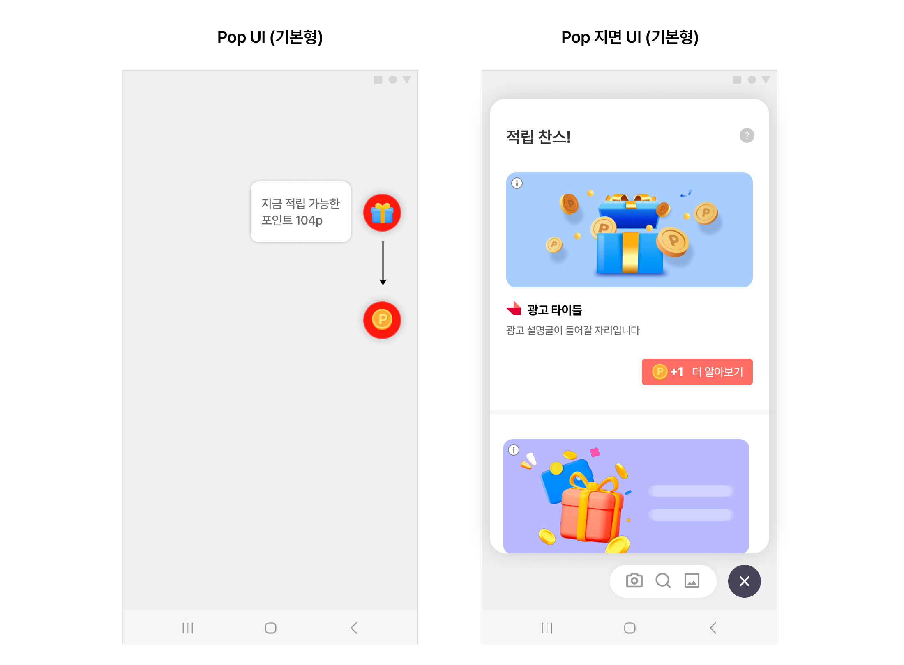

Pop은 스크린 최상단에 뜨는 UI를 통해 사용자를 광고 지면으로 유도합니다. Pop을 활성화하면 화면을 껐다 켤 때마다 팝이 화면에 보이게 됩니다.<br>
Android 12에 적용되는 오버레이의 터치 이벤트 차단에 대응하기 위해 팝(Pop) 버튼에 투명도를 적용하여 안정적인 앱 동작을 지원합니다.

### 준비사항

[Feed 지면 기본 설정](#Feed-기본설정) 완료<br>
Pop 지면에 사용할 Unit ID (이하 YOUR_POP_UNIT_ID)

### Pop 준비
YOUR_POP_UNIT_ID와 Feed 지면에서 사용한 Unit id([Feed 지면 기본 설정](#Feed-기본설정)에서의 YOUR_FEED_UNIT_ID) 를 동일한 값으로 하게 설정하는 경우, FeedConfig에 optInFeatureList를 설정하여 간편히 Pop 지면을 도입할 수 있습니다.<br>
optInFeatureList 를 사용하면 FeedConfig의 설정 중의 일부가 Pop 지면에도 적용됩니다.<br> Pop 지면에서 Feed와 다른 Unit id 를 사용하기, Feed 지면과 다른 설정을 사용하기 를 위해서는 [PopConfig 설정](#POP-고급설정)을 참고하여 PopConfig를 사용해야 합니다.<br>
다음은 FeedConfig를 설정하는 예시입니다.

```
FeedConfig feedConfig = new FeedConfig.Builder(getApplicationContext(), "YOUR_POP_UNIT_ID")
        .optInFeatureList(Collections.singletonList(OptInFeature.Pop))
        .build();
final SKPAdBenefitConfig skpAdBenefitConfig = new SKPAdBenefitConfig.Builder(context)
        .setFeedConfig(feedConfig)
        .build();
SKPAdBenefit.init(this, skpAdBenefitConfig);
```


Pop이 준비되면 Feed 지면에 Pop 활성화 버튼이 노출됩니다. 자세한 사항은 [Pop 활성화 버튼](#POP-고급설정)에서 확인할 수 있습니다.

### Pop 초기화 및 활성화
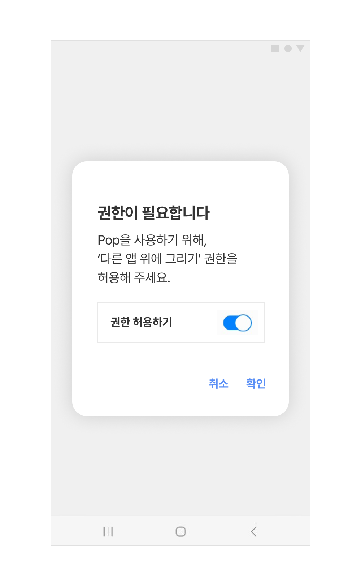

마시멜로(Android API 23) 이상 버전에서 Pop을 실행시키기 위해서 다른 앱 위에 그리기 권한이 필요합니다. 원활한 권한 획득을 위해 SKP Ad Android SDK는 사용자가 권한을 활성화하도록 유도하는 기능을 제공하고 있습니다.<br>
다음 가이드에 따라 다른 앱위에 그리기 권한을 받고 Pop 을 활성화 할 수 있습니다.<br><br>

Activity에 SKPAdPop 클래스를 멤버 변수로 추가합니다.
```
private SKPAdPop skpAdPop;
```

Pop 실행 전, 다른 앱 위에 그리기 권한을 얻어야 합니다. requestPermissionWithDialog를 호출하여 유저에게 다른 앱 위에 그리기 권한을 부여하도록 유도할 수 있습니다.
```
public static final int REQUEST_CODE_SHOW_POP = 1024;
 
public void showPopOrRequestPermissionWithDialog() {
    // 권한 확인
    if (SKPAdPop.hasPermission(context) || Build.VERSION.SDK_INT < Build.VERSION_CODES.M) {
        // Pop 실행
        skpAdPop.preloadAndShowPop();
    } else {
        // 권한 요청
        SKPAdPop.requestPermissionWithDialog((Activity) context,
            new PopOverlayPermissionConfig.Builder(R.string.pop_name)
                .settingsIntent(OverlayPermission.createIntentToRequestOverlayPermission(context))
                .requestCode(REQUEST_CODE_SHOW_POP)
                .build()
        );
    }
}
```

다른 앱 위에 그리기 권한이 부여되면 자동으로 Activity로 돌아오며, Intent를 통해 결과를 확인합니다. 권한 획득이 확인되면 preloadAndShowPop을 호출하여 Pop을 실행합니다.

```

import static com.skplanet.lib.settingsmonitor.SettingsMonitor.KEY_SETTINGS_REQUEST_CODE;
import static com.skplanet.lib.settingsmonitor.SettingsMonitor.KEY_SETTINGS_RESULT;
 
public class MainActivity extends AppCompatActivity {
    @Override
    public void onCreate(Bundle savedInstanceState) {
        super.onCreate(savedInstanceState);
        setContentView(R.layout.activity_main);
         
        if (getIntent().getBooleanExtra(KEY_SETTINGS_RESULT, false)
                && getIntent().getIntExtra(KEY_SETTINGS_REQUEST_CODE, 0) == REQUEST_CODE_SHOW_POP) {
            // 권한 획득 확인 후 pop 실행
            skpAdPop.preloadAndShowPop();
        }
    }
}
```

### Pop 비활성화
skpAdPop.removePop(Context) 을 호출하여 Pop을 비활성화 할 수 있습니다. Pop이 비활성화되면 Service Notification이 사라집니다.<br>
다음은 Pop을 비활성화하는 예시입니다.
```
skpAdPop.removePop(context);
```

## POP 고급설정

### 개요
본 가이드에서는 SKP Android SDK의 Pop 지면의 기능을 설명하고 각 기능을 변경하는 방법을 설명합니다.

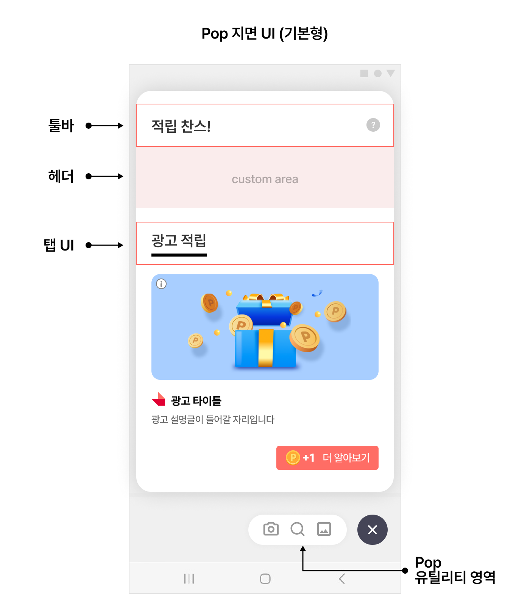

### PopConfig 설정

<p>PopConfig를 통해 Pop의 기능을 설정할 수 있습니다.</p>
다음은 PopConfig를 SKPAdBenefitConfig에 추가하는 예시입니다.

```
PopConfig popConfig = new PopConfig.Builder(getApplicationContext(), "YOUR_POP_UNIT_ID")
        .build();
         
final SKPAdBenefitConfig skpAdBenefitConfig = new SKPAdBenefitConfig.Builder(context)
        .setPopConfig(popConfig)
        .build();
         
SKPAdBenefit.init(this, skpAdBenefitConfig);
```

### 콘텐츠 숨기기
Pop 에서는 기본적으로 콘텐츠를 함께 제공하고 있습니다. 콘텐츠는 광고가 아니며 뉴스 기사와 같은 아이템입니다.<br>
만일 콘텐츠를 Pop 에서 보이지 않도록 하기 위해서는 다음과 같이 설정하여 숨길 수 있습니다.

```
PopConfig popConfig = new PopConfig.Builder(getApplicationContext(), "YOUR_POP_UNIT_ID")
        .articlesEnabled(false) // 컨텐츠 비활성화
        .build();
```

### Pop 활성화 버튼

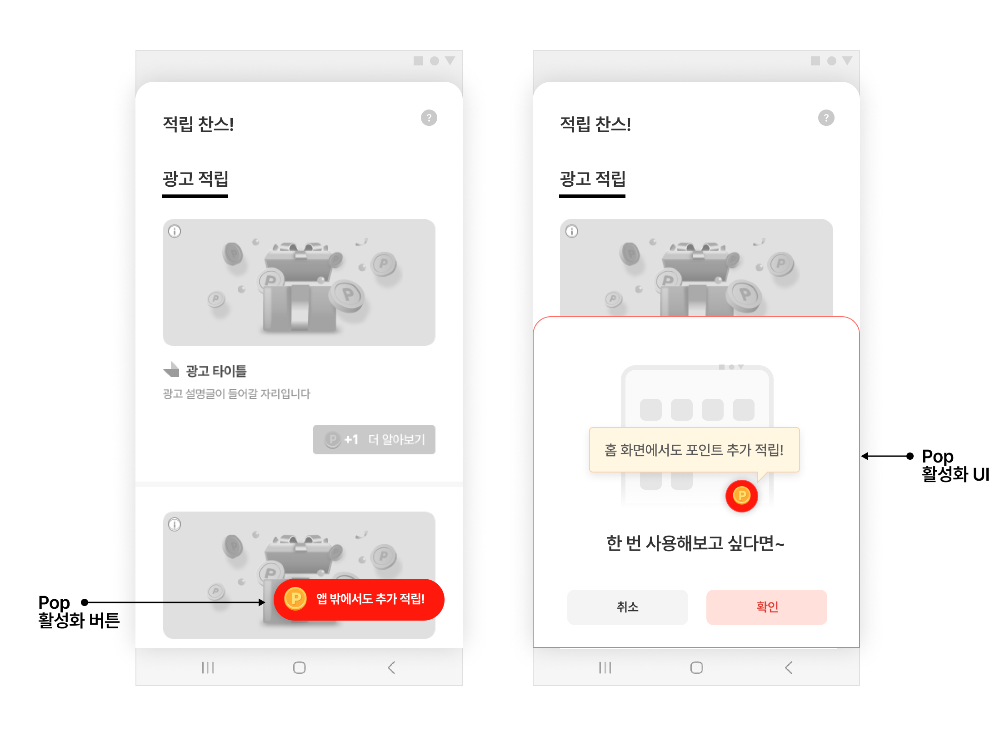

Feed 지면에 Pop 지면 활성화 버튼을 표시할 수 있습니다. 사용자는 Pop 지면 활성화 버튼을 통해 자연스럽게 Pop 을 활성화할 수 있습니다.
사용자에게 Pop 활성화 버튼을 표시하는 방법은 다음과 같습니다.

- PopConfig를 설정하지 않고, FeedConfig를 아래와 같이 설정한 경우

```
FeedConfig feedConfig = new FeedConfig.Builder(getApplicationContext(), YOUR_FEED_UNIT_ID)
        .optInFeatureList(Collections.singletonList(OptInFeature.Pop))
        .build();
```
- PopConfig를 설정한 경우
```
PopConfig popConfig = new PopConfig.Builder(getApplicationContext(), "YOUR_POP_UNIT_ID")
        .build();
         
final SKPAdBenefitConfig skpAdBenefitConfig = new SKPAdBenefitConfig.Builder(context)
        .setPopConfig(popConfig) // PopConfig 설정
        .build();
SKPAdBenefit.init(this, skpAdBenefitConfig);
```

위의 조건을 충족하도록 연동했다면, Pop을 활성화하지 않은 사용자에게 Pop 활성화 버튼이 보입니다.<br><br>

Pop 활성화 버튼을 표시하지 않기 위해서는 아래와 같이 설정해야합니다. 위의 표시 가능 조건과 무관하게 Pop 활성화 버튼은 보이지 않습니다.
```
final FeedConfig feedConfig = new FeedConfig.Builder(context, "YOUR_FEED_UNIT_ID")
        .optInAndShowPopButtonHandlerClass(null) // Pop 활성화 버튼 숨김
        .build();
```

### Pop Service Notification 자체 구현
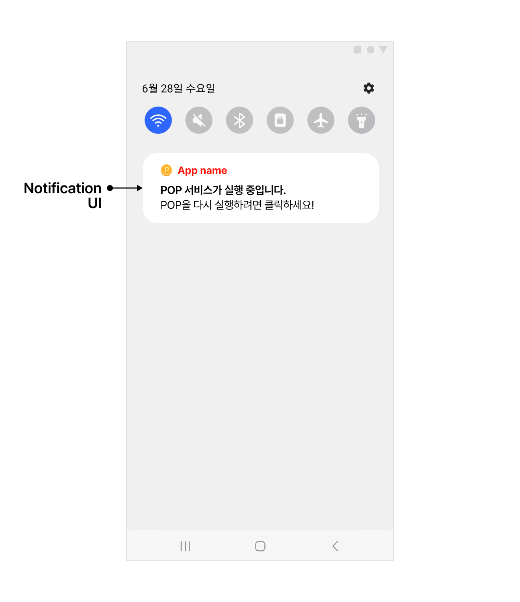

Pop이 정상적으로 동작하기 위해서 Service 를 필요로 합니다. 그래서 Pop이 활성화되어 있는 동안에 Service Notification이 보입니다.

다음은 Service Notification 을 직접 구현하여 SKPAd Android SDK에서 제공하는 Notification 을 대체하는 방법을 안내합니다. Notification의 동작, UI 레이아웃까지 직접 구현하여 수정할 수 있습니다.<br>만일 SKPAd Android SDK에서 제공하는 Notification 을 기반으로 간단한 UI 수정을 원하는 경우는 [Notification UI 수정](#POP-Customizing)을 참고하시기 바랍니다.

Pop Notification 을 수정하기 위해서는 PopControlService 의 상속 클래스를 구현합니다. 필요에 따라 notificationChannel 을 생성하거나 View 를 등록할 수 있습니다.<br>
 NotificationId는 PopNotificationConfig에서 설정할 수 있습니다. 구현한 상속 클래스는 Manifest에 등록해야 합니다.<br>
PopControlService 은 몇 가지 편리한 기능을 제공합니다. 필요에 따라 사용할 수 있습니다.


|API|설명|
|-|-|
getPopPendingIntent(unitId, context)|Pop 지면으로 진입하는 PendingIntent 를 제공합니다.

아래는 Pop Service Notification 자체 구현하는 예시입니다.
```
public class YourControlService extends PopControlService {
 
    @Override
    protected Notification buildForegroundNotification(@NonNull String unitId, @NonNull PopNotificationConfig popNotificationConfig) {
        // Pop을 표시하는 PendingIntent (원형 아이콘)
        PendingIntent popPendingIntent = getPopPendingIntent(unitId, this);
 
        // 필요에 따라 notificationChannel을 등록합니다.
        NotificationCompat.Builder builder;
        if (Build.VERSION.SDK_INT >= Build.VERSION_CODES.O) {
            createNotificationChannelIfNeeded();
            builder = new NotificationCompat.Builder(this, NOTIFICATION_CHANNEL_ID);
        } else {
            builder = new NotificationCompat.Builder(this);
        }
 
        // Pop Service Notification 에 사용할 View 를 등록합니다.
        RemoteViews remoteView = new RemoteViews(getPackageName(), R.layout.view_custom_notification);
        builder.setSmallIcon(popNotificationConfig.getSmallIconResId())
                .setContent(remoteView)
                .setContentIntent(popPendingIntent)
                .setPriority(PRIORITY_LOW)
                .setShowWhen(false);
                .setForegroundServiceBehavior(FOREGROUND_SERVICE_IMMEDIATE);
        if (popNotificationConfig.getColor() != null) {
            builder.setColor(popNotificationConfig.getColor());
        }
        return builder.build();
    }
 
    @TargetApi(Build.VERSION_CODES.O)
    protected void createNotificationChannelIfNeeded() {
        final NotificationManager notificationManager = (NotificationManager) getSystemService(Context.NOTIFICATION_SERVICE);
        if (notificationManager.getNotificationChannel(NOTIFICATION_CHANNEL_ID) == null) {
            final NotificationChannel channel = new NotificationChannel(NOTIFICATION_CHANNEL_ID, NOTIFICATION_CHANNEL_NAME, NotificationManager.IMPORTANCE_LOW);
            channel.setShowBadge(false);
            notificationManager.createNotificationChannel(channel);
        }
    }
}
```
```
final PopNotificationConfig popNotificationConfig = new PopNotificationConfig.Builder(getApplicationContext())
                .notificationId(NOTIFICATION_ID)
                .build();
 
final PopConfig popConfig = new PopConfig.Builder(getApplicationContext(), UNIT_ID_POP)
        .popNotificationConfig(popNotificationConfig)
        .controlService(YourControlService.class)
        .build();
 
final SKPAdBenefitConfig skpAdBenefitConfig = new SKPAdBenefitConfig.Builder(getApplicationContext())
        .setPopConfig(popConfig)
        .build();
```
```
// AndroidManifest.xml
 
<application
    ...생략...
     
    <service android:name=".java.YourControlService" />
     
    ...생략...
</application>
```

[안드로이드 14부터 변경된 Foreground Service 정책](https://developer.android.com/about/versions/14/changes/fgs-types-required?hl=ko#special-use)에 따라 직접 구현한 PopControl Service의 경우 Foreground Service Type을 지정해야 합니다.

Planet AD에서는 아래와 같이 Foreground Service Type을 사용하고 있습니다.
App에서 해당 Service 지정 시 아래와 같이 설정하는 것을 권장드립니다.
```
        <service android:name=".java.YourControlService"
            android:foregroundServiceType="specialUse">
            <property android:name="android.app.PROPERTY_SPECIAL_USE_FGS_SUBTYPE"
                android:value="@string/explanation_for_special_use"/>
        </service>
```
```
	<?xml version="1.0" encoding="utf-8"?>
	<!--Generated by crowdin.com-->
	<resources>
		<string name="explanation_for_special_use">- 포그라운드 서비스를 사용하는 기능은 Bubble이며, 사용자가 기기의 화면을 키는 동작, 잠금을 해제하는 동작의 피드백으로 즉시 제공되어야 합니다.\n
	- 포그라운드 서비스는 각 동작에 대한 broadcast를 즉각적으로 받기 위해서 실행되어 있어야 하고, 적절한 포그라운드 카테고리가 없기 때문에 special use 권한을 활용합니다.</string>
	</resources>
```

### 툴바 영역 View 자체 구현

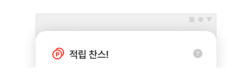

Pop지면의 툴바 영역의 UI를 변경할 수 있습니다. SKP Android SDK가 제공하는 UI을 이용하여 변경하는 방법과 사용하지 않고 변경하는 방법이 있습니다.

#### SDK에서 제공하는 UI를 이용하여 변경
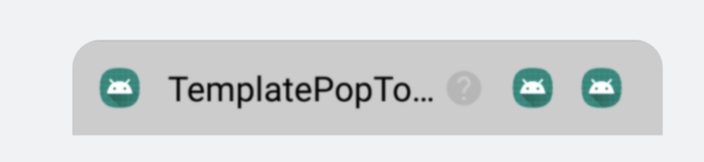

기본으로 제공되는 UI를 이용하여 변경하는 방법입니다. 간단하지만 제약이 있습니다.

DefaultPopToolbarHolder의 상속 클래스는 구현하여 툴바를 변경합니다. SDK에서 제공하는 PopToolbar 를 이용하여 정해진 레이아웃에서 변경합니다. 상속 클래스는 PopConfig의 feedToolbarHolderClass에 설정합니다.

다음은 SKPAd Android SDK에서 제공하는 UI를 이용하여 구현하는 예시입니다.
```
class YourPopToolbarHolder extends DefaultPopToolbarHolder {
    @Override
    public View getView(Activity activity, @NonNull final String unitId) {
        toolbar = new PopToolbar(activity); // PopToolbar 에서 제공하는 기본 Template 사용
        toolbar.setTitle("TemplatePopToolbarHolder"); // 툴바 타이틀 문구를 변경합니다.
        toolbar.setIconResource(R.mipmap.ic_launcher); // 툴바 좌측 아이콘을 변경합니다.
        toolbar.setBackgroundColor(Color.LTGRAY); // 툴바 배경색을 변경합니다.
 
        addInquiryMenuItemView(activity, unitId); // 문의하기 버튼은 이 함수를 통해 간단하게 추가 가능합니다.
        addRightMenuItemView1(activity, unitId); // custom 버튼 추가
        return toolbar;
    }
 
    // custom 버튼 추가는 toolbar.buildPopMenuItemView 를 사용하여 PopMenuImageView 를 생성하고
    // toolbar.addRightMenuButton 를 사용하여 toolbar 에 추가합니다.
    private void addRightMenuItemView1(@NonNull final Activity activity, @NonNull final String unitId) {
        PopMenuImageView menuItemView = toolbar.buildPopMenuItemView(activity, R.mipmap.ic_launcher);
        menuItemView.setOnClickListener(new View.OnClickListener() {
            @Override
            public void onClick(View v) {
                showInquiry(activity, unitId); // 문의하기 페이지로 연결합니다.
            }
        });
        toolbar.addRightMenuButton(menuItemView);
    }
}
```
```
new PopConfig.Builder(getApplicationContext(), "YOUR_POP_UNIT_ID")
      .feedToolbarHolderClass(YourPopToolbarHolder.class)
      .build();
```

#### Custom View를 직접 구현하여 UI를 변경
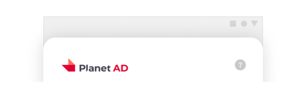

DefaultPopToolbarHolder의 상속 클래스는 구현하여 툴바를 변경합니다. SDK에서 제공하는 PopToolbar를 사용하지 않고 직접 구성한 레이아웃을 사용합니다. 그리고 구현한 상속 클래스는 PopConfig에 설정합니다.<br>
다음은 레이아웃을 직접 구성하여 구현하는 예제입니다.

```
public class YourPopToolbarHolder extends DefaultPopToolbarHolder {
    @Override
    public View getView(Activity activity, @NonNull final String unitId) {
        // 직접 구성한 layout 을 사용합니다
        ViewGroup root =  (ViewGroup) activity.getLayoutInflater().inflate(R.layout.your_pop_custom_toolbar_layout, null);
 
        View buttonInquiry = root.findViewById(R.id.yourInquiryButton);
        buttonInquiry.setOnClickListener(new View.OnClickListener() {
            @Override
            public void onClick(View v) {
                // 문의하기 페이지 열기
                showInquiry(activity, unitId);
            }
        });
        return root;
    }
}
```
```
new PopConfig.Builder(getApplicationContext(), "YOUR_POP_UNIT_ID")
      .feedToolbarHolderClass(YourPopToolbarHolder.class)
      .build();
```


### 유틸리티 영역 UI 변경

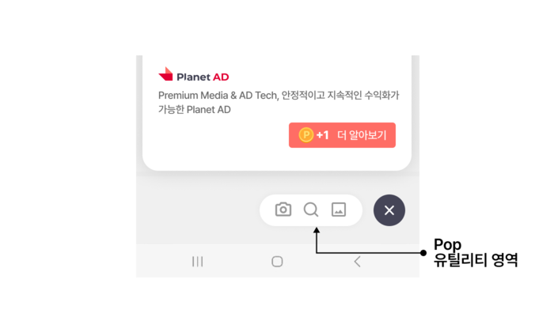

유틸리티 영역을 활용하여 사용자에게 편리한 기능을 제공합니다.

다음은 유틸리티 영역을 변경하는 예시입니다.

PopUtilityLayoutHandler의 상속 클래스를 구현하고, 구현한 Custom View(your_pop_utility_view)를 추가합니다. 그리고 FeedConfig에 구현한 클래스를 추가합니다.

```
public final class CustomPopUtilityLayoutHandler extends PopUtilityLayoutHandler {
 
    private Context context;
 
    public CustomPopUtilityLayoutHandler(Context context) {
        super(context);
        this.context = context;
    }
 
    @Override
    public void onLayoutCreated(ViewGroup parent) {
        LayoutInflater inflater = LayoutInflater.from(context);
        final FrameLayout layout = (FrameLayout) inflater.inflate(
                R.layout.your_pop_utility_view,
                parent,
                false
        );
        parent.addView(layout);
    }
}
```
```
new PopConfig.Builder(getApplicationContext(), "YOUR_POP_UNIT_ID")
      .popUtilityLayoutHandlerClass(CustomPopUtilityLayoutHandler.class)
      .build();
```

#### 유틸리티 영역 아이콘 디자인 규격
- 추천 이미지 사이즈
  - 24*24 dp (mdpi 기준)
  - 96*96 px (xxxhdpi까지 지원, 픽셀기준 최대 4배)
- 아이콘은 PNG 와 벡터이미지가 모두 가능합니다.
- 컬러 아이콘 사용 가능

### 커스텀 페이지 추가
Pop 지면을 이용하여 원하는 내용을 표시할 수 있습니다. 커스텀 페이지는 툴바와 컨텐츠로 이루어져있습니다.

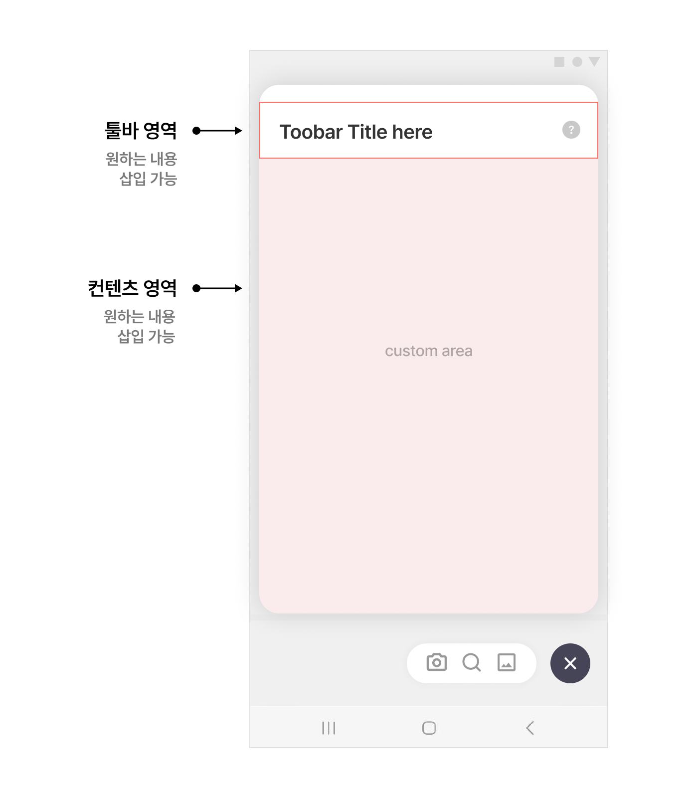

- 툴바에는 타이틀을 설정할 수 있습니다.
- 컨텐츠영역에 원하는 Fragment를 설정할 수 있습니다.

아래 예시 코드에 따라 구현할 수 있습니다.
```
new PopNavigator().launchCustomFragment(
    context,
    new CustomInAppLandingInfo(
        new YourFragment(),
        R.stirng.your_title
    )
);
```

커스텀 페이지는 자유롭게 구현하여 사용할 수 있습니다. 예를 들어, 유틸리티 영역 혹은 툴바 영역에 버튼을 추가하고 원하는 페이지를 보여주기 위해 사용합니다. 


## POP Customizing

### 개요

본 가이드에서는 SKP Ad Android SDK에서 제공하는 UI의 구성을 지키며 디자인을 변경하기 위한 방법을 안내합니다.<br>
추가적인 디자인 변경을 원하시는 경우에는 [고급 설정](#POP-고급설정)에서 UI를 자체 구현하는 방법으로 진행할 수 있습니다.

### Pop 배경색 변경


Pop의 배경색은 [테마 적용](#커스터마이징)에 따라 변경할 수 있습니다.

### Pop 아이콘 변경
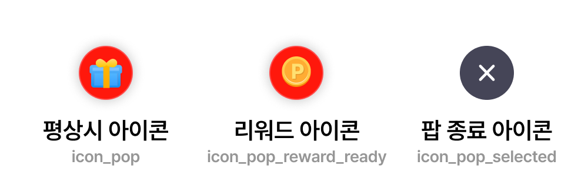

PopConfig를 설정하여 Pop 아이콘 이미지를 변경할 수 있습니다.

다음은 Pop 아이콘을 변경하는 예시입니다.
```
PopConfig popConfig = new PopConfig.Builder(context, "YOUR_POP_UNIT_ID")
      .iconResId(R.drawable.your_pop_icon)
      .rewardReadyIconResId(R.drawable.you_pop_icon_reward_ready)
      .build();
```

iconResId: 상태에 따라 평상시 아이콘과 팝 닫기 아이콘을 지정해 주어야 합니다.
```
<!-- your_pop_icon.xml -->
<?xml version="1.0" encoding="utf-8"?>
<selector xmlns:android="http://schemas.android.com/apk/res/android">
    <!-- 닫기 아이콘 -->
    <item android:drawable="@drawable/icon_pop_selected" android:state_selected="true" />
    <!-- 평상시 팝 아이콘 -->
    <item android:drawable="@drawable/icon_pop"/>
</selector>
```

rewardReadyIconResId: 적립 가능한 포인트가 있을 때 기본 아이콘이 아닌 다른 아이콘을 (예: 동전 아이콘) 유저에게 보여줄 수 있습니다.
```
<!-- you_pop_icon_reward_ready.xml -->
<?xml version="1.0" encoding="utf-8"?>
<selector xmlns:android="http://schemas.android.com/apk/res/android">
    <!-- 닫기 아이콘 -->
    <item android:drawable="@drawable/icon_pop_selected" android:state_selected="true" />
    <!-- 적립 가능 포인트가 있을 때 팝 아이콘 -->
    <item android:drawable="@drawable/icon_pop_reward_ready"/>
</selector>
```
팝 아이콘 권장 사이즈
- 56x56 dp (mdpi 기준)
- 224x224 px (xxxhdpi까지 지원, 픽셀기준 최대 4배)


### Pop 활성화 버튼
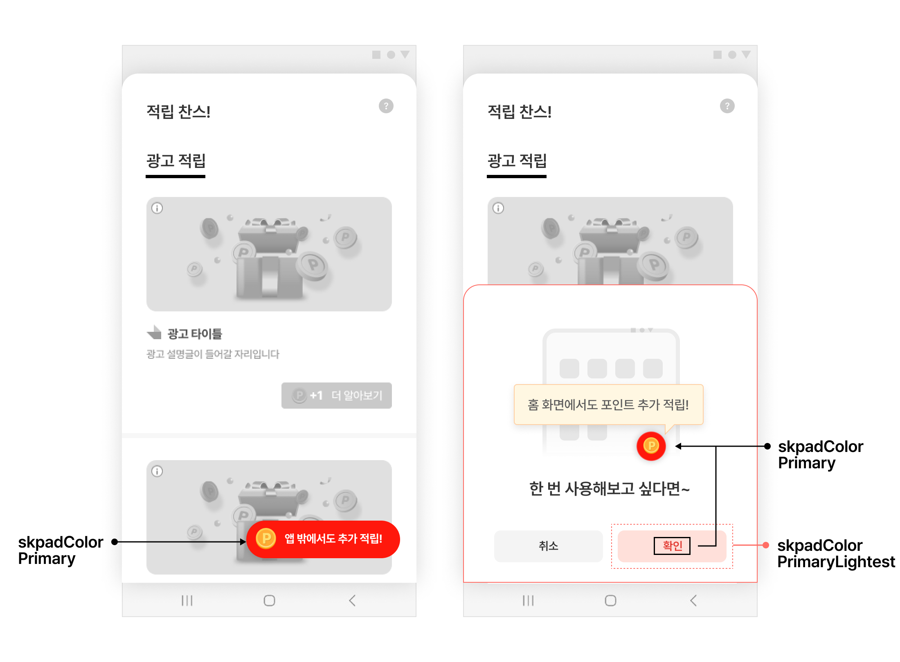

Pop 활성화 버튼의 디자인은 아래 가이드에 따라 수정할 수 있습니다.

활성화 버튼의 색상과 아이콘은 [테마 적용](#커스터마이징)을 통해 변경할 수 있습니다.

활성화 버튼의 문구는 DefaultOptInAndShowPopButtonHandler의 상속 클래스에서 설정합니다. 상속 클래스를 작성하고 FeedConfig에 설정합니다.

```
public class CustomOptInAndShowPopButtonHandler extends DefaultOptInAndShowPopButtonHandler {
    // 활성화 버튼에 보여지는 문구입니다.
    @Override
    public String getOptInAndShowPopButtonText(Context context) {
        return "YOUR_BUTTON_TEXT";
    }
}
final FeedConfig feedConfig = new FeedConfig.Builder(context, "YOUR_FEED_UNIT_ID")
        .optInAndShowPopButtonHandlerClass(CustomOptInAndShowPopButtonHandler.class)
        .build();
```

### Notification UI 수정
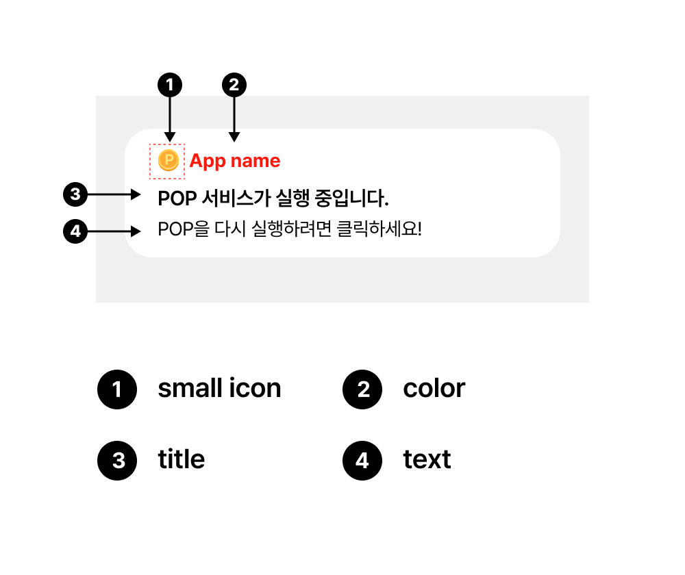


Pop이 활성화되어 있는 동안에 Service Notification이 보입니다.<br>
다음은 PopNotificationConfig를 설정하여 SKP Ad Android SDK에서 제공하는 Notification 의 UI를 변경하는 방법입니다.
```
final PopNotificationConfig popNotificationConfig = new PopNotificationConfig.Builder(getApplicationContext())
      .smallIconResId(R.drawable.your_small_icon) // 흰색 아이콘, Adaptive Icon 이 설정하지 않도록 주의 요망
      .titleResId(R.string.your_pop_notification_title)
      .textResId(R.string.your_pop_notification_text)
      .colorResId(R.color.your_pop_notification_color)
      .notificationId(5000) // 기본값
      .build();
```
```
PopConfig popConfig = new PopConfig.Builder(context, "YOUR_POP_UNIT_ID")
      .popNotificationConfig(popNotificationConfig)
      .build();
```
UI 레이아웃 혹은 Notification 전체를 수정하기 위해서는 [Pop Service Notification 자체 구현](#POP-고급설정)을 참고하시기 바랍니다.

### 스낵바 및 토스트 메시지 커스터마이징
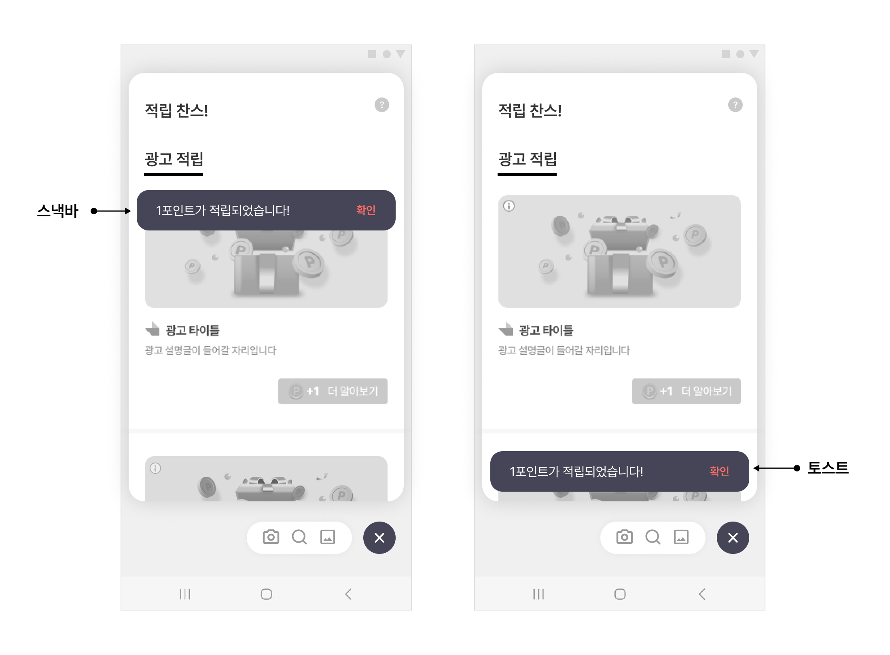

사용자에게 포인트를 지급할 때, 스낵바 혹은 토스트를 사용해 적립 내역을 표시합니다.<br>
기본 문구는 "광고 적립 포인트 n포인트 적립되었습니다." 입니다.<br>
다음은 DefaultPopFeedbackHandler의 상속 클래스를 구현하여, 문구를 수정한 예제입니다.
```
public class CustomPopFeedbackHandler extends DefaultPopFeedbackHandler {
     
    // 광고 적립에 성공 시, 호출됩니다.
    @Override
    public void notifyNativeAdReward(
            @NotNull Context context,
            @NotNull View view,
            boolean canUseSnackbar, //snackbar 사용 가능 여부
            int reward // 적립된 리워드 양
    ) {
        String message = "Customized feed launch reward message";
 
        if (canUseSnackbar) {
            showSnackbar(message, view); // 구현 필요
        } else {
            showToast(message); // 구현 필요
        }
    }
}
```


## Interstial 기본설정

### 개요


Interstitial 지면은 PlanetAd Android SDK에서 제공하는 UI를 사용해 앱을 완전히 덮으면서 노출됩니다. <br>
제공하는 UI로 쉽게 연동할 수 있으며, 광고 지면이 앱을 덮고 있어서 앱 UI 와의 조합을 고려하지 않고 노출하기 용이합니다. 


### 준비 사항
- [시작하기](#시작하기) 적용 완료
- Interstitial 지면에 사용할 Unit ID (이하 YOUR_INTERSTITIAL_UNIT_ID)

### 광고 표시
Interstitial 지면을 표시합니다. PlanetAD Android SDK의 Interstitial 지면은 다이얼로그와 바텀시트의 UI를 제공합니다.<br>
다이얼로그와 바텀시트 각각 InterstitialAdHandler.Type.Dialog 또는 InterstitialAdHandler.Type.BottomSheet으로 설정할 수 있습니다.<br>

다음은 다이얼로그형태의 Interstitial 지면을 표시하는 예시입니다. 

```
final InterstitialAdHandler interstitialAdHandler = new InterstitialAdHandlerFactory()
        .create("YOUR_INTERSTITIAL_UNIT_ID", InterstitialAdHandler.Type.Dialog);
interstitialAdHandler.show(context);
```


## Interstial 고급설정

### 개요
이 문서에서 가이드 하는 내용은 PlanetAD Android SDK의 Interstitial 지면 연동의 기능을 설명하고 각 기능을 사용하는 방법을 안내합니다.

### 광고 개수 설정
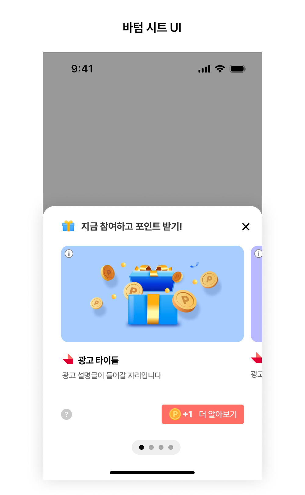

바텀 시트 형태의 Interstitial 지면은 복수 개의 광고를 표시할 수 있습니다. 

다음은 3개의 광고를 할당받는 예시입니다. 

```
InterstitialAdConfig interstitialAdConfig = new InterstitialAdConfig.Builder()
    .adCount(3)  // 1 ~ 5 
    .build();

interstitialAdHandler.show(context, interstitialAdConfig);
```

### 종료에 대한 콜백
Interstitial 지면이 종료되는 이벤트를 수신할 수 있습니다. 필요에 따라 이용하여 종료 시점에 원하는 기능을 추가할 수 있습니다. 

다음은 Interstitial 지면이 종료되는 이벤트를 수신하는 예시입니다.

```
interstitialAdHandler.show(MainActivity.this, interstitialAdConfig, new InterstitialAdHandler.OnInterstitialAdEventListener() {
    
    // ...
    
    @Override
    public void onFinish() {
      // 인터스티셜 종료시
    }
}); 
```

### 광고 요청 결과에 대한 콜백
광고 할당 요청에 따른 결과를 수신할 수 있습니다. 

다음은 광고 요청 결과를 수신하는 리스너를 추가한 예시입니다.

```
interstitialAdHandler.show(MainActivity.this, interstitialAdConfig, new InterstitialAdHandler.OnInterstitialAdEventListener() {

    // ...
    
    @Override
    public void onAdLoaded() {
        // 로드 성공시
    }
    
    @Override
    public void onAdLoadFailed(AdError error) {
        // 로드 실패시. error를 통해 로드 실패 이유를 알 수 있음
    }
});
```

## Interstial Customizing

### 개요
본 가이드에서는 PlanetAD Android SDK에서 제공하는 Interstitial 지면 UI의 구성을 지키며 디자인을 변경하기 위한 방법을 안내합니다. 

### Interstitial 지면 UI 커스터마이징

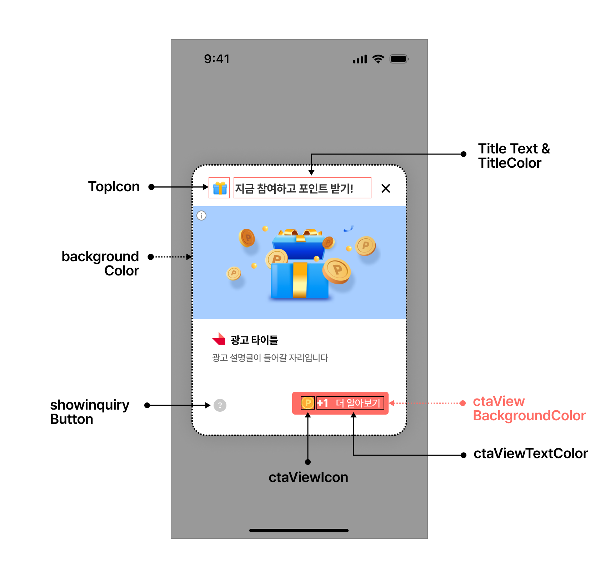

Interstitial 지면 UI는 2가지를 설정할 수 있습니다.

Cta 버튼 UI는 테마 적용으로 변경할 수 있습니다.

타이틀 및 색상 및 아이콘은 InterstitialAdConfig을 설정하여 변경할 수 있습니다. 

다음은 타이틀 및 색상 및 아이콘을 변경하는 예시입니다.

```
InterstitialAdConfig interstitialAdConfig = 
        new InterstitialAdConfig.Builder()
                .topIcon(R.drawable.your_drawable)
                .titleText("지금 바로 참여하고 포인트 받기")
                .textColor(android.R.color.your_color)
                .layoutBackgroundColor(R.color.your_color)
                .build();

final InterstitialAdHandler interstitialAdHandler = new InterstitialAdHandlerFactory()
        .create("YOUR_INTERSTITIAL_UNIT_ID", InterstitialAdHandler.Type.Dialog);
interstitialAdHandler.show(context, interstitialAdConfig);
```

## 디자인 커스터마이징

### 테마 적용

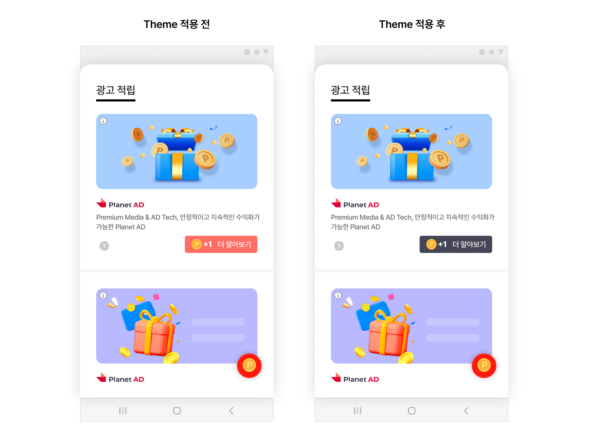

PlanetAD Benefit에서 제공하는 광고지면의 CTA 테마를 변경할 수 있습니다. 이 단계는 선택사항이긴 하지만 원하는 색상, 아이콘을 적용하는 단계이므로 적용하는 것을 권장합니다. 앱에서 사용중인 application theme에 PlanetAD에서 제공하는 attribute를 정의하여 간편하게 PlanetAD Benefit SDK의 CTA UI를 커스터마이징 할 수 있습니다. 

|attribute (type)|child attribute (type)|커스터마이징 되는 UI|
|-|-|-|
|skpadRewardIcon (reference)|N/A|<li>[All] cta view 리워드 아이콘</li><li>[Feed] profile banner 리워드 아이콘</li><li>[Feed] pop opt-in 버튼 아이콘</li>|
|skpadCtaViewStyle(reference)|<li>skpadCtaBackground - (reference) Cta 배경 설정</li><li>skpadCtaParticipatedIcon - (reference) 광고 참여 후 아이콘 설정</li><li>skpadCtaTextColor - (color\|reference) Cta 텍스트 색상 </li><li>skpadCtaTextSize - (dimension) Cta 텍스트 크기</li>|[All] cta view|
|<li>skpadColorPrimaryDark(reference\|color)</li><li>skpadColorPrimary (reference\|color)</li><li>skpadColorPrimaryLight(reference\|color)</li><li>skpadColorPrimaryLighter (reference\|color)</li><li>skpadColorPrimaryLightest (reference\|color)</li>|N/A|<li>[Feed] Tab UI, Filter UI, Pop FAB 배경색 등</li><li>[Interstitial] Feed 진입 경로 텍스트 색상</li><li>[Pop] Pop 아이콘 배경색, Toolbar UI, 다른 앱 위에 그리기 권한 다이얼로그 UI 등</li>


### PrimaryColor 변경
PlanetAD SDK 에서 제공하는 UI 중 Dialog의 버튼 색상, Bottom sheet UI의 확인 버튼을 포함하한 일부 UI 의 색상을 아래와 같이 Theme 에서 설정할 수 있습니다. 

```
<!-- Base application theme. -->
<style name="YourAppTheme" parent="Theme.AppCompat.DayNight.DarkActionBar">
    <item name="skpadColorPrimaryDark">@color/samplePrimaryDark</item>
    <item name="skpadColorPrimary">@color/samplePrimary</item>
    <item name="skpadColorPrimaryLight">@color/samplePrimaryLight</item>
    <item name="skpadColorPrimaryLighter">@color/samplePrimaryLighter</item>
    <item name="skpadColorPrimaryLightest">@color/samplePrimaryLightest</item>
</style>
```

### 리워드 아이콘
리워드를 표시하는 아이콘 추가를 위해 application theme에 skpadRewardIcon 를 추가합니다.
```
<!-- Base application theme. -->
<style name="YourAppTheme" parent="Theme.AppCompat.DayNight.DarkActionBar">
    <!-- 생략 -->
    <item name="skpadRewardIcon">@drawable/your_reward_icon</item>
</style>
```

### CTA 변경
광고의 CTA의 색상, 아이콘 등을 변경하기 위해 application theme에 skpadCtaViewStyle 를 추가합니다.

```
<!-- Base application theme. -->
<style name="YourAppTheme" parent="Theme.AppCompat.DayNight.DarkActionBar">
    <!-- 생략 -->
    <item name="skpadCtaViewStyle">@style/YourCtaViewStyle</item>
</style>

<style name="YourCtaViewStyle">
    <item name="skpadCtaBackground">@drawable/your_background</item>
    <item name="skpadCtaParticipatedIcon">@drawable/your_participated_icon</item>
    <item name="skpadCtaRewardIcon">@drawable/your_reward_icon</item>
    <item name="skpadCtaTextColor">@color/your_text_color</item>
    <item name="skpadCtaTextSize">14sp</item>
</style>
```

Cta 배경 예시

```
<!-- your_background.xml -->
<?xml version="1.0" encoding="utf-8"?>
<selector xmlns:android="http://schemas.android.com/apk/res/android">
    <item android:state_pressed="true">
        <shape>
            <solid android:color="@color/colorPrimaryDark"/>
            <corners android:radius="4dp"/>
        </shape>
    </item>
    <item android:state_enabled="false">
        <shape>
            <solid android:color="@color/gray"/>
            <corners android:radius="4dp"/>
        </shape>
    </item>
    <item>
        <shape>
            <solid android:color="@color/colorPrimary"/>
            <corners android:radius="4dp"/>
        </shape>
    </item>
</selector>
```


### 커스텀 런처 설정

#### Custom In-App Browser 사용법
- 현재 Custom Launcher 를 사용하지 않을 경우 아래 가이드는 아무 영향이 없습니다.
- Custome Launcher 사용할 예정이거나, 1.X 버전에서 이미 사용하고 있을 경우, 아래의 항목을 필수로 적용해야 합니다.

Custom launcher 사용시, 광고를 클릭했을 때 랜딩되는 In-App Browser를 Customize 할 수 있습니다. 예를 들어, 광고 랜딩 페이지 로드 등을 매체사가 지정하는 Class에서 구현할 수 있습니다.

##### 구현시 주의사항 :

- SKPAdBrowser에서 제공하는 Fragment를 사용하여 In-App Browser를 구현해야 합니다. 사용하지 않을 경우, 일부 광고(액션형 광고, 체류 리워드 광고)가 제대로 동작하지 않을 수 있습니다.
- Launcher에서 제공하는 LandingInfo 의 URL을 임의로 변경해서 사용하면 안됩니다. 이 경우 웹 페이지가 제대로 로드되지 않을 수 있습니다.

1. CustomBrowserActivity 를 구현합니다.
```
public class CustomBrowserActivity extends AppCompatActivity {
    public static final String KEY_URL = "com.sample.KEY_URL";
    private SKPAdBrowserFragment fragment;

    @Override
    protected void onCreate(@Nullable Bundle savedInstanceState) {
        super.onCreate(savedInstanceState);
        setContentView(R.layout.activity_custom_browser);

        // URL을 KEY로 하여 WebView를 가지고있는 Fragment를 받아와 사용합니다.
        Intent intent = getIntent();
        fragment = SKPAdBrowser.getInstance(this).getFragment(intent.getStringExtra(KEY_URL));
        getSupportFragmentManager().beginTransaction().replace(R.id.browserContainer, fragment).commit();
        final SKPAdWebView webView = fragment.getWebView();

        // Browser의 이벤트를 받을 수 있습니다. DeepLink가 열렸을 경우, Browser를 닫아주어야 빈 페이지가 보여지는 현상을 방지할 수 있습니다.
        SKPAdBrowser.getInstance(this).setOnBrowserEventListener(new SKPAdBrowser.OnBrowserEventListener() {
        
        // 기존에 사용하던 isDeepLink 를 아래로 대체
            @Override
            public void onDeepLinkOpened() {
                finish();
            }
        });
    }

    // Optional - BackButton을 눌렀을때 뒤로가기 기능
    @Override
    public void onBackPressed() {
    final SKPAdWebView webView = fragment.getWebView();
        if (webView != null && webView.canGoBack()) {
            webView.goBack();
        } else {
            super.onBackPressed();
        }
    }
}
```

2. activity_custom_browser.xml
```
<?xml version="1.0" encoding="utf-8"?>
<FrameLayout xmlns:android="http://schemas.android.com/apk/res/android"
    android:layout_width="match_parent"
    android:layout_height="match_parent">
    <FrameLayout
        android:id="@+id/browserContainer"
        android:layout_width="match_parent"
        android:layout_height="match_parent" />
</FrameLayout>
```

3. Launcher 를 구현
```
public class MyLauncher implements Launcher {

    @Override
    public void launch(@NonNull Context context, @NonNull LaunchInfo launchInfo) {
        launch(context, launchInfo, null);
    }

    @Override
    public void launch(@NonNull final Context context, @NonNull final LaunchInfo launchInfo, @Nullable final LauncherEventListener listener) {
        launch(context, launchInfo, listener, null);
    }

    @Override
    public void launch(@NonNull final Context context, @NonNull final LaunchInfo launchInfo, @Nullable final LauncherEventListener listener, @Nullable List<Class<? extends SKPAdJavascriptInterface>> javascriptInterfaces) {
                 
        // Custom Browser 실행
        final Intent intent = new Intent(context, CustomBrowserActivity.class);
        intent.setFlags(Intent.FLAG_ACTIVITY_NEW_TASK);
        intent.putExtra(CustomBrowserActivity.KEY_URL, launchInfo.getUri().toString()); // URI는 변경 하면 안 됨
        context.startActivity(intent);
    }
}
```
4. SKPAdBenefit.init 호출 이후에 생성한 Launcher를 세팅
```
SKPAdBenefit.setLauncher(new MyLauncher());
```

##### Custom launcher 사용시 Article의 sourceUrl 사용법
```
public class MyLauncher implements Launcher {
    @Override
    public void launch(@NonNull final Context context, @NonNull final LaunchInfo launchInfo, @Nullable final LauncherEventListener listener, @Nullable List<Class<? extends SKPAdJavascriptInterface>> javascriptInterfaces) {
        if (launchInfo.getArticle() != null) {
            String sourceUrl = launchInfo.getArticle().getSourceUrl();
        }
    }
}
```
컨텐츠의 경우 url scheme에 따라 랜딩 방식을 다르게 처리하고 싶다면 (ex. 앱 안에서 브라우저 오픈 없이 다른 화면으로 이동되는 컨텐츠) 다음과 같은 방법으로 NativeArticle 객체의 sourceUrl을 가져와 분기 처리를 할 수 있습니다.

#####  Custom launcher 사용시 광고 또는 컨텐츠인지 미리 판단하고 싶을 경우
```
public class MyLauncher implements Launcher {
    ...
    @Override
    public void launch(@NonNull final Context context, @NonNull final LaunchInfo launchInfo, @Nullable final LauncherEventListener listener, @Nullable List<Class<? extends SKPAdJavascriptInterface>> javascriptInterfaces) {
        
        // 광고 또는 컨텐츠인지 미리 판단하고 싶을 경우, 다음을 이용하여 확인
        if (launchInfo.getAd() != null) {
            // 광고
        } else if (launchInfo.getArticle() != null) {
            // 컨텐츠
        } 
          
        ...// Custom Browser 실행
    }
}
```

## Web Android SDK 연동 가이드

### 개요
이 가이드는 Android 앱 내의 WebView에서 광고를 표시하기 위한 PlanetAD Benefit Web Android용 SDK 연동 방법을 안내합니다.

#### 1단계 연동용 ID 발급받기

SKP AD  Android용 SDK를 연동하려면 반드시 앱의 고유 식별자인 App ID와 광고 지면의 고유 식별자 Unit ID가 필요합니다. 연동용 ID를 발급받으려면 SKP 광고 담당자에게 연락하세요.

|ID 유형|설명|
|-|-|
App ID|SKP AD Android용 SDK를 연동하는 앱 별로 부여하는 고유 식별자입니다.
Unit ID|앱 내에 광고 지면별로 부여하는 고유 식별자입니다.

#### 2단계 SDK 설치하기
SKP Ad Android용 SDK를 설치하려면 다음의 절차를 따르세요.
1. 프로젝트 레벨의 build.gradle 파일에 SKP Ad SDK 저장소를 추가하세요.
```
// 프로젝트 레벨의 build.gradle
 
allprojects {
    repositories {
        maven { url "https://asia-northeast3-maven.pkg.dev/planetad-379102/planetad" } // SKP 저장소
    }
}
```
2. 모듈 레벨의 build.gradle 파일에 SKP Ad SDK 라이브러리를 추가하세요.

```
// 모듈 레벨의 build.gradle
 
dependencies {
    implementation ("com.skplanet.sdk.ad:skpad-benefit:1.10.1") { changing = true }  // SKP AD Benefit SDK 라이브러리
}
```

3. 모듈 레벨의 build.gradle 파일에 compileSdkVersion과 targetSdkVersion을 34로 업데이트하세요.

```
android {
    compileSdkVersion 34
 
    defaultConfig {
        targetSdkVersion 34
    }
}
```

#### 3 단계: App ID 설정하기
AndroidManifest.xml 파일에서 다음과 같이 <meta-data> 요소를 추가하고, app-pub-{YOUR_APP_ID}의 {YOUR_APP_ID}를 SKP 광고 담당자로부터 발급받은 App ID로 교체하세요.<br>

발급받은 App ID가 123456789123 이라면 app-pub-123456789123가 되어야 합니다.
```
<manifest>
    <application>
        <!-- SKPAd SDK App id -->
        <meta-data
            android:name="com.skplanet.APP_KEY"
            android:value="app-pub-000000000000" />
    </application>
</manifest>
```

#### 4 단계: SDK 초기화하기
Application의 onCreate()에서 다음의 코드를 추가하여 SKP Ad Android용 SDK를 초기화하세요.

```
public class App extends Application {
    @Override
    public void onCreate() {
        super.onCreate();
                 
        // SKPAdBenefit 초기화
        final SKPAdBenefitConfig skpAdBenefitConfig = new SKPAdBenefitConfig.Builder(context)
            .build();
        SKPAdBenefit.init(this, skpAdBenefitConfig);
    }
}
```

#### 5단계: 사용자 프로필 등록하기
광고 할당을 요청하려면 사용자 프로필을 등록해야 합니다. 사용자 프로필을 구성하는 항목은 아래 표를 참고하세요.

|사용자 프로필|설명|
|-|-|
userId|매체사 앱에서 사용하는 사용자 식별자입니다. 서비스 도중 변하지 않는 고정 값이어야 하며, 광고 할당을 위해서 필수로 전달해야합니다.<br>앱을 삭제 후 재설치하여 사용자의 ID 값이 변경되거나 다른 사유로 인해 고정 ID를 사용하지 못하는 경우 SKP 광고 담당자에게 문의하세요.
gender| 사용자의 성별입니다. 사용자 맞춤형 광고를 제공하는 데에 활용됩니다.<li>남성: UserProfile.Gender.MALE</li><li>여성: UserProfile.Gender.FEMALE</li>
birthYear|사용자의 출생연도입니다. 사용자 맞춤형 광고를 제공하는 데에 활용됩니다.

사용자가 로그인하는 시점에 다음의 코드를 추가하여 SDK에 사용자 프로필을 등록하세요.<br>
원활한 서비스 운영을 위해 사용자 프로필 등록은 반드시 호출해야합니다. SKPAdBenefit.setUserProfile() 메소드를 호출하지 않으면 광고가 제공되지 않습니다.<br>
사용자의 로그인 정보를 웹 페이지에서 알 수 있지만 앱에서 알 수 없는 경우, 웹 페이지에서 사용자 프로필을 설정하는 기능을 지원하고 있습니다.<br>

```
// 사용자 정보를 등록하는 코드입니다.
final UserProfile.Builder builder = new UserProfile.Builder(SKPAdBenefit.getUserProfile());
final UserProfile userProfile = builder
        .userId("USER_ID") // 사용자 식별자값
        .gender(UserProfile.Gender.MALE) // 사용자의 성별
        .birthYear(2000) // 출생연도
        .build();
SKPAdBenefit.setUserProfile(userProfile);
```

사용자가 앱에서 로그아웃하는 시점에 다음과 같이 사용자 프로필 정보를 삭제하세요.
```
// SDK에 등록한 사용자 프로필을 삭제하는 코드입니다.
SKPAdBenefit.setUserProfile(null);
```


#### 6 단계: 광고를 표시할 WebView 설정하기
웹 SDK와 소통할 수 있도록 광고를 표시하려고 하는 웹뷰에 다음 코드를 추가하세요.
```
WebView webview = (WebView) findViewById(R.id.webView);
 
final SKPAdBenefitJavascriptInterface javascriptInterface = new SKPAdBenefitJavascriptInterface(webView);
webView.getSettings().setJavaScriptEnabled(true); // JS를 사용하여 광고를 로드하기 때문에 필수임
if (Build.VERSION.SDK_INT >= Build.VERSION_CODES.LOLLIPOP) {
    // 롤리팝부터 Mixed Content 에러 막기 위함
    webView.getSettings().setMixedContentMode(WebSettings.MIXED_CONTENT_ALWAYS_ALLOW);
}
webView.addJavascriptInterface(javascriptInterface, SKPAdBenefitJavascriptInterface.INTERFACE_NAME);
```
 

#### 7 단계: Benefit JS SDK가 삽입된 웹 페이지 로드하기
Benefit JS SDK가 삽입된 웹 페이지를 열 경우, Android 코드에서 설정한 UserProfile 정보 등을 Web SDK에서 자동으로 받아 광고를 로드합니다.
```
webView.loadUrl(MY_WEB_PAGE);
```

#### 8 단계: 앱 빌드하기
Planet AD Android SDK를 사용하기 위한 모든 설정이 완료되었습니다. 앱을 빌드하고 정상적으로 실행되는지 확인하세요.

## 광고 노출 클릭 참여와 관련한 콜백 변화

### 순서 (AOS/iOS는 이름만 다를 뿐 동작은 동일하기 때문에 아래에서는 AOS의 이름을 기준으로 설명함)
- AOS : onImpressed → onClicked → (onRewardRequested) → onRewarded → onParticipated
- iOS : didImpressAd → didClickAd → willRequestRewardForAd → didRewardForAd → didParticipateAd


### onImpressed
- 정의
  - 광고가 유저에게 노출 되었음 (=NativeAdView의 광고 레이아웃의 50%가 유저에게 보여짐)
- 중복 호출 여부
  - 한 광고당 한번만 호출됨
- 추천 대응
  - X

### onClicked
- 정의
  - 광고가 유저에 의해 클릭됨 (=clickableViews로 지정한 component들이 클릭됨)
  -일반/비디오 광고 모두 onClickEvent/shouldClickAd (AOS/iOS)를 통한 click 이벤트 intercept가 가능함 (아래 참조)
  - 이때 일반 광고는 랜딩페이지로 이동을 시도하며, 비디오 광고는 서버에서 비디오의 Asset을 받아와 재생을 시작함
- 중복 호출 여부
  - 한 광고당 중복해서 호출될 수 있음 (유저가 광고를 클릭하여 랜딩한 후 돌아와서 다시 클릭하거나, 아래처럼 비디오 Pause/Resume 등이 불리거나 inline으로 재생 중에 fullscreen 재생하기를 누르는 경우 등)
- 주의
  - 비디오 광고의 경우 mediaView 내에 재생/전체화면재생/리플레이/랜딩 버튼이 유저에게 노출되어 있고 (Appendix 이미지 참조) 이 버튼을 클릭했을 때 아무런 반응이 없는 것은 유저 경험상 이상하기 때문에, mediaView를 clickableViews로 지정하지 않았더라도 해당 4개의 버튼은 클릭이 가능하며 클릭시 onClicked 콜백이 불림
 -또한 비디오 재생 중에 Pause/Resume 등을 위해 위에 있는 “재생" 버튼이 반복적으로 눌려질 수 있는데, 이 경우에도 매번 onClicked 콜백이 불림
- 추천 대응
  - X

### onRewardRequested
- 정의
  - 광고에 대한 리워드 지급 조건을 만족해서 리워드가 지급 요청 되었음
  - 일반 광고의 경우 click 후 너무 빠르게 (1초) back-button을 눌러 돌아오지 않았고, 비디오 광고의 경우 최소 재생 시간이 지남
- 중복 호출 여부
  - 보통 한번 호출되나 아래 onRewarded의 Failure 조건이 만족하는 경우 호출이 되지 않거나 (리워드 지급 대상이 아닌 경우) 중복하여 호출 될 수 있음 (서버에서 에러가 나서 적립이 이루어지지 않아 유저가 재시도 하는 경우)
주의
  - 해당 콜백은 생략이 가능 (리워드 지급 조건을 만족시키지 못 하면 리워드가 지급되지 않는데, 이때는 onRewarded 콜백에 Failure로 전달됨)
- 추천 대응
  - 리워드 지급 완료에 대한 Response를 받기까지 시간이 걸릴 수 있으므로 로딩 이미지 등을 보여줌
  - 비디오의 경우 최소 재생 시간을 Play 한 후 리워드가 지급되고 onClicked 콜백이 여러번 호출되기 때문에 onClicked 콜백이 아닌 onRewardRequested 콜백에서 로딩 이미지를 보여주는 것을 추천함

### onRewarded
- 정의
  - 리워드 관련한 처리가 완료됨
- 중복 호출 여부
  - SUCCESS는 한번만 호출되고, Failure의 다양한 경우는 중복 호출될 수 있음
- 상태 (result 인자에 담겨 있음. AOS/iOS 전달값)
  - SUCCESS : 리워드가 성공적으로 지급 완료됨
  - ALREADY_PARTICIPATED : 이미 참여한 광고 (현참여)임
  - MISSING_REWARD : 리워드가 없는 광고임
    - 기참여 광고 (rewardStatus가 received) 역시 이 콜백이 불리기 때문에 별도 처리가 필요함
  - TOO_SHORT_TO_PARTICIPATE : 일반 광고의 경우 유저가 광고. click 후 너무 빨리 (1초 이내) back-button을 눌러서 돌아옴
  - NETWORK_TIMEOUT : 리워드 지급을. 요청했지만 Response를 기다리는 데에 Timeout (5초)이 발생함
  - BROWSER_NOT_LAUNCHED : 광고를 클릭했지만 어떤 이유로든 브라우저가 열리지 않음
  - REQUEST_ERROR : Valid 하지 않은 유저에 대해 리워드 지급 요청이 일어남
  - UNKNOWN_NETWORK_ERROR : 알 수 없는 이유로 네트워크 에러가 발생함
  - UNKNOWN_SERVER_ERROR : 알 수 없는 이유로 서버 쪽에서 에러가 발생함
  - UNKNOWN_CLIENT_ERROR : 알 수 없는 이유로 런타임 에러가 발생함
  - UNKNOWN_ERROR : 그 외의 모든 에러
- 추천 대응
  - 모든 경우 onRewardRequested에서 만든 “로딩이미지"가 있으면 없앰
  - SUCCESS의 경우 리워드 지급 완료 애니메이션을 보여줌
  - ALREADY_PARTICIPATED 또는 MISSING REWARD에서 rewardStatus가 received인 경우에 대해서 “이미 적립한 광고" 메시지 보여줌
  - TOO_SHORT_TO_PARTICIPATE에서 광고를 더 보시면 리워드가 지급된다는 메시지 보여줌
  - 그 외의 경우 일반 에러메시지 보여줌

### onParticipated
- 정의
  - 광고 참여가 완료됨
- 중복 호출 여부
  - 한번만 호출됨
- 주의
  - 유저가 한 광고 (A)를 참여 완료 했을 때, 그 광고 뿐만 아니라 SDK가 현재 로드하고 있는 모든 똑같은 광고 (버즈빌이 부여한 id 값으로 구분)에 대해서도 해당 콜백이 호출되고 광고의 isParticipated가 true로 변경됨
- 추천 대응
  - isParticipated가 true인 광고에 대해 적용하는 UI (리워드 부분을 없애고 지급 처리 되었음을 나타내는 체크 표시 등)를 적용함


딥링크 URL을 사용하는 광고에 대한 Parameter 전달

Launcher 사용시 nativeAd.getAd().getCreative().isDeeplink() / ad.creative.isDeeplink (AOS / iOS) 의 값으로 판단 가능
true인 경우 브라우저가 로딩되면 구글 Playstore 또는 광고주 앱으로 이동하게 되기 때문에, 여기에 대한 적절한 처리가 필요함
default 값은 false로 전달됨


AOS: onClickEvent / iOS : shouldClickAd method를 사용한 클릭 Hooking

비디오/일반 광고 구분 없이, 그리고 비디오 광고 내에서도 inline으로 video가 재생될 때와 fullscreen 재생될 때 구분 없이 모두 onClickEvent/shouldClickAd method로 클릭시의 이벤트 Hooking 가능함
각각의 method는 각각 NativeAdView 객체 (AOS)와 Adview 객체 (iOS) 하에 속함

## 맞춤형 광고에 대한 고지와 VOC 지원

### 맞춤형 광고를 위한 고지 추가하기
Planet AD는 개인별 맞춤형 광고를 제공하며, 그에 해당하는 사항을 필수적으로 사용자에게 고지해야합니다.

이러한 맞춤형 광고 고지를 위해 미리 만들어진 UI를 제공하고 있으며, 해당 UI로 진입하기 위한 방법은 아래와 같습니다.

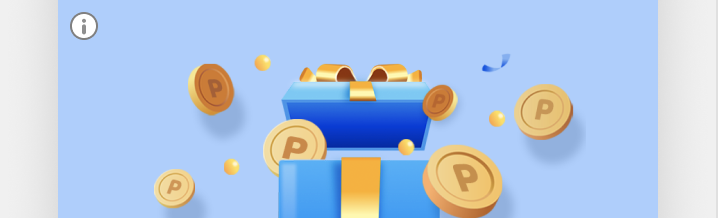
 
- AdInfoView 추가하기

   - SDK에서는 AdInfoView를 제공하며, APP에서는 해당 View를 광고 영역에 추가함으로서 맞춤형 광고에 대한 고지 기능을 제공할 수 있습니다.
```
<com.skplanet.skpad.benefit.presentation.nativead.NativeAdView
    android:id="@+id/native_ad_view"
    ...생략... >
     
    // AdInfoView 는 NativeAdView의 하위 컴포넌트로 구현해야합니다.
    <com.skplanet.skpad.benefit.presentation.guide.AdInfoView
        android:id="@+id/information"
        ...생략... />
 
    ...생략...
</com.skplanet.skpad.benefit.presentation.nativead.NativeAdView>
```

```
public void populateAd(final NativeAd nativeAd) {
    final NativeAdView view = findViewById(R.id.your_native_ad_view);
 
    final Ad ad = nativeAd.getAd();
 
    final MediaView mediaView = view.findViewById(R.id.mediaView);
    final TextView titleTextView = view.findViewById(R.id.textTitle);
    final ImageView iconView = view.findViewById(R.id.imageIcon);
    final TextView descriptionTextView = view.findViewById(R.id.textDescription);
    final CtaView ctaView = view.findViewById(R.id.ctaView);
    final AdInfoView adInfoView = interstitialView.findViewById(R.id.information);
    final InquiryView inquiryView = interstitialView.findViewById(R.id.inquiryButton);

    final CtaPresenter ctaPresenter = new CtaPresenter(ctaView); // CtaView should not be null
    ctaPresenter.bind(nativeAd);
 

    ...생략...
    // NativeAdView에 AdInfoView를 설정해주어야 합니다.
    view.setAdInfoView(adInfoView);


    view.setMediaView(mediaView);
    view.setClickableViews(clickableViews);
    view.setNativeAd(nativeAd);
    ...생략...

}
```


### 유저 문의하기 사용하기
종종 리워드 미적립을 이유로 유저가 문의(VOC)를 보내기도 합니다.

이러한 유저 VOC에 대한 접수 및 처리를 자동화 하기 위해 SDK에서는 미리 만들어 놓은 웹 페이지를 제공하고 있습니다.

이 문의하기 페이지는 연동되어 있는 앱을 기준으로 조회하기 때문에, 유닛별로 구현할 필요가 없으며, VOC의 위치를 강제하지 않습니다.

- 아래의 단계를 통해 해당 기능을 사용하실 수 있습니다.

   1. VOC 페이지 로드를 위한 유저 진입 Icon/ Tab을 디자인 합니다.
   2. 1번의 Icon/Tab이 클릭될 때 코드에서 `SKPAdBenefit.getInstance().showInquiryPage()` 호출합니다.

- Interstitial, Feed 타입의 경우, 문의하기에 사용하는 기본 제공 아이콘을 사용하실 수 있습니다.

   - Interstitial - `InterstitialAdConfig`에 `showInquiryButton(true)` 설정.
```
        InterstitialAdConfig config = new InterstitialAdConfig.Builder()
                .showInquiryButton(true)    // 문의하기 버튼 활성화
                                            // 단, 만14세 이상인 경우에만 VOC(문의하기) 기능을 노출해야합니다.
                .build();

```


   - Feed - 툴바를 커스터마이징하여, 툴바 메뉴에 포함된 "문의하기" 메뉴가 출력되지 않도록 해야 합니다.


- Native Type일 경우에는, 문의하기를 위해 제공되는 View를 사용하실 수 있습니다.


```
<com.skplanet.skpad.benefit.presentation.nativead.NativeAdView
    android:id="@+id/native_ad_view"
    ...생략... >
     
    // InquiryView 는 NativeAdView의 하위 컴포넌트로 구현해야합니다.
   
    <com.skplanet.skpad.benefit.presentation.guide.InquiryView
        android:id="@+id/inquiryButton"
        ...생략... />
 
    ...생략...
</com.skplanet.skpad.benefit.presentation.nativead.NativeAdView>
```

```
public void populateAd(final NativeAd nativeAd) {
    final NativeAdView view = findViewById(R.id.your_native_ad_view);
 
    final Ad ad = nativeAd.getAd();
 
    final MediaView mediaView = view.findViewById(R.id.mediaView);
    final TextView titleTextView = view.findViewById(R.id.textTitle);
    final ImageView iconView = view.findViewById(R.id.imageIcon);
    final TextView descriptionTextView = view.findViewById(R.id.textDescription);
    final CtaView ctaView = view.findViewById(R.id.ctaView);
    final AdInfoView adInfoView = interstitialView.findViewById(R.id.information);
    final InquiryView inquiryView = interstitialView.findViewById(R.id.inquiryButton);

    final CtaPresenter ctaPresenter = new CtaPresenter(ctaView); // CtaView should not be null
    ctaPresenter.bind(nativeAd);
 

    ...생략...
    // NativeAdView에 InquiryView를 설정해주어야 합니다.
    view.setInquiryView(inquiryView);

    // 만 14세 이상인 경우에만 VOC(문의하기) 기능을 노출해야합니다.
    view.setVisibility(Constants.OLDER_14YEAR ? View.VISIBLE : View.INVISIBLE);


    view.setMediaView(mediaView);
    view.setClickableViews(clickableViews);
    view.setNativeAd(nativeAd);
    ...생략...

}
```
### 문의하기 기능 주의사항
Planet AD는 만 14세 미만 아동에게 (맞춤형) 리워드 광고를 송출하지 않습니다.
- 따라서, APP에서는 만 14세 미만의 고객에게는  Planet AD SDK에서 제공하는 VOC(문의하기) 기능을 제공해서는 안됩니다.
- 혹 제공 중일 경우, 앱에서는 고객이 만 14세 미만일 경우 Planet AD의 VOC(문의하기)로 진입할 수 있는 기능을 비활성화 혹은 숨김처리되어야 합니다.


## Android 14 Foreground Service 정책 대응 

[안드로이드 14부터 변경된 Foreground Service 정책](https://developer.android.com/about/versions/14/changes/fgs-types-required?hl=ko#special-use) 대응을 위한 가이드에 대해 기술합니다.

### POP 기능의 Foreground Service Type 고지 관련
Planet AD Benefit SDK에는 POP 기능을 위해 Foreground Service가 포함되어 있으며, 해당 Service의 Type은는 "specialUse"로 설정되어 있습니다.

앱에서 추가적으로 고지가 필요할 경우 아래의 내용에 대한 참고가 필요합니다.

```
<service android:name="com.skplanet.skpad.benefit.pop.DefaultPopControlService"
    android:foregroundServiceType="specialUse">
    <property android:name="android.app.PROPERTY_SPECIAL_USE_FGS_SUBTYPE"
        android:value="@string/explanation_for_special_use"/>
</service>
```
```
<?xml version="1.0" encoding="utf-8"?>
<resources>
    <string name="explanation_for_special_use">- 포그라운드 서비스를 사용하는 기능은 Bubble이며, 사용자가 기기의 화면을 키는 동작, 잠금을 해제하는 동작의 피드백으로 즉시 제공되어야 합니다.\n
- 포그라운드 서비스는 각 동작에 대한 broadcast를 즉각적으로 받기 위해서 실행되어 있어야 하고, 적절한 포그라운드 카테고리가 없기 때문에 special use 권한을 활용합니다.</string>
</resources>
```

### POP 기능 제외를 통한 불필요한 Foreground Service의 제거
Planet AD Benefit SDK를 사용하나, POP 기능을 사용하지 않는다면, 해당 기능은 아래와 같이 Exclude함으로서 제외함으로서 불필요한 Foreground Service가 앱에 포함되는 것을 막을 수 있습니다.

```
implementation ("com.skplanet.sdk.ad:skpad-benefit:1.10.1") {
    changing = true
    exclude group: 'com.skplanet.sdk.ad', module: 'skpad-benefit-pop'
}

```

