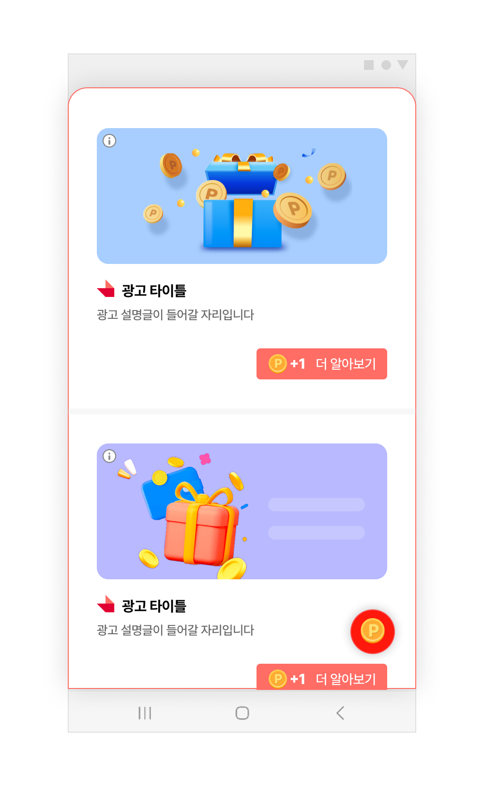

## Feed 기본설정

### 개요
Feed 지면은 광고를 리스트 형식으로 제공하는 지면입니다.



### 준비 사항
- [시작하기](./0_benefit_begin.md) 적용 완료
- Feed 지면에 사용할 Unit ID (이하 YOUR_FEED_UNIT_ID)


### Feed 지면 초기화
<p>BuzzAdBenefitConfig에 FeedConfig를 추가합니다.</p>

```java
public class App extends Application {
    @Override
    public void onCreate() {
        super.onCreate();
        
        final FeedConfig feedConfig = new FeedConfig.Builder(context, "YOUR_FEED_UNIT_ID")
            .feedHeaderViewAdapterClass(DefaultFeedHeaderViewAdapter.class)
            .build();
            
        final BuzzAdBenefitConfig buzzAdBenefitConfig = new BuzzAdBenefitConfig.Builder(context)
            .setFeedConfig(feedConfig)
            .build();
            
        BuzzAdBenefit.init(this, buzzAdBenefitConfig);

        ...
    }
}
```

FeedConfig를 사용하여 Feed 지면의 기능과 디자인을 변경할 수 있으며, [고급 설정](./2_Feed-advanced.md)을 참고하여 Feed 지면의 기능과 변경 방법을 확인할 수 있습니다.

### Feed 지면 표시


바텀시트 형태의 Feed지면을 표시합니다. 광고를 할당 받지 않은 상태에서는 Feed 지면이 사용자에게 노출된 후에 자동으로 할당받습니다.
- 단, 할당 받는 도중에는 "참여할 수 있는 광고가 없습니다." 라는 이미지가 보일 수 있습니다.
```java
final FeedHandler feedHandler = new FeedHandler(context, "YOUR_FEED_UNIT_ID");
feedHandler.startFeedActivity(this);
```

startFeedActivity()를 반복해서 호출하더라도 광고는 갱신되지 않고 동일한 광고가 보입니다. 새로운 광고를 할당하기 위해서는 FeedHandler 인스턴스를 다시 생성하거나, preload() 를 다시 호출해야합니다.
사용자에게 다른 형태로 Feed지면을 제공하기 위해서 프래그먼트로 Feed 연동을 참고하시기 바랍니다.

### 광고 할당 받기
preload를 호출하여 광고를 할당받을 수 있습니다. preload를 반복해서 호출하면 광고가 갱신됩니다.<br>
개인 정보 처리 방침에 동의하지 않고 preload를 호출하면 광고 할당을 할 수 없습니다. SDK에서 제공하는 개인 정보 처리 방침 UI를 이용하여 preload를 호출하기 이전에 개인 정보 처리 방침에 대해 동의를 받을 수 있습니다.<br>
다음은 광고 할당 후 Feed 지면을 표시하는 예시입니다. 다음과 같이 구현하면 사용자가 Feed 지면에 진입하기 전에 광고 할당이 보장되기 때문에 "참여할 수 있는 광고가 없습니다."는 이미지를 보이지 않습니다.

```java
final FeedHandler feedHandler = new FeedHandler(context, "YOUR_FEED_UNIT_ID");
feedHandler.preload(new FeedHandler.FeedPreloadListener() {
    @Override
    public void onPreloaded() {
        int feedAdSize = feedHandler.getSize(); // 광고의 개수
        int feedTotalReward = feedHandler.getTotalReward(); // 적립 가능한 총 포인트 금액
        feedHandler.startFeedActivity(context);
    }
 
    @Override
    public void onError(AdError error) {
        // 광고가 없을 경우 호출됩니다. error를 통해 원인을 알 수 있습니다
    }
});
```