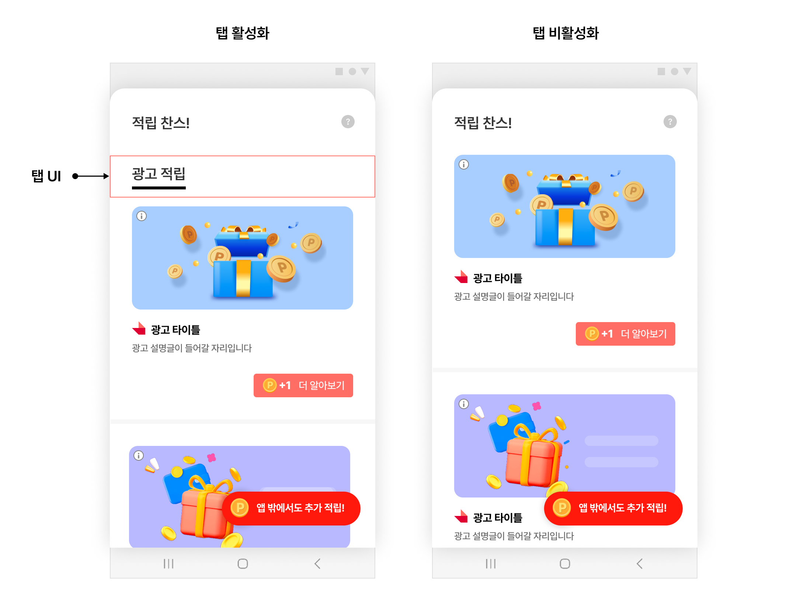

## Native 고급설정

### 개요
본 가이드는 Native 지면에서 추가적으로 제공하는 기능에 대하여 추가적으로 설명합니다. 필요에 따라 가이드를 참고하시어 더욱 고도화할 수 있습니다.

#### CtaView버튼 커스터마이징


PlanetAD Android SDK 에서 기본으로 제공하는 CtaView UI 및 처리 로직을 사용하지 않고 구현을 원하는 경우에는 다음과 같이 수정할 수 있습니다.

```
public void populateAd(final NativeAd nativeAd) {
    final NativeAdView view = findViewById(R.id.native_ad_view);
 
    final Ad ad = nativeAd.getAd();
 
    // create ad component
    ...생략...
     
    final YourCtaView ctaView = view.findViewById(R.id.your_cta_view);
    updateCtaStatus(ctaView, nativeAd);
     
    ...생략...
 
    final List<View> clickableViews = new ArrayList<>();
    clickableViews.add(customizedCtaView);
     
    ...생략...
 
    nativeAdView.addOnNativeAdEventListener(new NativeAdView.OnNativeAdEventListener() {
        ...(생략)...
 
        @Override
        public void onClicked(@NonNull NativeAdView view, @NonNull NativeAd nativeAd) {
            updateCtaStatus(ctaView, nativeAd);;
        }
         
        @Override
        public void onParticipated(@NonNull NativeAdView view, @NonNull NativeAd nativeAd) {
            updateCtaStatus(ctaView, nativeAd);
        }
    });
}
 
// 기획에 따라 수정될 수 있는 예시 코드입니다.
void updateCtaStatus(YourCtaView ctaView, NativeAd nativeAd) {
    final String callToAction = nativeAd.getAd().getCallToAction();
    final int reward = nativeAd.getAvailableReward();
    final int totalReward = nativeAd.getAd().getReward();
    final boolean participated = nativeAd.isParticipated();
    final boolean isClicked = nativeAd.isClicked();
    final boolean isActionType = nativeAd.getAd().isActionType();
 
 
    if (isClicked && isActionType && !participated) {
        ctaView.setCtaText("참여 확인 중");
        ctaView.setRewardIcon(null);
        ctaView.setRewardText(null);
    } else {
        if (totalReward > 0 && participated) {
            ctaView.setRewardIcon(R.drawable.your_reward_received_icon);
            ctaView.setRewardText(null);
            ctaView.setCtaText("참여 완료");
        } else if (reward > 0) {
            ctaView.showRewardImage(R.drawable.your_reward_icon);
            ctaView.setRewardText(String.format(Locale.US, "+%,d", reward));
            ctaView.setCtaText(callToAction);
        } else {
            ctaView.showRewardImage(null);
            ctaView.setRewardText(null);
            ctaView.setCtaText(callToAction);
        }
    }
}
```

#### 한번에 여러 개의 광고 로드
한 번의 광고 요청으로 여러 개의 광고를 할당받을 수 있습니다. 최대 10개까지 가능합니다.<br>
다음은 NATIVE_ADS_COUNT를 지정하여 여러 개의 광고를 할당받는 예시입니다.
```
final NativeAdLoader loader = new NativeAdLoader("YOUR_NATIVE_AD_UNIT_ID");
loader.loadAds(new NativeAdLoader.OnAdsLoadedListener() {
    @Override
    public void onLoadError(@NonNull AdError adError) {
        ...
    }
 
    @Override
    public void onAdsLoaded(@NonNull Collection<NativeAd> collection) {
        ...
    }
}, NATIVE_ADS_COUNT);
```

#### 비디오 광고 리스너 등록
비디오형 광고에서 발생하는 이벤트를 수신할 수 있습니다.<br>
다음은 MediaView에 비디오 광고 이벤트 리스너를 등록하는 예시입니다.

```
mediaView.setVideoEventListener(new VideoEventListener() {
  @Override
  public void onVideoStarted() {
  }
 
  @Override
  public void onError(@NonNull VideoErrorStatus videoErrorStatus, @Nullable String errorMessage) {
    if (errorMessage != null) {
        Toast.makeText(mediaView.getContext(), errorMessage, Toast.LENGTH_SHORT).show();
    }
  }
 
  @Override
  public void onResume() {
  }
 
  @Override
  public void onPause() {
  }
 
  @Override
  public void onReplay() {
  }
 
  @Override
  public void onVideoEnded() {
    // 동영상 재생 완료시 필요한 처리
  }
 
  @Override
  public void onLanding() {
    // 동영상 광고 랜딩시 필요한 처리
  }
});
```

