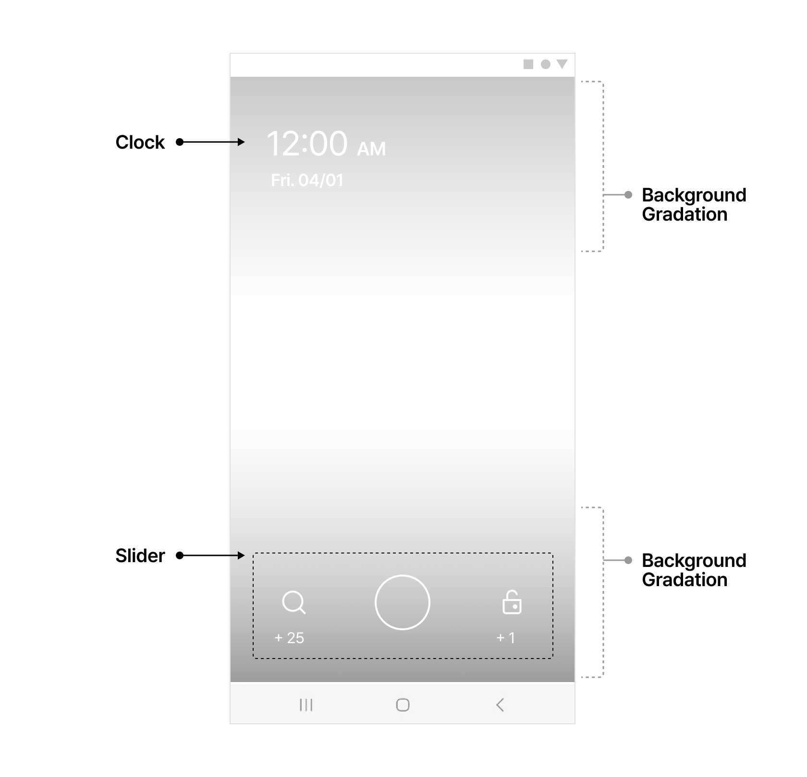

# Android SKP AD Sceen SDK 연동 가이드

## 목차
- [기본 설정](#기본-설정)
- [일시적 비활성화](#일시적-비활성화)
- [서비스 노티피케이션](#서비스-노티피케이션)
- [광고 컨텐츠 설정](#광고-컨텐츠-설정)
- [UI 커스터마이징](#UI-커스터마이징)
- [유저 액션 리스너](#User-Action-Listener)
- [배터리 최적화 옵션끄기](#배터리-최적화-옵션-끄기)
- [맞춤형 광고에 대한 고지와 VOC 지원](#맞춤형-광고에-대한-고지와-VOC-지원)
- [Android 14 Foreground Service 정책 대응](#Android-14-Foreground-Service-정책-대응)

## 기본 설정

### 시작하기 전에

#### 안내 사항

본 문서는 SKP AD Screen SDK를 퍼블리셔의 안드로이드 어플리케이션에 연동하기 위한 가이드입니다. 아래의 안내사항을 숙지 후 연동을 진행해주세요.

연동 작업 전 SKP 담당 매니저와 사전 협의가 완료되어야 합니다.

[잠금화면을 통한 수익 창출](https://play.google.com/intl/ko_ALL/about/monetization-ads/ads/lockscreen)에 대한 구글 정책을 반드시 확인 후 연동을 진행합니다.

잠금화면 앱은 잠금화면 기능만을 수행해야 하므로 이 외의 목적을 가진 어플리케이션에는 잠금화면을 넣을 수 없습니다.

서비스 출시 이전에 연동이 완료된 앱의 apk 파일을 SKP빌 BD 매니저에게 전달 후 승인 과정을 거쳐야 합니다.

#### Requirements

||항목|세부내용|비고|
| :- | - | - | - |
|1|안드로이드 지원 버전|Android 4.0.3 (API Level 15) 이상 Android 10 정식 지원||
|2|[Google Play의 대상 API 레벨 요구사항을 충족](https://developer.android.com/distribute/best-practices/develop/target-sdk)|<p>SKPADScreen SDK의 대응:</p><p>targetSdkVersion 34 사용 compileSdkVersion 34 이상 사용</p>|<p>정책 적용 시점</p><p>신규 앱: 2019년 8월 1일 기존 앱: 2019년 11월 1일</p>|
|3|AndroidX 적용|[AndroidX 사용하기](https://developer.android.com/jetpack/androidx/migrate?hl=ko) 참조||
|4|targetSdkVersion 34 지원|SKP AD screen SDK 최신 버전에서는 targetSdkVersion 34 사용 가능||
|5|Kotlin 버전|1\.7 이상 사용||

Lockscreen Activity의 style에 windowTranslucent, windowIsFloating, windowSwipeToDismiss 중 1개 이상이 true로 설정되어 있을 경우 Android OS 8.0 버전에서 크래시가 발생할 수 있으므로 확인이 필요합니다. 

이에 해당된다면 아래 내용을 확인해주세요.

<details>
  <summary>Android 8.0에서의 Lockscreen Activity의 특정 스타일로 인한 충돌 방지하기</summary>
<br>
Lockscreen Activity의 특정한 style 설정이 Android OS 8.0 버전에서 크래시가 발생할 수 있으므로 확인이 필요합니다.<br>

발생 조건: [Android API 26의 설정](https://android.googlesource.com/platform/frameworks/base/+/android-8.0.0_r36/core/java/android/app/Activity.java#986)으로 인해, 아래 조건 모두 충족 시 Crash 발생

+ 앱의 targetSdkVersion 이 27 이상<br>
+ 유저의 디바이스의 OS 버전이 8.0 (API 26)<br>
+ Lockscreen Activity에 적용된 style에 windowTranslucent, windowIsFloating, windowSwipeToDismiss 중 1개 이상이 true로 설정되어 있을 경우<br>

해결 방안
+ styles.xml 에서 windowTranslucent, windowIsFloating,windowSwipeToDismiss 중 true로 세팅된 항목을 제거 또는 false로 변경


```xml
<resources>
<style name="YourLockScreenTheme" parent="@style/AppTheme">
    <!-- Items below need to be removed or set to false on specific conditions-->
    <item name="android:windowIsTranslucent">false</item>
    <item name="android:windowIsFloating">false</item>
    <item name="android:windowSwipeToDismiss">false</item>

</style>
</resources>
```

</details>


#### Prerequisites

항목 세부내용 비고

||항목|세부내용|비고|
| :- | - | - | - |
|1|퍼블리셔 앱 로그인을 위한 API 서버|SKPAdScreen SDK에 유저 정보를 등록하기 위함||
|2|포인트 적립 요청 수신 API|PlanetAD 서버에서 퍼블리셔 서버로 포인트 적립 요청을 보낸 이후, 실제 포인트 지급을 처리할 퍼블리셔의 API 서버||
|3|연동을 위한 키값|<p>PlanetAD 매니저로부터 발급받은 아래 값들</p><p>app\_key : 퍼블리셔 앱의 키값 unitId : 광고 서빙을 위한 Unit ID||

### build.gradle , AndroidManifest.xml 설정

build.gradle 에 아래 코드에 보이는 저장소 및 디펜던시를 추가합니다.

```
repositories {
    maven { url "https://asia-northeast3-maven.pkg.dev/planetad-379102/planetad" }
}
 
dependencies {
    implementation ("com.skplanet.sdk.ad:skpad-screen:1.14.3")
}
```

AndroidManifest.xml에 아래 meta data를 추가하고 000000000000 부분에 app_key를 기입합니다.

```xml
<meta-data
    android:name="com.skplanet.APP_KEY"
    android:value="app-pub-000000000000" />
```

### 메소드 호출

연동 단계는 1) 초기화 → 2) 유저 정보 설정 → 3) 잠금화면 제어 설정 의 세 단계를 따라야 합니다.

##### 1) 초기화: init() 및 launch() 호출

|항목|코드|호출 위치|세부내용|
| :- | - | - | - |
|SKP AD Screen 초기화 필수|```SKPAdScreen.init(String unitId, Context context, Class lockerActivityClass, int imageResourceIdOnFail)```| <li>Application Class 의 onCreate()</li><li>모든 다른 메소드보다 항상 먼저 호출되도록 함</li><li>기존에 사용하던 Application Class가 없이 SKP AD Screen 연동을 위해 처음으로 Application Class를 생성할 경우 반드시 AndroidManifest.xml에 해당 Application Class를 등록해야 합니다.</li>|Parameters<li>unitId : SKPAdScreen SDK 사용을 위한 Unit ID로,SKP AD Screen 어드민에서 확인 가능합니다.</li><li>context : Application context 를 this 로 입력합니다.</li><li>lockerActivityClass : 잠금화면 액티비티 클래스.<ul><li>잠금화면을 커스터마이징하지 않는 경우 SDK 내에서 제공하는 SimpleLockerActivity.class 를 설정합니다.</li><li>커스터마이징을 하는 경우 직접 구현한 액티비티 클래스를 설정합니다. 자세한 사항은 [UI 커스터마이징](#UI-커스터마이징) 문서의 설명을 참조하세요.</li><li>imageResourceIdOnFail : 네트워크 에러 발생 시 혹은 일시적으로 잠금화면에 보여줄 캠페인이 없을 경우 보여주게 되는 이미지를 앱 내 리소스에 포함시켜야 하며, 이 이미지의 리소스 아이디를 설정합니다.</li></ul>|
SKP AD Screen 시작 필수|```SKPAdScreen.getInstance().launch()```|앱 실행 시 처음 실행되는 액티비티에 추가||

###### Sample Code
```Java
public class App extends Application {

    @Override
    public void onCreate() {
        super.onCreate();
        ...

        SKPAdScreen.init("Unit ID", this, SimpleLockerActivity.class, R.drawable.image_on_fail);
    }
}
```

##### 2) 유저 정보 설정

연령, 성별, 지역 등 타게팅 정보를 설정하지 않는 경우 타게팅이 설정된 광고가 보이지 않으므로, 유저가 볼 수 있는 전체 광고의 수량이 줄어들게 됩니다. 설정이 불가할 경우 PlanetAD 담당 매니저와 논의 부탁드립니다.

|항목|코드|호출 위치|세부내용|
| :- | - | - | - |
|사용자 정보 설정을 위한 객체|```SKPAdScreen.getInstance().getUserProfile()```|SKPAdScreen.getInstance().activate() 호출 전에 반드시 유저 정보를 설정해야 함|유저 정보 설정할 수 있는 Class 인 UserProfile 호출|
|유저 식별값 필수|```setUserId(String userId)```||userId<li>유저에게 적립금을 지급하기 위한 필수적인 설정값</li><li>매체사에서 유저를 구분할 수 있는 식별값</li><li>매체사 포인트 적립 포스트백 API 연동 요청 시에 전달됨</li><li>앱 재설치 또는 일정 주기에 따라 userId 가 변화할 경우,반드시 BD 매니저와 사전 논의 필요</li>|
|유저 연령 권장|```setBirthYear(int birthYear)```|| 유저의 출생년도를 4자리 숫자로 입력하여 나이 설정|
|유저 성별 권장|```setGender(String gender)```|| 미리 정의된 String 을 통해 형식에 맞추어 성별 설정<li>UserProfile.USER_GENDER_MALE : 남성</li><li>UserProfile.USER_GENDER_FEMALE : 여성</li>|
|유저 지역 권장|```setRegion(String region)```|| "시/도 + 공백 + 시/군/구" 형식으로 설정<li>사용가능한 시/도 및 시/군/구 정보</li><li>예시: "서울특별시 관악구", "제주특별자치도 제주시"</li>|
이 외 선택|커스텀 타게팅 문서 참고|| 매체사에서 원하는 유저 정보로 타게팅 가능

##### 3) 잠금화면 제어

|항목|코드|호출 위치|세부내용|
|:-|-|-|-|
SKP AD Screen 활성화 필수|```SKPAdScreen.getInstance().activate()```|<p>SKP AD Screen 활성화 시점 <li>activate()를 처음 잠금화면 활성화 시 호출하면, 이후부터 자동으로 잠금화면 사이클이 관리 되기 때문에 deactivate()를 호출하기 전에 다 시 호출할 필요는 없음</li>|이 함수가 호출된 이후부터 잠금화면에 SKP AD Screen이 나타남
SKP AD Screen 비활성화 필수|```SKPAdScreen.getInstance().deactivate()```|SKP AD Screen 비활성화 시점|이 함수가 호출되면 더 이상 잠금화면에 SKPAdScreen이 나타나지 않음
유저 로그아웃 필수|```SKPAdScreen.getInstance().logout()```|유저가 로그아웃하는 시점|이 함수는 deactivate() 를 호출하며, SKPAdScreen에서 사용하는 유저 정보를 디바 이스에서 삭제함
SKPAdScreen이 화면에서 사라 지는 시간 설정 권장|```SKPAdScreen.getInstance().setSettings(SKPAdScreen. Settings.FINISH_IN_SEC, int set_seconds)```|SKPAdScreen.init() 이후에 호출|<p>SKPAdScreen 액티비티가 화면에 뜬 뒤 일정 시간 동안 유저의 활동이 없을 경우 SKPAdScreen이 화면에서 사라짐</p><li><p>Parameters</p></li><ul><li>set\_seconds : 유저의 활동이 없는 경우 SKPAdScreen이 화면에서 사 라지게 될 시간 (초 단위)</li></ul><li>상세 동작 예시</li><ul><li>미설정 시: 60초 동안 유저 활동이 없을 경우 동작 <li>set_seconds = 30 : 30초 동안 유 저 활동이 없을 경우 동작</li><li> set_seconds = 0 : 해당 기능 미동작</li></ul>
|잠금화면을 활성화한 후 실제로 잠금화면이 처음 준비가 된 시 점 확인 선택|```SKPAdScreen.getInstance().activate(OnReadyListener listener)```||활성화한 후 실제로 잠금화면이 처음 준비가 완료된 시점을 알고 싶을 때, 아래의 interface 를 구현하여 activate() 메소드의 파라미터로 넘깁니다. <br><br>public interface OnReadyListener { <br> &nasp; void onReady(); // This will be called when the first lockscreen is ready to be shown.<br>}|
Notification 커스텀 선택|서비스 노티피케이션 문서 참고||SKPAdScreen을 활성화한 후 Notification area 에 생성된 Notification의 icon, text 등을 수정하고자 하는 경우|
|잠금 화면 광고 할당Callback|'''SKPAdScreen.getInstance().setAllocationListener(OnAllocationListener listener)'''|SKPAdScreen.init() 이후에 호출|<p>잠금화면이 활성화 된 이후 광고 할당이 완료 되는 시점에 호출되는 Callback</p>Callback Instance의 유지 필요

### 기본 보안기능 화면 속성 수정

SKPAdScreen.init()된 직후 메소드를 호출하여 보안기능 화면 속성을 수정합니다.
+ backgroundResourceId(int resourceId): Swipe mode 보안화면에 나오는 배경화면을 지정
+ backgroundImageScaleType(enum ImageView.ScaleType): Swipe mode 보안화면에 지정한 배경화면의 정렬값 설정 (기본값: FIT_XY)
+ backgroundColor(int Color): Swipe mode 보안화면의 배경색 설정 (기본값: Color.WHITE)
+ backgroundDimAlpha(float): Swipe mode 보안화면에는 시계와 액션 안내 텍스트의 가독성을 높이기 위하여 알파값이 적용된 검은색 화면의 알파값을 조절 (기본값: 0.7)

+ showClock(boolean): 시계의 노출/미노출을 세팅 (기본값: true)

+ showDescription(boolean): 유저 액션 안내 텍스트의 노출/미노출을 세팅 (기본값: true)

##### Sample Code

```java
SKPAdScreen.init("app_key", this, SimpleLockerActivity.class, R.drawable.image_on_fail, Constants.useGDPR? SKPAdScreen.PrivacyPolicy.GDPR :SKPAdScreen.PrivacyPolicy.NONE);

SKPAdScreen.getInstance().setSecurityConfiguration(
        new SecurityConfiguration.Builder().
                backgroundResourceId(R.drawable.your_drawable).
                backgroundImageScaleType(ImageView.ScaleType.FIT_CENTER).
                backgroundColor(Color.WHITE).
                backgroundDimAlpha(0.7f).
                showClock(true).
                showDescription(true).
                build());
```


### "다른 앱 위에 그리기" 권한 얻기

[안드로이드 10부터 변경된 정책](https://developer.android.com/guide/components/activities/background-starts)에 따라, 잠금화면을 띄우기 위해서는 "다른 앱 위에 그리기" 권한 획득이 필요합니다. 따라서 사용자에게 해당 권한 요청에 대한 메시지를 잠금화면과 In-App에서 노출해 권한 획득을 도울 수 기능을 제공합니다.

##### 1) 잠금화면 안내 메시지

+ 앱에서 추가 코드를 작성할 필요없이 자동으로 적용
+ Android 8 (Oreo) 미만이거나 해당 권한이 이미 획득되어 있는 경우에는 팝업을 보여주지 않음
+ 6시간 간격으로 노출

##### 2) In-App 안내 메시지

```boolean SKPAdScreen#showOverlayPermissionGuideDialogIfNeeded(Activity)```

+ 유저에게 "다른 앱 위에 그리기" 권한 획득을 요청하는 메시지의 팝업 다이얼로그를 띄우는 인터페이스
+ 앱의 메인 화면이 생성될 때나(MainActivity의 OnCreate()), 사용자가 잠금화면을 활성화했을 때 해당 팝업을 보여주는 것을 권장
+ 리턴 값은 팝업 다이얼로그가 발생했는지 아닌지를 알려주는 boolean 값

```
public class MainActivity extends Activity {

        @Override
        protected void onCreate(Bundle savedInstanceState) {
            // (생략)
            SKPAdScreen.getInstance().showOverlayPermissionGuideDialogIfNeeded(MainActivity.this);
        }
}
```

+ 팝업에서 확인 클릭 시 해당 권한을 획득할 수 있는 안드로이드 설정 화면으로 이동하고, 권한 획득시 자동으로 이전 화면으로 전환
+ Android 8 (Oreo) 미만이거나 해당 권한이 이미 획득되어 있는 경우에는 팝업을 보여주지 않음

### 포인트 적립 포스트백 연동 - Server-to-Server 연동

SKPAdScreen은 포인트 적립이 발생했을 때 직접 유저들에게 포인트를 지급하는 것이 아닙니다. SKPAdScreen 서버에서는 매체사 서버로 포인트 적립 요청을 보낼 뿐이며, 실제 지급은 매체사 서버에서 처리합니다.

+ 프로세스
  1. 매체사 포인트 적립 포스트백 API 연동 문서를 참고하여 포스트백 수신 서버 구축
  2. Endpoint url을 PlanetAD 매니저에게 전달

포인트 적립 알림 푸시를 유저에게 보내고 싶은 경우에는 포인트 적립 요청을 받고 매체사에서 직접 푸시를 전송합니다.

#### 포인트 적립 요청 흐름


SKPAdScreen의 UI 및 동작을 커스터마이징하고 싶다면 [고급 설정 문서](#UI-커스터마이징)를 참고하여 구현합니다.


## 일시적 비활성화
SKP AD Screen을 일시적으로 비활성화하기 위해 사용할 수 있는 기능입니다.

유저가 잠금화면을 비활성화하려고 하는 순간 특정 시간 뒤에 자동으로 다시 활성화시킬 수 있는 선택지를 제공함으로써 유저 수가 감소하는 것을 방어 할 수 있습니다.


|분류|항목|코드|호출 위치|세부내용|
| - | - | - | - | - |
일시적으로 잠금화면 을 비활성화하는 기 능|특정 시간 동안 비활성화|```SKPAdScreen. getInstance().snooze(int snoozeForSecs)```|<p>SKP AD Screen이 활성화된 상태에서 비활성화하려 할 때 옵션으로 제공 </p><p>일시적 비활성화 후에 SKPAdScreen.getInstance(). activate() 를 호출하면 바로 다시 잠금화면이 보이게 됩 니다.</p>|<p><li>snoozeForSecs 초 동안 SKP AD Screen이 잠금화면에 나타 나지 않음</li><li>snoozeForSecs 후에 다시 자동 으로 SKP AD Screen이 보이게 됨</li>
||재부팅될 때까지 비활성화|```SKPAdScreen.getInstance().deactivateUntilReboot()```||<li>재부팅될 때까지 SKP AD Screen이 잠금화면에 나타나지 않음</li><li>재부팅 후에 다시 자동으로 SKP AD Screen이 보이게 됨</li>
일시적 비활성화 상 태 확인 기능|특정 시간 동안 쉬는 상태인지 확 인|```SKPAdScreen.getInstance().isSnoozed()```|활성화 여부 확인하는 지점|현재 SKP AD Screen이 snoozeForSecs 초 동안 쉬는 상태인 지 확인|
||재부팅 전까지 쉬 는 상태인지 확인|```SKPAdScreen.getInstance().isDeactivatedUntilReboot()```||현재 SKP AD Screen이 재부팅 전까 지 쉬는 상태인지 확인


#### SKP AD Screen이 보여지는 조건
- SKPAdScreen.getInstance().isActivated() && !SKPAdScreen.getInstance().isSnoozed() && !SKPAdScreen.getInstance(). isDeactivatedUntilReboot()

## 서비스 노티피케이션

#### SKP AD Screen이 동작하기 위해서는 SKP AD Screen 잠금화면 서비스가 [Foreground Service](http://developer.android.com/guide/components/services.html#Foreground)로 실행됩니다. 
#### Foreground Service 실행 중인 경우는 반드시 서비스 노티피케이션을 보여주도록 되어있기 때문에, 아래와 같이 해당 노티피케이션의 설정을 수정 가능하도록 지원하고 있습니다.


## Usage
|항목|코드 & 호출 위치|세부내용|예시|
| - | - | - | - |
|서비스 노티피케이 션 커스터 마이징 권장|LockerServiceNotificationConfig 클래스를 통해 접근 (getter) 및 변경(setter) 반드시 SKPAdScreen.init() 다음에 호출해야 함|<p>Parameters</p><li>String Title : 노티피케이션의 상단 타이틀. 기본값은 앱 명칭</li><li>String Text : 노티피케이션의 하단 텍스트. 기본값은 빈 문자열("")</li><li>int SmallIcon : 노티피케이션의 작은 아이콘 이미지. 기본값은 앱 아이콘</li><li>int LargeIcon : 노티피케이션의 큰 아이콘 이미지. 기본값은 없음</li><li>boolean ShowAlways : 노티피케이션을 항상 보여줄지 유무. 위 설정 값들이 제대로 나오는지 테스트 목적으로도 사용 가능. 기본값은 false</li><li>intent Intent : 노티피케이션 클릭 시 실행될 인텐트. 기본값은 앱의 첫 액티비티(Launcher Activity)로 의 이동 인텐트|public class App extends Application {<br>   @Override<br>   public void onCreate() {<br>   super.onCreate();<br>    ....<br>    SKPAdScreen.init("app_key", this, SimpleLockerActivity. class, R.drawable.image_on_fail, false);<br>    // 노티피케이션 설정<br>    LockerServiceNotificati onConfig config = SKPAdScreen.getInstance().getLockerServiceNotificationConfig();<br>   config. setTitle("SampleTitle");<br>    config.setText("SampleText");<br>    config.setSmallIconResourceId(R.drawable.ic_noti_small);<br>    config.setLargeIconResourceId (R.drawable.ic_noti_large);<br>    // config.setShowAlways(true);<br>    }<br>    }
서비스 노티피케이션을 일시적으로 다른 노티피케이션으로 대체하기 선택|<p>서비스 노티피케이션이 노출되어 있는 상태에서 노티피케이션을 추가적으로 띄울 경우 (적립 알림 등), 한 앱에서 다수의 노티피케이션이 알림바에 나타나기 때문에 유저 경험 상 좋지 않을 수 있습니다. 해당 메소드를 통해 서비스 노티피케이션이 있던 곳에 새로운 노티피케이션을 띄우고, 다시 원래의 서비스 노티피케이션으로 돌아갈 수 있습니다.<li>퍼블리셔 측에서 빌드가 완료된 notification을 이 메소드의 파라미터로 전달</li><ul><li>해당 notification을 서비스 노티피케이션이 위치한 곳에 띄움</li></ul><li>이 메소드의 파라미터로 null을 전달하여 다시 호출<ul><li>다시 LockerServiceNotificationConfig에서 설정한 원래 상태의 서비스 노티피케이션으로 돌아감</li><ul>

## 광고 컨텐츠 설정

SKP Ad Screen스크린에 노출되는 광고와 컨텐츠에 대한 세부 설정을 선택할 수 있는 기능들입니다. 기능에 따라 유저가 개별 설정 가능하도록 UI를 오픈할 수 있는 경우도 있으니 자세한 내용은 각 기능 설명을 확인해주세요.<br><br>
하위 항목은 아래와 같습니다.

### 광고 컨텐츠 노출 비율
잠금화면 상하단 스크롤 시 화면에 나오는 광고와 컨텐츠의 비율을 조절할 수 있는 기능입니다. 단, 광고가 나올 순서에 노출 가능한 광고가 없을 경우 Backfill로 컨텐츠가 노출됩니다.<br>
유저에게 UI를 오픈하여 직접 설정값을 선택하도록 할 수도 있습니다.

||항목|코드 & 호출 위치|세부내용|
| :- | - | - | - |
|1|설정값 선택|```SKPAdScreen.getInstance().setSettings(SKPAdScreen.Settings.PAGE_DISPLAY_RATIO, String page_display_ratio)```|<p>page_display_ratio : 설정할 광고:컨텐츠 비율. 아래 값 들 중 선택 가능</p><p>"1\:1" "1\:2" "1\:3"|
|2|설정된 값 확인|```SKPAdScreen.getInstance().getSettings(SKPAdScreen.Settings.PAGE_DISPLAY_RATIO)```|<p>세팅된 String page\_display\_ratio 값을 리턴</p><p>위 1번의 setSettings() 로 설정한 값이 없을 경우 null 리턴</p>|

###  동영상 광고 자동재생
잠금화면 상하단 스크롤 시 화면에 나오는 광고와 컨텐츠의 비율을 조절할 수 있는 기능입니다. 단, 광고가 나올 순서에 노출 가능한 광고가 없을 경우 Backfill로 컨텐츠가 노출됩니다.<br>
유저에게 UI를 오픈하여 직접 설정값을 선택하도록 할 수도 있습니다.

||항목|코드 & 호출 위치|세부내용|
| :- | - | - | - |
|1|설정값 선택|<p>1. 인앱, 잠금화면 상 등에 자동재생 여 부 설정 가능한 UI 구현</p><p>2. SKPAdScreen.getInstance(). setAutoplayType(enum AutoplayType) 호출</p>|<p>setAutoplayType에 자동재생 설정값을 파라미터로 전달해야 함</p><p>SKPAdScreen.AutoplayType.ENABLED : 항상 자동재생 SKPAdScreen.AutoplayType.ON\_WIFI : 와이파이에서만 자동재생 SKPAdScreen.AutoplayType.DISABLED : 자동재생하지 않음</p>|
|2|설정된 값 확인|SKPAdScreen.getInstance(). getAutoplayType()|<p>세팅된 AutoplayType 값을 리턴!</p><p>위 1번의 setAutoplayType()로 설정한 값이 없을 경우 null 리턴</p>|
3|재생되고 있는 동영상의 현재 설정값 표시| onVideoAutoplay(AutoplayState autoplayState) |재생중인 동영상의 현재 설정값이 autoplayState 파라미터를 통해서 들어옴 <li>해당 값에 따라 이용자에게 메세지를 표시</li><br>protected void onVideoAutoplay(AutoplayState autoplayState) {<br>`    `int messageResourceId;<br>`    `switch (autoplayState) {<br>` ` ` `case AutoPlay:<br>` ` ` ` ` ` ` ` messageResourceId = R.string.autoplay\_enabled\_always;`        `<br>` ` ` ` ` ` ` ` break;<br>` ` ` ` case AutoPlayOnWIFI:<br>` ` ` ` ` ` ` ` messageResourceId = R.string.autoplay\_enabled\_on\_wifi;<br>` ` ` ` ` ` ` ` break;<br>` ` ` ` case NotAllowed:<br>` ` ` ` ` ` ` ` messageResourceId = R.string.autoplay\_disabled;<br>` ` ` ` ` ` ` ` break;<br>` ` ` ` default:<br>` ` ` ` ` ` ` ` return;<br>`    `}<br><br>` `final Snackbar snackbar = Snackbar.make(findViewById (android.R.id.content), messageResourceId, Snackbar. LENGTH\_SHORT);<br>...<br>`    `snackbar.show();<br>}<br>

### 광고・컨텐츠・컨텐츠채널 피드백
유저가 잠금화면 상의 광고나 컨텐츠, 혹은 컨텐츠 채널에 대해 피드백을 할 수 있는 기능입니다. 잠금화면 상에 노출된 소재 별 세부적인 기능 및 적용 방법은 아래와 같습니다.

1. User Flow

1) 광고

|기능|설명|
|-|-|
|광고 숨기기|해당광고 즉시 노출 중단|
|문의하기|사용자의 VOC를 위한 웹페이지 연동|
|이 광고가 노출된 이유|맞춤형 광고 고지 페이지로 진입|

2) 컨텐츠

|기능|설명|
|-|-|
|컨텐츠 숨기기|해당 컨텐츠 즉시 노출 중단|
|문의하기|사용자의 VOC를 위한 웹페이지 연동|
|"컨텐츠 채널"의 컨텐츠 숨기기|해당 컨텐츠 채널의 모든 컨텐츠가 롤링 목록에서 즉시 제거됨|
|숨긴 채널 보기(컨텐츠 채널을 1개 이상 숨겼을 경우 표시)|숨긴 채널 목록에서 특정 채널을 체크하면 숨김이 해제되며, 다음 할당 시부터 해당 컨텐츠 채널의 컨텐츠 재노출|

`"컨텐츠 채널"이란? `

잠금화면에 컨텐츠를 제공하는 매체사를 의미합니다. 매체사에 따라 뉴스, 건강, 연예 등 여러 카테고리의 컨텐츠를 제공할 수 있으며, 위 기능으로 하나의 컨텐츠 채널을 숨기면 카테고리를 불문하고 해당 채널의 모든 컨텐츠가 필터링됩니다.

2. Usage

    - 잠금화면 UI에 해당 기능을 위한 버튼 구현
    - 해당 버튼의 onClickListener에서 showLockerContextMenu() 호출

 
```
findViewById(R.id.locker_menu).setOnClickListener(new View.OnClickListener() {

    @Override
    public void onClick(View v) {
        showLockerContextMenu();
    }
});
```


## UI 커스터마이징

잠금화면 기본 UI를 고도화하여 퍼블리셔가 원하는 대로 디자인을 수정하고 기능을 추가할 수 있습니다.<br>
잠금화면은 하나의 액티비티로 구성되며, 일반적인 액티비티와 마찬가지로 **1) 레이아웃을 만들어주고, 2) 액티비티 클래스 내에서 몇 가지 필수 함수들을 호출**  혹은 구현해주면 됩니다.

### 레이아웃 - View 구현
레이아웃에는 필수적으로 시계, 슬라이더가 포함되어 있어야 하며, 캠페인 이미지에 따라 뷰들의 가독성이 떨어지지 않게 하기 위해 배경 그라데이션을 추가하는 것이 좋습니다. 그 외에 커스텀 기능을 위한 뷰 (아래 그림의 카메라 shortcut 등) 를 추가할 수 있습니다.


시계, 버튼 등의 컴포넌트의 사이즈를 sp로 설정할 경우 유저의 폰트 크기 설정에 따라 잠금화면 레이아웃이 바뀔 수 있습니다. 따라서 sp 사용 시 모든 경우의 해상도를 고려하여 레이아웃을 그려야 하며, 유저의 폰트 크기 설정과 무관하게 화면을 구성하고자 한다면 dp로 사이즈를 명시하는 것을 권장합니다. (참고: [안드로이드 가이드 문서](https://developer.android.com/guide/topics/resources/more-resources?hl=ko#Dimension))

#### 시계
레이아웃에 뷰를 추가하고, 해당 뷰에 표시되는 값은 액티비티 내의 onTimeUpdated에서 처리합니다.

#### 슬라이더
<p>슬라이더를 구성하는 모든 이미지들을 변경할 수 있습니다.</p>


|슬라이더 속성|설명|
| - | - |
slider:sl_left_icon|슬라이더의 왼쪽 아이콘
slider:sl_right_icon|슬라이더의 오른쪽 아이콘
slider:sl_pointer|슬라이더의 가운데 이미지
slider:sl_pointer_drag|슬라이더의 가운데 눌렀을 때 이미지
slider:sl_radius|슬라이더 중심과 좌우 아이콘 중심까지의 반지름
slider:sl_text_size|슬라이더의 포인트 텍스트의 크기 (Default : 14sp)

##### 슬라이더 속성 사용 예제

```java
<com.skplanet.skpadscreen.sdk.widget.Slider
     android:id="@+id/locker_slider"
     android:layout_width="match_parent"
     android:layout_height="wrap_content"
     android:layout_alignParentBottom="true"
     android:layout_centerHorizontal="true"
     android:layout_marginBottom="8dp"
     slider:sl_left_icon="@drawable/locker_landing"
     slider:sl_pointer="@drawable/locker_slider_normal"
     slider:sl_pointer_drag="@drawable/locker_slider_drag"
     slider:sl_radius="128dp"
     slider:sl_right_icon="@drawable/locker_unlock"
     slider:sl_text_size="14sp" />
```
슬라이더의 좌측, 우측 아이콘 변경시에는 반드시 크기가 112 x 112 픽셀 이상인 이미지를 사용해야 합니다.

#### 뷰 추가
일반적인 뷰와 같이, 원하는 뷰를 레이아웃에 배치하고, 기능은 액티비티 내에서 구현합니다.

#### 배경 그라데이션
현재 보여지는 캠페인 이미지에 따라 시계 및 슬라이더의 가독성이 떨어질 수 있으므로 해당 UI 뒤에 배경 그라데이션을 넣어줍니다.

---
### 액티비티 클래스 - 기능 구현
- BaseLockerActivity를 상속받아서 잠금화면 액티비티 클래스를 생성
- 초기화 함수 (SKPAdScreen.init() API) 의 3번째 파라미터에 생성한 액티비티 클래스를 지정
  - 액티비티 내에서 구현해야하는 필수 요소: 슬라이더, 시계
  - 그 외: 선택에 따라 직접 구현

#### AndroidManifest.xml 설정
##### BaseLockerActivity를 상속받은 클래스 이름이 CustomLockerActivity인 경우

```xml
<manifest>
    <application>
        ...
        <activity
            android:name=".CustomLockerActivity"
            android:excludeFromRecents="true"
            android:launchMode="singleTask"
            android:screenOrientation="portrait"
            android:taskAffinity="${applicationId}.Locker"
            android:resizeableActivity="false" />
    </application>
</manifest>
```

- excludeFromRecents, launchMode, screenOrientation, taskAffinity 속성은 반드시 위의 값으로 설정되어야 합니다.
- android:resizeableActivity="false" 의 경우 일부 삼성 단말에서 잠금화면 액티비티 사이즈 조절이 가능한 현상을 막기 위함으로, optional 한 항목입니다.


### 시계
- 레이아웃에서 배치한 뷰를 시간 변화에 따라 업데이트 해줍니다. 시간이 분 단위로 업데이트 될때마다 BaseLockerActivity 내의 함수인 onTimeUpdated가 호출되므로 이를 오버라이딩하여 이 함수의 파라미터로 전달되는 시간 정보를 이용해 time, am/pm, date 등의 정보를 업데이트해야 합니다.
- 잠금화면 액티비티에서 onCurrentCampaignUpdated 와 onTimeUpdated 를 오버라이딩하여 구현하지 않으면 오류가 발생하므로 반드시 구현해야 합니다. 구체적 사용 예시는 샘플 내의 CustomLockerActivity.java 를 참고하세요.

### 슬라이더
<p>슬라이더는 잠금화면과 독립적인 뷰이기 때문에 잠금화면과의 연동을 위해서는 크게 두 가지 작업을 해야 합니다.</p>

|항목|코드|세부내용|
| - | - | - |
좌/우 슬라이더 선택에 따른 리스너 등록|<p>좌/우 선택에 따른 리스너 등록</p><li>Slider.setLeftOnSelectListener</li><li>Slider.setRightOnSelectListener</li>|<p>좌/우 선택 이벤트 발생 시 아래 함수 호출</p><li>잠금해제: unlock</li><li>링크이동: landing</li>
좌/우 포인트 업데이트|<li>캠페인 롤링 시, 캠페인이 변할 때마다 BaseLockerActivity 내의 함수인 onCurrentCampaignUpdated 가 호출됨</li><li>이를 오버라이딩하여, 해당 함수의 파라미터로 전달되는 campaign 정보를 이용하여 포인트 정보 업데이트 해야함</li><ul><li>Slider.setLeftText</li><li>Slider.setRightText</li><ul>|캠페인 롤링 시 각가의 캠페인에 따라 화면에 표시되는 좌/우 포인트 변경이 필요함


### ELSE
이 외의 UI 커스터마이징은 아래 내용을 참고해주세요.

#### 전/후 페이지 유무 표시
잠금화면 터치 시 화면 상하단에 화살표 등으로 전/후 페이지 유무를 표시할 수 있습니다. 이를 위해서는 setPageIndicators 를 호출하여 표시할 뷰를 지정해줍니다.

- protected void setPageIndicators(View previous, View next)
  - Parameters
    - previous : 이전 페이지가 존재할 경우 표시할 뷰
    - next : 이후 페이지가 존재할 경우 표시할 뷰

```java
setPageIndicators(
    findViewById(R.id.locker_arrow_top),
    findViewById(R.id.locker_arrow_bottom)
);
```


#### 유저의 액션에 따라 Unlock/Landing 아이콘 바꾸기
기본적으로 제공되는 SimpleLockerActivity에서 양쪽 슬라이드 아이콘은 사용자 액션에 따라 세개의 다른 아이콘이 보여지도록 설정되어 있습니다. 아래 예시를 참고하여 유저 액션에 따라 아이콘을 바꾸어 보여줄 수 있습니다.
예를 들면 좌측 locker_landing 아이콘의 경우, 아래처럼 상태 값에 따라 다른 아이콘이 나타나고 있습니다.
```xml
<?xml version="1.0" encoding="utf-8"?>
<selector xmlns:android="http://schemas.android.com/apk/res/android">
    <item
        android:drawable="@drawable/bs_locker_landing_selected"
        android:state_enabled="true"
        android:state_selected="true"/>
    <item
        android:drawable="@drawable/bs_locker_landing_enabled"
        android:state_enabled="true"
        android:state_selected="false"/>
    <item
        android:drawable="@drawable/bs_locker_landing_disabled"
        android:state_enabled="false"/>
</selector>
```

- 첫번째 아이템 : 중앙 슬라이더가 클릭 됐을 때
- 두번째 아이템 : 중앙 슬라이더가 좌측으로 밀어져서 랜딩이 일어나기 바로 직전
- 세번째 아이템 : 아무 액션도 없을 때 입니다.


#### 잠금화면 캠페인 전화 효과
잠금화면 카드 UI(피드 UI 참고)에서 상하로 swipe 하면서 롤링할 때에, 소재가 전환되는 효과를 변경할 수 있습니다.

- protected void setPageTransformer(ViewPager.PageTransformer transformer)
  - ViewPager.PageTransformer : 퍼블리셔가 구현한 PageTransformer를 전달합니다. 설정 방법은 [안드로이드 가이드 문서](https://developer.android.com/reference/android/support/v4/view/ViewPager.PageTransformer?hl=ko#transformPage(android.view.View,%20float))를 참고합니다.

```java
setPageTransformer(new ViewPager.PageTransformer() {
    @Override
    public void transformPage(View page, float position) {
        if (Build.VERSION.SDK_INT >= 11) {
            int pageHeight = page.getHeight();
            if (0 <= position && position <= 1) {
                page.setTranslationY(pageHeight * -position + (position * pageHeight / 4));
            }
        }
    }
});
```

## User Action Listener

SKPAdScreen 상에서 유저가 취하는 액션에 따라 해당 액션을 트래킹하거나 포인트 적립 시도 등의 알림을 줄 수 있습니다.<br>
하위 항목은 아래와 같습니다.<br>

### 임프레션 및 클릭 이벤트 트래킹

SKPAdScreen에서 임프레션, 클릭 발생 시 원하는 기능을 구현할 수 있습니다. setOnTrackingListener()를 이용하여 TrackingListener를 설정합니다.

"임프레션", "클릭"이란?<br>


|항목|설명|
| - | - |
임프레션| 잠금화면에 광고 혹은 컨텐츠가 뜬 시점
클릭| 유저가 슬라이더를 좌측으로 스와이프하여 랜딩에 시도한 시점<br>시스템 잠금화면 등으로 인해 아직 브라우저가 열리지 않았어도 호출됨

```java
setOnTrackingListener(new OnTrackingListener() {
 
    @Override
    public void onImpression(Campaign campaign) {
        //Impression 시 원하는 기능 구현
    }
 
    @Override
    public void onClick(Campaign campaign) {
        //Click 시 원하는 기능 구현
    }
 
});
```

### 적립 시도 성공/실패 알림
<p>SKPAdScreen에서 유저가 얻은 포인트에 대해 적립 시도가 발생했다는 알림을 줄 수 있습니다.</p>
<p>본 리스너는 적립 시도에 대한 리스너이기 때문에 퍼블리셔 서버에서 실제 적립 처리를 했는지와는 별개이므로, 실제 적립이 완료된 뒤에 알림을 주고자 할 경우 퍼블리셔가 직접 구현해야 합니다.</p>
본 리스너를 사용할 경우 아래와 같은 토스트 메시지를 띄울 수 있습니다. (point = N으로 가정) 광고 페이지를 보면 N포인트를 적립받을 수 있습니다.<br>


|코드 & 호출 위치| Response|
| - | - |
```SKPAdScreen.getInstance().setOnPointListener(OnPointListener listener)```<br><br><li>interface OnPointListener : 포인트 적립 시도 성공 여부를 확인할 수 있는 interface</li><li>반드시 SKPAdScreen.init() 호출 이후 호출해야함</li>|<li>onSuccess(PointType type, int points) : 포인트 적립 시도가 성공적으로 발생했을 때</li><li>onFail(PointType type) : 유저의 네트워크 에러로 현재 적립 시도가 불가능할 때</li><ul><li>PointType : 해당 포인트가 발생한 원인</li><ul><li>UNLOCK : 오른쪽 스와이프 - 잠금해제</li><li>LANDING : 왼쪽 스와이프 - 페이지 랜딩</li></ul></ul>

#### 주의사항
- 알림으로 뜨는 포인트는 즉시 적립 가능한 포인트만을 의미합니다. 회원가입, 앱 실행형 등 액션을 마쳐야 적립이 이루어지는 광고의 경우 알림을 주지 않습니다.
- 이러한 상황에 대해서도 알림을 구현하려고 하는 경우에는 OnTrackingListener의 onClick(Campaign campaign) 메소드를 이용해서 처리할 수 있습니다. (위 "임프레션 및 클릭 이벤트 트래킹"을 참고하세요.)
- onClick() 의 파라미터로 전달되는 캠페인에 대해 campaign.getActionPoints()를 통해 액션형 포인트를 얻은 후, 이 값이 0보다 크다면 해당 캠페인은 액션형 캠페인이므로 이 정보를 통해 알림을 직접 구현합니다.

```java
SKPAdScreen.getInstance().setOnPointListener(new OnPointListener() {
 
    @Override
    public void onSuccess(PointType type, int points) {
        // 적립 요청 성공 메세지
        Toast.makeText(getApplicationContext(), points + " p 적립 요청이 완료되었습니다.", Toast.LENGTH_LONG).show();
    }
 
    @Override
    public void onFail(PointType type) {
        // 포인트 적립 실패 메세지
        Toast.makeText(getApplicationContext(), "네트워크 문제로 적립되지 않았습니다", Toast.LENGTH_LONG).show();
    }
 
});
```

## 배터리 최적화 옵션 끄기

<p>안드로이드 P 정책에 따라, 기기의 배터리 최적화 과정에서 SKPAdScreen 앱의 동작이 제한되어 잠금 화면이 뜨지 않을 수 있습니다. 안내 메시지를 띄워서 유저가 직접 배터리 최적화 대상에서 SKPAdScreen 앱을 제외하도록 유도할 수 있습니다.</p>

### 안내 메세지 보여주는 옵션 설정

|API|호출위치|Parameter|주의|
|-|-|-|-|
showBatteryGuideIfNeeded(Activity mainActivity, View view)<br><br>안내 메시지가 보일 액티비티와 뷰를 파라미터로 전달합니다.| MainActivity의 onCreate()| <li>mainActivity: 안내 메시지가 보일 메인 액티비티</li><li>view: Content view</li>|<li>액티비티의 테마가 AppCompat 테마일 경우 Snackbar가 나오고</li><li>다른 테마일 경우 Dialog가 나오게 되며 두 번째 파라미터인 view는 사용되지 않습니다.</li>

```java
public class MainActivity extends Activity {
    @Override
    protected void onCreate(Bundle savedInstanceState) {
    ...
    SKPAdScreen.getInstance().showBatteryGuideIfNeeded(this, findViewById(android.R.id.content));
    ...
    }
}
```

## 맞춤형 광고에 대한 고지와 VOC 지원

### 맞춤형 광고를 위한 고지 추가하기
Planet AD는 개인별 맞춤형 광고를 제공하며, 그에 해당하는 사항을 필수적으로 사용자에게 고지해야합니다.

이러한 맞춤형 광고 고지를 위해 미리 만들어진 웹페이지를 제공하고 있으며, 이 맞춤형 광고 고지 페이지로 진입하기 위한 방법은 아래와 같습니다.

- 광고・컨텐츠・컨텐츠채널 피드백 메뉴를 이용하는 경우는 아래의 문서에 기술되어 잇습니다.
    - [광고・컨텐츠・컨텐츠채널 피드백](#광고-컨텐츠-설정)

- 커스텀으로 만들어서 사용하는 경우, 아래의 단계를 통해 해당 기능을 사용하실 수 있습니다.
   1. 맞춤형 광고 고지 웹페이지 진입을 위한 유저 진입 Icon/ Tab을 디자인 합니다.
   2. 1번의 Icon/Tab이 클릭될 때 코드에서 `SKPAdScreen.showAdInfoPage()` 호출합니다.


### 유저 VOC (문의하기) 사용하기
종종 리워드 미적립을 이유로 유저가 문의(VOC)를 보내기도 합니다.

이러한 유저 VOC에 대한 접수 및 처리를 자동화 하기 위해 SDK에서는 미리 만들어 놓은 웹 페이지를 제공하고 있습니다. 이 문의하기 페이지는 연동되어 있는 앱을 기준으로 조회하기 때문에, 유닛별로 구현할 필요가 없으며, VOC의 위치를 강제하지 않습니다.

- 광고・컨텐츠・컨텐츠채널 피드백 메뉴를 이용하는 경우는 아래의 문서에 기술되어 잇습니다.
    - [광고・컨텐츠・컨텐츠채널 피드백](#광고-컨텐츠-설정)


- 커스텀으로 만들어서 사용하는 경우, 아래의 단계를 통해 해당 기능을 사용하실 수 있습니다.
   1. VOC 페이지 로드를 위한 유저 진입 Icon/ Tab을 디자인 합니다.
   2. 1번의 Icon/Tab이 클릭될 때 코드에서 `SKPAdScreen.showInquiryPage()` 호출합니다.

## Android 14 Foreground Service 정책 대응

[안드로이드 14부터 변경된 Foreground Service 정책](https://developer.android.com/about/versions/14/changes/fgs-types-required?hl=ko#special-use) 대응을 위한 가이드에 대해 기술합니다.

### POP 기능의 Foreground Service Type 고지 관련
Planet AD Benefit SDK에는 잠금화면 기능을 위해 Foreground Service가 포함되어 있으며, 해당 Service의 Type은는 "specialUse"로 설정되어 있습니다.

앱에서 추가적으로 고지가 필요할 경우 아래의 내용에 대한 참고가 필요합니다.

```
<service android:name="com.skplanet.skpadscreen.sdk.LockerService"
    android:foregroundServiceType="specialUse">
    <property android:name="android.app.PROPERTY_SPECIAL_USE_FGS_SUBTYPE"
        android:value="@string/explanation_for_special_use"/>
</service>
```
```
<?xml version="1.0" encoding="utf-8"?>
<resources>
    <string name="explanation_for_special_use">- 포그라운드 서비스를 사용하는 기능은 잠금화면이며, 사용자가 기기의 화면을 키는 동작, 잠금을 해제하는 동작의 피드백으로 즉시 제공되어야 합니다.\n
- 포그라운드 서비스는 각 동작에 대한 broadcast를 즉각적으로 받기 위해서 실행되어 있어야 하고, 적절한 포그라운드 카테고리가 없기 때문에 special use 권한을 활용합니다.</string>
</resources>
```
