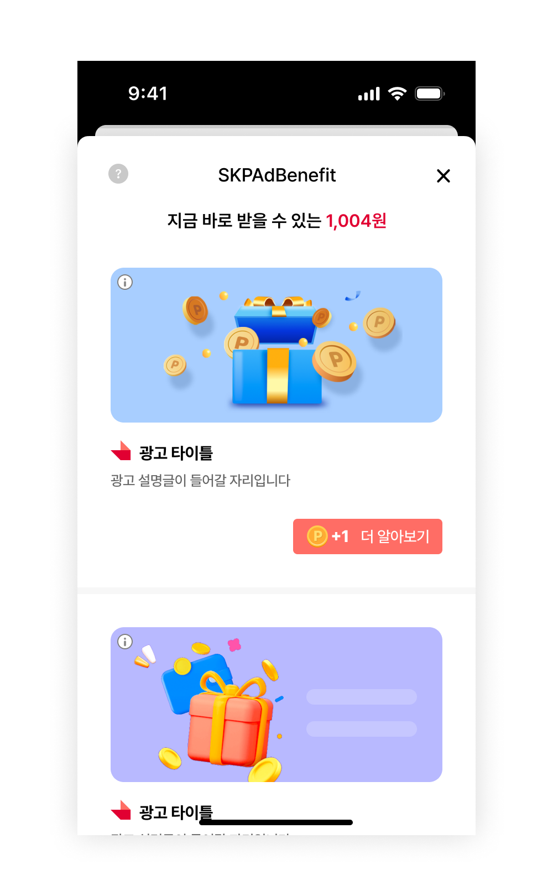
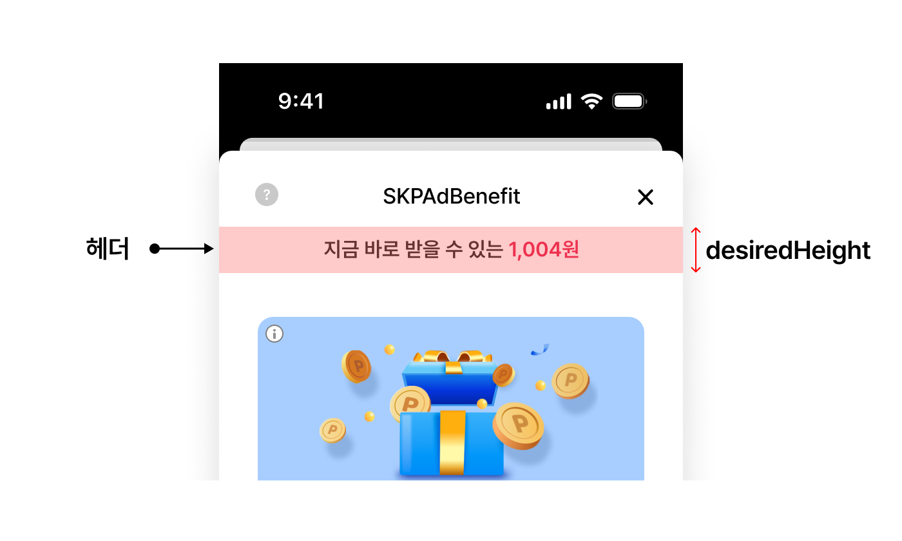
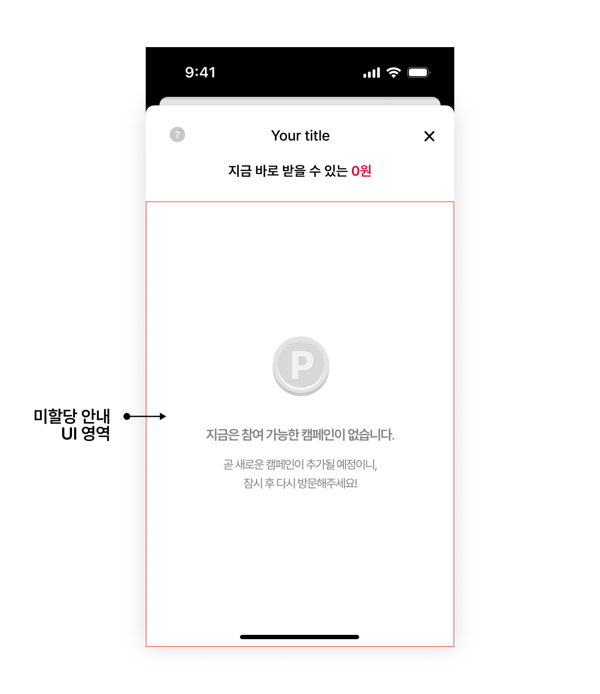
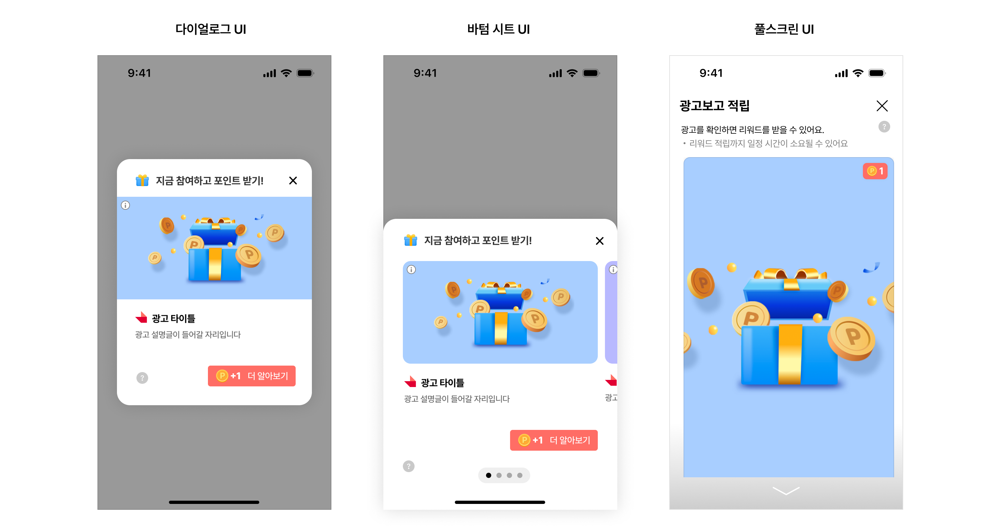
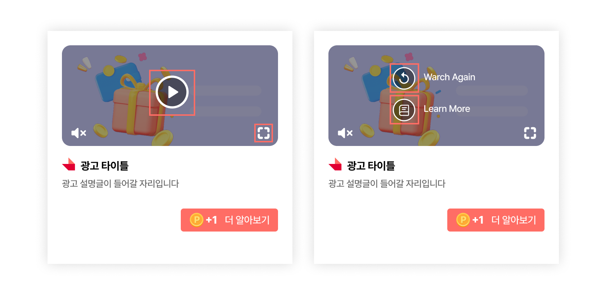

# SKPAdBenefit iOS SDK 연동 가이드
  

## 목차
- [1. 개요](#1-개요)
- [2. 시작하기](#2-시작하기)
- [3. 광고 지면 - Feed](#3-광고-지면---feed)
  - [3-1. 기본 설정](#3-1-기본-설정)
  - [3-2. 고급 설정](#3-2-고급-설정)
  - [3-3. 디자인 커스터마이징](#3-3-디자인-커스터마이징)
- [4. 광고 지면 - Native](#4-광고-지면---native)
  - [4-1. 기본 설정](#4-1-기본-설정)
  - [4-2. 고급 설정](#4-2-고급-설정)
- [5. 광고 지면 - Interstitial](#5-광고-지면---interstitial)
  - [5-1. 기본 설정](#5-1-기본-설정)
  - [5-2. 고급 설정](#5-2-고급-설정)
  - [5-3. 디자인 커스터마이징](#5-3-디자인-커스터마이징)
- [6. iOS Web SDK 연동 가이드](#6-ios-web-sdk-연동-가이드)
- [7. FAQ](#7-faq)
  - [7-1. iOS 14를 위한 준비](#7-1-ios-14를-위한-준비)
  - [7-2. 동영상 자동재생에 대한 설정](#7-2-동영상-자동재생에-대한-설정)
  - [7-3. 토큰 발급 콜백받기](#7-3-토큰-발급-콜백받기)
  - [7-4. 인앱 브라우저 사용방법](#7-4-인앱-브라우저-사용방법)
  - [7-5. 오프라인 빌드 적용 예시](#7-5-오프라인-빌드-적용-예시)  
  - [7-6. 앱 다크모드 활성화 시 Feed 광고 뷰 설정](#7-6-앱-다크모드-활성화-시-feed-광고-뷰-설정)
  - [7-7. 광고 로드 실패 시 에러 정보 확인하기](#7-7-광고-로드-실패-시-에러-정보-확인하기)  
  - [7-8. 광고 로드 가능 여부 확인하기](#7-8-광고-로드-가능-여부-확인하기)
  - [7-9. 문의하기](#7-9-문의하기)
  - [7-10. 광고 노출/클릭/참여와 관련한 콜백 변화](#7-10-광고-노출클릭참여와-관련한-콜백-변화)
  
---  

  
<br>
<br>
<br>

# 1. 개요

SKPAdBenefit iOS SDK를 사용하여 원하는 지면에 네이티브와 동영상 형태의 광고를 보여줄 수 있습니다.   
SKPAdBenefit iOS SDK가 제공하는 기본 UI를 사용해 원하는 지면에 쉽고 빠른 연동이 가능합니다. 더불어, 지면별 다양한 디자인 커스터마이징도 지원하여 높은 수준의 사용자 경험을 제공할 수 있습니다.

<br>


# 2. 시작하기
  
## 기본 요건

- deployment target 12 이상
- Xcode 14 이상 사용

<br>

## 준비 사항

   

<br>

SKPAdBenefit iOS SDK를 연동하기 위해서 아래 사항을 준비해야 합니다.

|ID |설명  |비고 |
|--|--|--|
|App ID | 앱별 고유 식별자 | 앱마다 하나씩 발급합니다.<br>이전에 PlanetAD 상품을 사용하고 있더라도, OS가 다르거나 앱이 다른 경우 새로 발급받아야 합니다.|
|Unit ID | 광고 지면별 고유 식별자 | 광고 지면이 다를 경우, 지면 별로 각각 Unit ID를 발급받아야 합니다.|

> 발급이 필요한 경우는 PlanetAD 담당자에게 문의 바랍니다.

<br>

## 포인트 적립 서버 연동

   

<br>

PlanetAD 광고는 참여 시 포인트를 지급하는 보상형 광고와 지급하지 않는 비보상형 광고가 있습니다. 

사용자가 보상형 광고에 참여하면 포인트 적립 요청을 처리할 수 있는 서버가 필요할 수 있습니다. 연동하는 방식에 따라 차이가 있으니, 아래 표를 확인하여 진행하시기 바랍니다.

|광고 포인트 지급 여부 |자체 포인트 시스템 여부 |설명|
|--|--|--|
| 지급하지 않음 |- |비보상형 광고로 연동합니다.<br>서버 간 연동은 불필요합니다. |
| 지급을 원함 |없음 | `네이버페이 포인트` 등 제 3의 포인트 시스템을 이용하여 포인트를 부여할 수 있습니다.<br>PlanetAD 담당자에게 문의하시기 바랍니다. |
| 지급을 원함 | 있음 |포스트백 연동 가이드을 참고하여 서버간 연동을 진행할 수 있습니다. | 

<br>
<br>

## SDK 설치

Cocoapods 을 사용하여 라이브러리를 추가합니다.   

```ruby
// Podfile
source 'https://github.com/CocoaPods/Specs.git'
source 'https://github.com/PlanetAdDevelopers/Specs.git'

...

target 'YourApp' do

...

   pod 'SKPAdBenefit', '1.4.1'
   
...

end
```     

> ! 오프라인 빌드가 필요하시면 PlanetAD 담당자에게 문의 바랍니다. PlanetAD 담당자가 SDK 연동에 필요한 라이브러리를 준비해드립니다.   
자세한 내용은 [오프라인 빌드를 적용하는 예시](#7-5-오프라인-빌드-적용-예시)를 확인하시기 바랍니다.   

<br>

## SDK 초기화

- [SKPAdBenefit 초기화](#skpadbenefit-초기화)
- [사용자 프로필 설정](#사용자-프로필-설정)

<br>

### SKPAdBenefit 초기화   

SABConfig에 App ID를 추가하고 AppDelegate의 `application:didFinishLaunchingWithOptions`에서 SDK를 초기화합니다.

다음은 `SKPAdBenefit`을 초기화하는 예시입니다.   

<details open><summary>Objective-C</summary>   
<p>   

  ```objective-c
  @interface AppDelegate ()
  @end

  @implementation AppDelegate {
    ...
  }

  - (BOOL)application:(UIApplication *)application didFinishLaunchingWithOptions:(NSDictionary *)launchOptions {
    ...
    SABConfig *config = [[SABConfig alloc] initWithAppId:@"YOUR_APP_ID"];
    [SKPAdBenefit initializeWithConfig:config];
    ...
  }
  @end
  ```
  
</p>
</details>

  
<details open><summary>Swift</summary>   
<p>    
  
```swift
@main
class AppDelegate: UIResponder, UIApplicationDelegate {

  func application(_ application: UIApplication, didFinishLaunchingWithOptions launchOptions: [UIApplication.LaunchOptionsKey: Any]?) -> Bool {
    ...
    let config = SABConfig(appId: "YOUR_APP_ID")
    SKPAdBenefit.initialize(with: config)
    ...    
  }
}
```   
  
</p>
</details>

<br>

> AppDelegate의 `application:didFinishLaunchingWithOptions`에 위의 코드를 추가할 것을 권장합니다. 어떤 이유(내부 정책 등)로 다음 위치에 코드를 적용하지 못할 경우, 반드시 **최초로 광고를 요청하는 위치보다 이전에 배치** 되어야 합니다.

<br>

### 사용자 프로필 설정
사용자 프로필은 광고 할당 요청 전에 등록해야 합니다. **필수 정보**를 등록하지 않으면 광고 할당이 되지 않습니다. **권장 정보**를 제외할 경우에는 유저 정보 기반의 광고가 할당에서 제외됩니다. 사용자 프로필 설정 완료 콜백을 받을 수 있습니다.

  

|유저 프로필 |설명 |비고 |
|--|--|--|
|`필수` userId |사용자 고유 식별자 |서비스 도중에 변하지 않는 값<br> `! 앱 삭제 후 재설치시 유저 ID 값이 변경되는 등, 고정된 유저 ID를 사용하지 못하는 경우 PlanetAD 담당자에게 문의 바랍니다.`|
|`권장` gender |사용자의 성별 | - 남성: `SABUserGenderMale`<br>- 여성: `SABUserGenderFemale`|
|`권장` birthYear |사용자의 출생 연도 |- |
<br>

다음은 사용자 프로필을 설정하는 예시입니다.
  
<details open><summary>Objective-C</summary>   
<p>    

  ```objective-c
  SABUserProfile *userProfile = [[SABUserProfile alloc] initWithUserId:@"YOUR_SERVICE_USER_ID" birthYear:1993 gender:SABUserGenderMale];
  [SKPAdBenefit setUserProfile:userProfile];
  ```
  
</p>
</details>  
  
<details open><summary>Swift</summary>   
<p>    

  ```swift
  let userProfile = SABUserProfile(userId: "YOUR_SERVICE_USER_ID", birthYear: 1993, gender: SABUserGenderFemale)
  SKPAdBenefit.setUserProfile(userProfile)
  ```
  
</p>
</details>  
  

<br>

### 사용자 정보 삭제하기

외부 인증을 통한 로그인이 만료되는 시점 혹은 앱 사용 종료로 설정값 삭제가 필요할 경우, 다음을 설정합니다.    

<details open><summary>Objective-C</summary>   
<p>    

  ```objective-c
  [SKPAdBenefit setUserProfile:nil];
  [SKPAdBenefit setUserPreference:nil];
  ```
  
</p>
</details>  
  
<details open><summary>Swift</summary>   
<p>    

  ```swift
  SKPAdBenefit.setUserProfile(nil)
  SKPAdBenefit.setUserPreference(nil)
  ```
  
</p>
</details>  
  

<br>
<br>

## 광고 지면 추가

SKPAdBenefit iOS SDK 연동을 위한 기본적인 설정은 완료하였습니다. 아래 지면별 연동 가이드에 따라 진행하시기 바랍니다.

|Feed |Native |Interstitial |
|--|--|--|
|<p align="center"></p>|<p align="center"></p>|<p align="center"></p>|
|<p align="center">[Feed 연동하기](#3-광고-지면---feed)<br>리스트 형태의 광고 지면입니다.</p> |<p align="center">[Native 연동하기](#4-광고-지면---native)<br>커스텀 광고 지면입니다.</p> |<p align="center">[Interstitial 연동하기](#5-광고-지면---interstitial)<br>전면 광고 지면입니다.</p> |

<br>
<br>
<br>


# 3. 광고 지면 - Feed

## 3-1. 기본 설정

### 개요

   
<br>
  
Feed 지면은 여러 개의 광고를 리스트 형식으로 제공하는 지면입니다.

  
<br>
  

### 준비 사항

- [2. 시작하기](#2-시작하기) 적용 완료
- Feed 지면에 사용할 Unit ID (이하 `YOUR_FEED_UNIT_ID`)

<br>

### Feed 지면 초기화

`SABFeedConfig`를 설정하고 `SABFeedViewController`를 생성하여 Feed 지면을 초기화합니다.   
다음은 Feed 지면을 초기화하는 예시입니다.

  
<details open><summary>Objective-C</summary>   
<p>    

  ```objective-c
  SABFeedConfig *config = [[SABFeedConfig alloc] initWithUnitId:@"YOUR_FEED_UNIT_ID"];
  config.title = @"YOUR_TITLE";

  SABFeedHandler *feedHandler = [[SABFeedHandler alloc] initWithConfig:config];
  SABFeedViewController *feedViewController = [feedHandler populateViewController];
  ```
  
</p>
</details>  
  
<details open><summary>Swift</summary>   
<p>    

  ```swift
  let config = SABFeedConfig(unitId: "YOUR_FEED_UNIT_ID")
  config.title = "YOUR_TITLE"

  let feedHandler = SABFeedHandler(config: config)
  let feedViewController = feedHandler.populateViewController()
  ```
  
</p>
</details>  
  

<br>

`SABFeedConfig`를 사용하여 Feed 지면의 기능과 디자인을 변경할 수 있습니다. [고급 설정](#3-2-고급-설정)과 [디자인 커스터마이징](#3-3-디자인-커스터마이징)을 참고하여 Feed 지면의 기능과 디자인 변경 방법을 확인할 수 있습니다.


<br>

### Feed 지면 표시

  
   

<br>

리스트 형태의 Feed 지면을 표시합니다. 단, 할당받은 광고가 없다면 할당을 진행하며 할당받는 도중에는 "참여할 수 있는 광고가 없습니다." 라는 이미지가 사용자에게 노출될 수 있습니다. `SABFeedViewController`를 이용하여 Feed 지면을 표시합니다.   

Feed 지면에서 매번 새로운 광고를 보여주지 위해서는 새로운 `FeedHandler` 인스턴스를 생성해야 합니다.   

다음은 Feed 지면을 표시하는 예시입니다.

<details open><summary>Objective-C</summary>   
<p>    

  ```objective-c
  // navigationController 를 사용하는 경우
  [self.navigationController pushViewController:feedViewController animated:YES];

  // navigationController 를 사용하지 않는 경우
  [self presentViewController:feedViewController animated:YES completion:nil];
  ```
  
</p>
</details>  
  
<details open><summary>Swift</summary>   
<p>    

  ```swift
  // navigationController 를 사용하는 경우
  navigationController?.pushViewController(feedViewController, animated: true)

  // navigationController 를 사용하지 않는 경우
  present(feedViewController, animated: true, completion: nil)
  ```
  
</p>
</details>  

<br>


### 광고 미리 할당받기

  

  
<br>

**광고 표시**에서 언급한 것처럼 광고를 미리 할당받지 않고 Feed 지면을 표시할 경우, "참여할 수 있는 광고가 없습니다." 라는 이미지가 사용자에게 노출될 수 있습니다. `preload`를 호출하여 Feed 지면을 표시하기 전에 광고를 미리 할당받을 수 있으며, 광고가 존재할 경우에만 Feed 지면을 표시하여 사용자 경험을 높일 수 있습니다.   

다음은 광고를 미리 할당받은 후, 참여할 수 있는 광고가 있을 때 Feed 지면을 표시하는 예시입니다.

  
<details open><summary>Objective-C</summary>   
<p>    

  ```objective-c
  [feedHandler preloadWithOnSuccess:^{
    NSUInteger adsCount = feedHandler.adsCount; // 광고의 개수
    double availableReward = feedHandler.availableReward; // 적립 가능한 총 포인트 금액
    [self presentFeedViewController];
  } onFailure:^(NSError * _Nonnull error) {
    // 광고가 없을 때에 대한 처리
  }];
  ```
  
</p>
</details>  
  
<details open><summary>Swift</summary>   
<p>    

  ```swift
    feedHandler.preloadWith(onSuccess: { [weak feedHandler] in
        let adsCount = feedHandler.adsCount // 광고의 개수
        let availableReward = feedHandler.availableReward // 적립 가능한 총 포인트 금액
        self.presentFeedViewController()
    }, onFailure: { error in
        // 광고가 없을 때에 대한 처리
    })
  ```
  
</p>
</details> 

  
**유의사항**

- 프리로드한 `SABFeedHandler`와 동일한 객체에서 `populateViewController()`를 호출해야 합니다.
    - 하나의 FeedHandler 인스턴스에서 광고를 load/preload 하는 경우, 그 인스턴스는 계속 같은 광고를 들고 있게 됩니다. 그래서 유저가 feed에서 나왔더라도 다시 해당 인스턴스로 populateViewController()를 호출하는 경우 같은 광고 리스트를 보게 됩니다.  
    만약 피드에 진입할 때마다 새로 광고가 로드되는 것을 원하는 경우 새로운 FeedHandler 인스턴스를 만들어서 populateViewController()를 호출해야 합니다.   
  
<br>  

## 3-2. 고급 설정

### 개요


<br>
이 문서에서 가이드 하는 내용은 SKPAdBenefit iOS SDK의 Feed 지면의 기능을 설명하고 각 기능을 변경하는 방법을 설명합니다.

<br>
<br>

### 헤더 영역 자체 구현

   

<br>

Feed 헤더 영역을 자유로이 활용할 수 있습니다. 예를 들어, Feed 영역을 설명하는 공간으로도 활용할 수 있습니다.   

`SABFeedHeaderView`의 구현 클래스를 구현하고, 구현한 View의 높이에 맞게 `desiredHeight`를 설정합니다.
    
필요에 따라 직접 구현한 UI 에 적립 가능한 금액을 표시할 수 있습니다. `availableRewardDidUpdate`를 통해 지급 가능한 금액을 알 수 있고, `availableRewardDidUpdate` 콜백에서 문구를 수정하여 표시할 수 있습니다.

다음은 헤더 영역을 자체 구현한 UI로 대체하는 예시입니다.

  
<details open><summary>Objective-C</summary>   
<p>    

  ```objective-c
  @interface CustomHeaderView: SABFeedHeaderView
  @end

  @implementation CustomHeaderView {
    UILabel *_headerLabel;
  }

  - (instancetype)initWithCoder:(NSCoder *)coder{
    if (self = [super initWithCoder:coder]) {
      [self setUpView];
    }
    return self;
  }

  - (instancetype)initWithFrame:(CGRect)frame {
    if (self = [super initWithFrame:frame]) {
      [self setUpView];
    }
    return self;
  }

  + (CGFloat)desiredHeight {
    return 115.0f;
  }

  - (void)availableRewardDidUpdate:(double)reward {
    _headerLabel.text = [NSString stringWithFormat:@"+%d points available!", (int)reward];
  }

  - (void)setUpView {
    _headerLabel = [[UILabel alloc] initWithFrame:CGRectZero];
    _headerLabel.text = @"Custom Header Text";
    [self addSubview:_headerLabel];
    
    // LayoutConstraint 설정
    ...
  }

  @end
  ```   
  
  ```objective-c
  SABFeedConfig *config = [[SABFeedConfig alloc] initWithUnitId:YOUR_FEED_UNIT_ID];
  config.headerViewClass = [CustomHeaderView class];
  ```
  
</p>
</details>  
  
<details open><summary>Swift</summary>   
<p>    

  ```swift
  class CustomHeaderView: SABFeedHeaderView {
    required init?(coder: NSCoder) {
      super.init(coder: coder)
      setUpView()
    }

    override init(frame: CGRect) {
      super.init(frame: frame)
      setUpView()
    }

    override class func desiredHeight() -> CGFloat {
      return 115.0
    }
  
    override func availableRewardDidUpdate(_ reward: Double) {
      headerLabel.setText("\(reward) points available!")
    }

    func setUpView() {
      headerLabel = UILabel(frame: .zero)
      headerLabel.text = @"Custom Header Text";
      addSubview(headerLabel)
    
      // LayoutConstraint 설정
      ...
    }
  }
  ```   
  
  ```swift
  let config = SABFeedConfig(unitId: YOUR_FEED_UNIT_ID)
  config.headerViewClass = CustomHeaderView.self
  ```   

</p>
</details> 

<br>  


### 광고 UI 자체 구현

SKPAdBenefit iOS SDK에서 제공하는 일반 광고의 UI의 자체 구현 방법입니다.   
추가로 광고의 노출, 클릭, 참여 이벤트 콜백을 받을 수 있습니다. 적용 방법은 [광고 이벤트 콜백 수신](#광고-이벤트-콜백-수신)을 참고하시기 바랍니다

<br>

#### 일반 광고 UI 자체 구현

  
<br>

다음은 일반 광고의 디자인을 변경하는 방법을 설명합니다.   

우선 광고 레이아웃을 생성합니다. 아래 예시에서는 `CustomAdViewHolder`로 정의합니다. 광고 레이아웃의 최상위 컴포넌트는 `SABNativeAdView`이며, 아래 컴포넌트는 `SABNativeAdView`의 하위 컴포넌트로 구현해야 합니다.

<br>

  

<br>

|Component |Description |Size |제약 사항 |비고 |
|--|--|--|--|--|
|`필수` Media view |이미지, 동영상 등 광고 소재 |1200x627 px |종횡비 유지 |여백 추가 가능 |
|`필수` Title view |광고의 제목 |최대 10자 |- |생략 부호로 일정 길이 이상은 생략 가능 |
|`필수` Description view |광고에 대한 상세 설명 |최대 40자 |- |생략 부호로 일정 길이 이상은 생략 가능 |
|`필수` CTA view |광고 참여를 유도하는 문구 |최대 7자 |- |- 생략 부호로 일정 길이 이상은 생략 가능<br>- 보상형 광고에는 포인트 정보도 포함해야 합니다. |
|`필수` Icon image view |광고주 아이콘 이미지 |80x80 px |종횡비 유지 |- |
|`필수` AdInfo view |사용자에게 광고임을 알리는 버튼 |26x26 px |종횡비 유지 |- |  
<br>

광고 레이아웃을 생성한 후, `SABAdViewHolder`의 구현 클래스를 구현합니다. `SABAdViewHolder`의 구현 클래스는 `SABFeedConfig`에 설정합니다.   

다음은 구현한 예시입니다.

<details open><summary>Objective-C</summary>   
<p>    

  ```objective-c
  @interface CustomAdViewHolder: SABAdViewHolder {
    SABNativeAdView *_adView;
    SABMediaView *_mediaView;
    SABAdInfoView *_adInfoView;
    UILabel *_titleLabel;
    ...
  }
  @end

  @implementation CustomAdViewHolder

  - (instancetype)initWithCoder:(NSCoder *)coder {
    if (self = [super initWithCoder:coder]) {
      [self setUpView];
    }
    return self;
  }

  - (instancetype)initWithFrame:(CGRect)frame {
    if (self = [super initWithFrame:frame]) {
      [self setUpView];
    }
    return self;
  }

  - (void)setUpView {
    _adView = [[SABNativeAdView alloc] initWithFrame:CGRectZero];
    _mediaView = [[SABMediaView alloc] initWithFrame:CGRectZero];
    _adInfoView = [[SABAdInfoView alloc] initWithFrame:CGRectZero];
    _titleLabel = [[UILabel alloc] initWithFrame:CGRectZero];
    ...
  
    [self addSubview:_adView];
    [_adView addSubview:_mediaView];
    [_adView addSubView:_adInfoView];
    [_adView addSubview:_titleLabel];
    ...
  
    // LayoutConstraint 설정
    ...
  }

  // Bind view with ad
  - (void)renderAd:(SABAd *)ad {
      [super renderAd:ad];
  
      self.titleLabel.text = ad.creative.title;
  
      // description 필드가 objc 객체에 기본으로 있어서 body로 컨버팅 하여 사용
      self.descriptionLabel.text = ad.creative.body;
  
      [self.iconImageView sd_setImageWithURL:[NSURL URLWithString:ad.creative.iconUrl]];
    
      // reward 가 없다면 포인트 미표시
      if (ad.reward > 0) {
          self.ctaLabel.text = [NSString stringWithFormat:@"+%d %@", (int)ad.reward, ad.creative.callToAction];
          [self.rewardIcon setImage:[UIImage imageNamed:@"point_icon"]];
      } else {
          self.ctaLabel.text = ad.creative.callToAction;
          [self.rewardIcon setImage:nil];
      }
  
      self.adView.ad = ad;
      self.adView.mediaView = self.mediaView;
      self.adView.adInfoView = self.adInfoView;
      self.adView.clickableViews = @[self.ctaButton, self.iconImageView];
  }
  @end
  ```
  
  ```objective-c
  SABFeedConfig *config = [[SABFeedConfig alloc] initWithUnitId:@"YOUR_FEED_UNIT_ID"];
  config.adViewHolderClass = [CustomAdViewHolder class];
  ```
  
</p>
</details>  
  
<details open><summary>Swift</summary>   
<p>    

  ```swift
  class CustomAdViewHolder: SABAdViewHolder {
    private var adView = SABNativeAdView()
    private var mediaView = SABMediaView()
    private var adInfoView = SABAdInfoView()
    private var titleLabel = UILabel()
    ...

    required init?(coder: NSCoder) {
      super.init(coder: coder)
      setUpView()
    }
  
    override init(frame: CGRect) {
      super.init(frame: frame)
      setUpView()
    }
  
    func setUpView() {
      addSubview(self.adView)
      adView.addSubview(self.mediaView)
      adView.addSubView(self.adInfoView)
      adView.addSubview(self.titleLabel)
      ...
    
      // LayoutConstraint 설정
      ...
    }

    // Bind view with ad
    override func renderAd(ad: SABAd) {
        super.renderAd(ad)
  
        self.titleLabel.text = ad.creative.title
  
        // description 필드가 objc 객체에 기본으로 있어서 body로 컨버팅 하여 사용
        self.descriptionLabel.text = ad.creative.body
  
        self.iconImageView.sd_setImage(with: URL(string: ad.creative.iconUrl))
  
        // reward 가 없다면 포인트 미표시
        if (ad.reward > 0) {
            self.ctaLabel.text = "\(Int(ad.reward))P \(ad.creative.callToAction ?? "디폴트 스트링")"
            self.rewardIcon.image = UIImage(named: "point_ico")
        } else {
            self.ctaLabel.text = ad.creative.callToAction
            self.rewardIcon.image = nil
        }
  
        self.adView.ad = ad
        self.adView.mediaView = self.mediaView
        self.adView.adInfoView = self.adInfoView
        self.adView.clickableViews = [self.ctaButton, self.iconImageView]
    }
  }
  ```
  
  ```swift
  let config = SABFeedConfig(unitId: "YOUR_FEED_UNIT_ID")
  config.adViewHolderClass = CustomAdViewHolder.self
  ```
  
</p>
</details> 
  
<br>
  

#### 광고 이벤트 콜백 수신

필요에 따라 광고 노출, 클릭, 참여 이벤트 콜백을 받을 수 있습니다.   

다음은 구현한 예시입니다.


<details open><summary>Objective-C</summary>   
<p>    

  ```objective-c
  @interface CustomAdViewHolder: SABAdViewHolder <SABNativeAdViewDelegate>
  @end

  @implementation CustomAdViewHolder

  - (void)loadFromNib {
      ...
      self.adView.delegate = self;
      ...
  }


  // Handle ad callbacks
  - (void)SABNativeAdView:(SABNativeAdView *)adView didImpressAd:(SABAd *)ad {
    // 사용자에게 광고가 보여지면 호출됩니다.
  }

  - (void)SABNativeAdView:(SABNativeAdView *)adView didClickAd:(SABAd *)ad {
    // 사용자가 광고를 클릭하여 참여하면 호출됩니다.
  }

  - (void)SABNativeAdView:(SABNativeAdView *)adView willRequestRewardForAd:(SABAd *)ad {
    // 사용자가 광고에 참여하고 리워드 요청을 하기 전에 호출됩니다.
  }

  - (void)SABNativeAdView:(SABNativeAdView *)adView didRewardForAd:(SABAd *)ad withResult:(SABRewardResult)result {
    // SDK에서 광고 리워드 요청 후에 호출됩니다.
  }

  - (void)SABNativeAdView:(SABNativeAdView *)adView didParticipateAd:(SABAd *)ad {
    // 광고 참여가 확인되면 호출됩니다. 
  }

  @end
  ```
  
</p>
</details>  
  
<details open><summary>Swift</summary>   
<p>    

  ```swift
  class CustomAdViewHolder: SABAdViewHolder, SABNativeAdViewDelegate {
    // Populate your view (example using xib file)
    
    func loadFromNib() {
        ...
        self.adView.delegate = self
        ...
    }

    // Handle ad callbacks
    func sabNativeAdView(_ adView: SABNativeAdView, didImpress ad: SABAd) {
      // 사용자에게 광고가 보여지면 호출됩니다.
    }
  
    func sabNativeAdView(_ adView: SABNativeAdView, didClick ad: SABAd) {
      // 사용자가 광고를 클릭하여 참여하면 호출됩니다.
    }
  
    func sabNativeAdView(_ adView: SABNativeAdView, willRequestRewardFor ad: SABAd) {
      // 사용자가 광고에 참여하고 리워드 요청을 하기 전에 호출됩니다.
    }
  
    func sabNativeAdView(_ adView: SABNativeAdView, didRewardFor ad: SABAd, with result: SABRewardResult) {
      // SDK에서 광고 리워드 요청 후에 호출됩니다.
    }
  
    func sabNativeAdView(_ adView: SABNativeAdView, didParticipateAd ad: SABAd) {
      // 광고 참여가 확인되면 호출됩니다. 
    }
  }
  ```
  
</p>
</details> 

<br>

> 컨텐츠 아이템 영역을 Customization하는 경우, SABArticleViewHolder를 상속받는 CustomArticleViewHolder를 구현하고, SABFeedConfig의 articleViewHolderClass를 설정 해주시면 됩니다.

<br>
<br>

### App Tracking Transparency (iOS 14 지원) 권한 획득 기능

Feed 지면에서 ATT 권한 획득을 위한 팝업 및 가이드 배너를 보여줄 수 있습니다.

<br>

#### Feed 진입 시 권한 획득 다이얼로그 노출

   
<br>

팝업 노출을 설정하면 iOS 14에서 ATT 권한 허용 여부를 결정하지 않은 사용자가 Feed 지면에 진입할 때 ATT 권한 획득 팝업이 보입니다.   

다음은 설정하는 방법입니다.

<details open><summary>Objective-C</summary>   
<p>    

  ```objective-c
  SABFeedConfig *config = [[SABFeedConfig alloc] initWithUnitId:@"YOUR_FEED_UNIT_ID"];
  config.shouldShowAppTrackingTransparencyDialog = YES;
  ```
  
</p>
</details>  
  
<details open><summary>Swift</summary>   
<p>    

  ```swift
  let config = SABFeedConfig(unitId: "YOUR_FEED_UNIT_ID")
  config.shouldShowAppTrackingTransparencyDialog = true
  ```
  
</p>
</details> 


ATT 권한에 대한 추가적인 설명은 [iOS 14를 위한 준비](#7-1-ios-14를-위한-준비)를 참조해 주세요.

<br>

#### Feed 헤더 영역에 ATT 권한 설명 배너 추가하기

   
<br>

Feed 지면 상단의 헤더 영역에 배너를 표시하여 사용자에게 ATT 권한에 대해서 설명할 수 있습니다. 단, Feed 헤더 영역을 커스터마이즈해서 사용하는 경우 또는 유저로부터 이미 AppTrackingTransparency 권한을 획득했을 경우에는 ATT 권한 설명 배너는 노출되지 않습니다.

다음은 Feed 지면 상단에 ATT 권한 설명 배너를 노출하는 설정 예시입니다.

<details open><summary>Objective-C</summary>   
<p>    

  ```objective-c
  SABFeedConfig *config = [[SABFeedConfig alloc] initWithUnitId:@"YOUR_FEED_UNIT_ID"];
  config.shouldShowAppTrackingTransparencyGuideBanner = YES;
  ```
  
</p>
</details>  
  
<details open><summary>Swift</summary>   
<p>    

  ```swift
  let config = SABFeedConfig(unitId: "YOUR_FEED_UNIT_ID")
  config.shouldShowAppTrackingTransparencyGuideBanner = true
  ```
  
</p>
</details> 

<details open><summary>Info.plist에 ATT 설명 페이지 URL 설정</summary>   
<p>    

  ```xml
  <key>SKPAdAppTrackingTransparencyLandingURL</key>
  <string>YOUR_ATT_DESCRIPTION_URL</string>
  ```
  
</p>
</details> 

<br>  

### Feed 지면 광고 미할당 안내 UI 자체 구현

   
<br>

사용자가 Feed 지면에 진입한 시점에 노출할 광고가 없다면 미 할당 안내 UI가 노출됩니다. SKPAdBenefit iOS SDK는 위와 같은 기본 UI를 제공합니다. 안내 UI는 자체 구현하여 변경하거나 [Feed 지면 광고 미할당 안내 UI 변경](#feed-지면-광고-미할당-안내-ui-변경)을 참고하여 이미지 혹은 문구만 변경하여 수정할 수도 있습니다.

다음은 자체 구현한 UI로 변경하는 예시입니다.

<details open><summary>Objective-C</summary>   
<p>    

  ```objective-c
  @implementation CustomErrorViewHolder {
    UILabel *_errorLabel;
  }

  - (instancetype)initWithCoder:(NSCoder *)coder {
    if (self = [super initWithCoder:coder]) {
      [self setUpView];
    }
    return self;
  }

  - (instancetype)initWithFrame:(CGRect)frame {
    if (self = [super initWithFrame:frame]) {
      [self setUpView];
    }
    return self;
  }

  - (void)setUpView {
    _errorLabel = [[UILabel alloc] initWithFrame:CGRectZero];
    _errorLabel.text = @"Custom Error View";
    [self addSubview:_errorLabel];
  
    // LayoutConstraint 설정
    ...
  }

  ...
  @end
  ```

  ```objective-c
  SABFeedConfig *config = [[SABFeedConfig alloc] initWithUnitId:YOUR_FEED_UNIT_ID];
  config.errorViewHolderClass = [CustomErrorViewHolder class];
  ```

</p>
</details>  
  
<details open><summary>Swift</summary>   
<p>    

  ```swift
  class CustomErrorViewHolder: UIView {
    private var errorLabel = UILabel()
  
    required init?(coder: NSCoder) {
      super.init(coder: coder)
      setUpView()
    }
  
    override init(frame: CGRect) {
      super.init(frame: frame)
      setUpView()
    }
  
    private func setUpView() {
      errorLabel.text = "Custom Error View"
      self.addSubview(errorLabel)
    
      // LayoutConstraint 설정
      ...
    }
  
    ...
  }
  ```

  ```swift
  let config = SABFeedConfig(unitId: FEED_UNIT_ID)
  config.errorViewClass = CustomErrorView.self
  ```
  
</p>
</details> 

<br>

Feed 지면에 진입하기 전에 광고를 미리 할당받아서 참여할 광고가 있는 경우에만 사용자를 Feed 지면으로 진입하도록 하면 미할당 안내 이미지를 보이지 않게 할 수 있습니다. 자세한 내용은 [광고 미리 할당받기](#광고-미리-할당받기) 를 참고하시기 바랍니다.

<br>
<br>


## 3-3. 디자인 커스터마이징

### 개요
 
본 가이드에서는 SKPAdBenefit iOS SDK에서 제공하는 UI의 구성을 지키며 디자인을 변경하기 위한 방법을 안내합니다. 추가적인 디자인 변경을 원하시는 경우에는 [고급 설정](#3-2-고급-설정)에서 UI를 자체 구현하는 방법으로 진행할 수 있습니다.
  
<br>

### Feed 지면 구분선 UI 변경

   
<br>

Feed 지면에는 광고와 광고를 구분하기 위한 구분선이 있습니다.
`SABFeedConfig`를 설정하여 Feed 지면의 구분선의 UI를 변경할 수 있습니다. 다음은 광고 구분선 UI를 변경하는 예시입니다.   

<details open><summary>Objective-C</summary>   
<p>    

  ```objective-c
  SABFeedConfig *config = [[SABFeedConfig alloc] initWithUnitId:@"YOUR_FEED_UNIT_ID"];
  config.separatorHeight = 1.0f / UIScreen.mainScreen.scale;
  config.separatorColor = [UIColor lightGrayColor];
  config.separatorHorizontalMargin = 10;
  ```
  
</p>
</details>  
  
<details open><summary>Swift</summary>   
<p>    

  ```swift
  let config = SABFeedConfig(unitId: "YOUR_FEED_UNIT_ID")
  config.separatorHeight = 1.0 / UIScreen.main.scale
  config.separatorColor = .lightGray
  config.separatorHorizontalMargin = 10
  ```
  
</p>
</details> 

<br>  

### Feed 지면 광고 미할당 안내 UI 변경

  

<br>

사용자가 Feed 지면에 진입한 시점에 노출할 광고가 없다면 미할당 안내 UI가 노출됩니다. SKPAdBenefit iOS SDK에서 제공하는 UI의 이미지 혹은 문구만을 변경하여 사용자 경험을 높일 수 있습니다.   

`SABFeedDefaultErrorView`의 구현 클래스를 구현하여 이미지 및 문구를 변경할 수 있습니다. 다음은 이미지 혹은 문구를 변경하는 예시입니다.

<details open><summary>Objective-C</summary>   
<p>    

  ```objective-c
  @interface CustomErrorView : SABFeedDefaultErrorView
  @end

  @implementation CustomErrorView

  - (UIImage *)errorImage {
      return [UIImage imageWithName:@"Custom Error Image"];
  }

  - (NSString *)errorTitleText {
      return @"Custom Error Title";
  }

  - (NSString *)errorDescriptionText {
      return @"Custom Error Description";
  }

  @end
  ```
  
  ```objective-c
  SABFeedConfig *config = [[SABFeedConfig alloc] initWithUnitId:@"YOUR_FEED_UNIT_ID"];
  config.errorViewClass = [CustomErrorView class];
  ```
  
</p>
</details>  
  
<details open><summary>Swift</summary>   
<p>    

  ```swift
  class CustomErrorView : SABFeedDefaultErrorView {
    override var errorImage: UIImage {
        get { return UIImage(named: "Custom Error Image") }
        set { self.errorImage = newValue }
    }
    override var errorTitleText: String {
        get { return "Custom Error Title" }
        set { self.errorTitleText = newValue }
    }
    override var errorDescriptionText: String {
        get { return "Custom Error Description" }
        set { self.errorDescriptionText = newValue }
    }
  }
  ```
  
  ```swift
  let config = SABFeedConfig(unitId: "FEED_UNIT_ID")
  config.errorViewClass = CustomErrorView.self
  ```
  
</p>
</details> 

<br>
<br>


### Feed 문의하기   
Feed 지면에서 문의하기 버튼을 보여줄 수 있습니다.


<br>

<details open><summary>Objective-C</summary>   
<p>    

  ```objective-c
  SABFeedConfig *config = [[SABFeedConfig alloc] initWithUnitId:@"YOUR_FEED_UNIT_ID"];
  config.showInquiryButton = YES;
  ```
  
</p>
</details>  
  
<details open><summary>Swift</summary>   
<p>    

  ```swift
  let config = SABFeedConfig(unitId: "YOUR_FEED_UNIT_ID")
  config.showInqiuryButton = true
  ```
  
</p>
</details>

([7-9. 문의하기](#7-9-문의하기) 참고)    
> **Planet AD는 만 14세 미만 아동에게 (맞춤형) 리워드 광고를 송출하지 않습니다.**    
> **만 14세 미만 사용자의 경우, config.showInquiryButton = NO로 설정하시기 바랍니다.**     

  
<br>
<br>
<br>

# 4. 광고 지면 - Native

## 4-1. 기본 설정

### 개요


<br>

본 가이드는 SKPAdBenefit iOS SDK의 Native 지면을 연동하는 방법을 안내합니다. Native 지면은 광고 지면 레이아웃을 직접 구성한 후, PlnaetAD 서버로부터 광고 데이터를 할당받아 광고 지면에 표시합니다.
  
<br>

### 준비사항

- [2. 시작하기](#2-시작하기) 적용 완료
- Native 지면에 사용할 Unit ID (이하 YOUR_NATIVE_UNIT_ID)

<br>
  

### 광고 레이아웃 구성

   

<br>

Native 지면은 광고 레이아웃을 자유롭게 구성하여 노출하는 지면입니다. 광고 레이아웃의 최상위 컴포넌트는 `SABNativeAdView`이며, 아래 컴포넌트는 `SABNativeAdView`의 하위 컴포넌트로 구현해야 합니다.

<br>

|Component |Description |Size |제약 사항 |비고 |
|--|--|--|--|--|
|`필수` Media view |이미지, 동영상 등 광고 소재 |1200x627 px |종횡비 유지 |여백 추가 가능 |
|`필수` Title view |광고의 제목 |최대 10자 |- |생략 부호로 일정 길이 이상은 생략 가능 |
|`필수` Description view |광고에 대한 상세 설명 |최대 40자 |- |생략 부호로 일정 길이 이상은 생략 가능 |
|`필수` CTA view |광고 참여를 유도하는 문구 |최대 7자 |- |- 생략 부호로 일정 길이 이상은 생략 가능<br>-보상형 광고에는 포인트 정보도 포함해야 합니다. |
|`필수` Icon image view |광고주 아이콘 이미지 |80x80 px |종횡비 유지 |- |
|`필수` AdInfo view |사용자에게 광고임을 알리는 버튼 |26x26 px |종횡비 유지 |- |
|`권장` Inquiry view |광고 참여 및 보상에 대한 문의 접수 버튼 ([7-9. 문의하기](#7-9-문의하기) 참고) |26x26 px |종횡비 유지 | ` **! Planet AD는 만 14세 미만 아동에게 (맞춤형) 리워드 광고를 송출하지 않습니다. 만 14세 미만의 경우 문의하기 버튼을 노출하지 않아야 합니다** ` |

<br>

다음은 Native 광고 레이아웃을 초기화하는 예시입니다.

<details open><summary>Objective-C</summary>   
<p>    

  ```objective-c
  @implementation ViewController {

    // Native 관련 뷰
    SABNativeAdView *_adView;
    SABMediaView *_mediaView;
    SABAdInfoView *_adInfoView;
    SABInquiryView *_inquirytView;
    UILabel *_titleLabel;
    ...
  }

  - (void)viewDidLoad {
    [super viewDidLoad];
  
    _adView = [[SABNativeAdView alloc] initWithFrame:CGRectZero];
    _mediaView = [[SABMediaView alloc] initWithFrame:CGRectZero];
    _adInfoView = [[SABAdInfoView alloc] initWithFrame:CGRectZero];
    _inquiryView = [[SABInquiryView alloc] initWithFrame:CGRectZero];
    _titleLabel = [[UILabel alloc] initWithFrame:CGRectZero];
    ...
  
    [self addSubview:_adView];
    [_adView addSubview:_mediaView];
    [_adView addSubview:_adInfoView];
    [_adView addSubview:_inquiryView];
    [_adView addSubview:_titleLabel];
    ...
  
    // LayoutConstraint 설정
    ...
  }
  @end
  ```
  
</p>
</details>  
  
<details open><summary>Swift</summary>   
<p>    

  ```swift
  class ViewController: UIViewController {
    // Native 관련 뷰
    private var adView = SABNativeAdView()
    private var mediaView = SABMediaView()
    private var adInfoView = SABAdInfoView()
    private var inquiryView = SABInquiryView()
    private var titleLabel = UILabel()
    ...
  
    override func viewDidLoad() {
      super.viewDidLoad()
 
      addSubview(self.adView)
      adView.addSubview(self.mediaView)
      adView.addSubview(self.adInfoView)
      adView.addSubvew(self.inquiryView)
      adView.addSubview(self.titleLabel)
      ...
    
      // LayoutConstraint 설정
      ...
    }
  }
  ```
  
</p>
</details> 

<br>  

### 광고 요청
  
광고 레이아웃에 추가할 광고를 할당받습니다.   
`SABAdLoader`의 `loadAd`를 실행하면 광고 데이터를 요청합니다.  
다음은 광고 할당 요청 예시입니다.   

  
<details open><summary>Objective-C</summary>   
<p>    

  ```objective-c
  SABAdLoader *adLoader = [[SABAdLoader alloc] initWithUnitId:@"YOUR_NATIVE_UNIT_ID"];
  // PlanetAD 서버에서 광고 정보를 받아옵니다
  [adLoader loadAdWithOnSuccess:^(SABAd * _Nonnull ad) {
    [self renderAd:ad];
  } onFailure:^(NSError * _Nullable error) {
    // 광고가 없을 경우 호출됩니다. error를 통해 발생한 error의 원인을 알 수 있습니다
  }];
  ```

</p>
</details>  
  
<details open><summary>Swift</summary>   
<p>    

  ```swift
  let adLoader = SABAdLoader(unitId: "YOUR_NATIVE_UNIT_ID")
  // PlanetAD 서버에서 광고 정보를 받아옵니다
  adLoader.loadAdWith(onSuccess: { ad in
    self.renderAd(ad)
  }, onFailure: { error in
    // 광고가 없을 경우 호출됩니다. error를 통해 발생한 error의 원인을 알 수 있습니다
  })
  ```
  
</p>
</details> 

`renderAd`는 아래 **광고 표시**를 참고하시기 바랍니다.

<br>

### 광고 표시

할당받은 광고 데이터를 직접 구현한 광고 레이아웃에 추가합니다. 다음은 광고를 표시하는 예시입니다. (아래 예시에서는 SDWebImage 라이브러리를 사용하였습니다.)

`SABAd` 오브젝트를 이용하여 광고 뷰를 그립니다. 다음과 같은 순서로 구성합니다.

[1] [광고 레이아웃 구성](#광고-레이아웃-구성)에서 생성한 광고 뷰에 `Ad` 의 각 요소를 설정합니다. 

[2] `NativeAdView` 에 `MediaView`, `AdInfoView`, `Ad`, `InquiryView` 를 설정합니다.

[3] `clickableViews` List 를 생성하여 광고 클릭이 가능한 영역을 지정합니다. 해당 뷰 영역을 클릭 할 경우, 광고 랜딩 페이지로 이동하게 됩니다.   


<details open><summary>Objective-C</summary>   
<p>    

  ```objective-c
  - (void)renderAd(SABAd *ad) {
    // (1) Ad 의 각 요소를 세팅합니다.
    self.titleLabel.text = ad.creative.title;
  
    // description 필드가 objc 객체에 기본으로 있어서 body로 컨버팅 하여 사용
    self.descriptionLabel.text = ad.creative.body;

    [self.iconImageView sd_setImageWithURL:[NSURL URLWithString:ad.creative.iconUrl]];
    self.ctaLabel.text = [NSString stringWithFormat:@"+%d %@", (int)ad.reward, ad.creative.callToAction];
    [self.rewardIcon setImage:[UIImage imageNamed:@"point_icon"]];

    // (2) NativeAdView 에 다음의 항목을 추가합니다.
    self.adView.ad = ad;
    self.adView.mediaView = self.mediaView;
    self.adView.adInfoView = self.adInfoView;
    self.adView.inquiryView = self.inquiryView;    

    // (3) 광고 클릭이 가능한 영역을 지정합니다.
    self.adView.clickableViews = @[self.ctaButton, self.iconImageView];
  }
  ```
  
</p>
</details>  
  
<details open><summary>Swift</summary>   
<p>    

  ```swift
  func renderAd(ad: SABAd) {
    // (1) Ad 의 각 요소를 세팅합니다.
    self.titleLabel.text = ad.creative.title

    // description 필드가 objc 객체에 기본으로 있어서 body로 컨버팅 하여 사용
    self.descriptionLabel.text = ad.creative.body

    self.iconImageView.sd_setImage(with: URL(string: ad.creative.iconUrl))
    self.ctaLabel.text = "\(Int(ad.reward))P \(ad.creative.callToAction ?? "디폴트 스트링")"
    self.rewardIcon.image = UIImage(named: "point_icon")

    // (2) NativeAdView 에 다음의 항목을 추가합니다.
    self.adView.ad = ad
    self.adView.mediaView = self.mediaView
    self.adView.adInfoView = self.adInfoView
    self.adView.inquiryView = self.inquiryView

    // (3) 광고 클릭이 가능한 영역을 지정합니다.
    self.adView.clickableViews = [self.ctaButton, self.iconImageView]
}
  ```
  
</p>
</details> 

<br>

### 광고 이벤트 수신

사용자가 광고와 상호작용하면서 발생하는 이벤트를 수신할 수 있습니다. 일반 광고와 동영상 광고에 따라 리스너가 상이합니다. 광고 참여 후 문구 변경 등을 이벤트를 수신하여 처리할 수 있습니다.

- `SABNativeAdViewDelegate`: 일반 광고
- `SABNativeAdViewVideoDelegate`: 동영상 광고

<br>

이벤트의 정의 및 동작을 [광고 노출/클릭/참여와 관련한 콜백 변화](#7-10-광고-노출클릭참여와-관련한-콜백-변화) 문서를 참고하여 확인할 수 있습니다.   
아래는 일반 광고와 동영상 광고 이벤트를 수신하는 예시입니다.

  
<details open><summary>Objective-C</summary>   
<p>    

  ```objective-c
  @interface SampleViewController: UIViewController <SABNativeAdViewDelegate, SABNativeAdViewVideoDelegate>
  @end

  @implementation SampleViewController

  - (void)viewDidLoad {
    adView.deleagte = self;
    adView.videoDelegate = self;
  }

  #pragma mark - SABNativeAdViewDelegate
  // 광고가 impress 되었을 때 호출됩니다.
  - (void)SABNativeAdView:(SABNativeAdView *)adView didImpressAd:(SABAd *)ad {
  }

  // 광고가 click 되었을 때 호출됩니다.
  - (void)SABNativeAdView:(SABNativeAdView *)adView didClickAd:(SABAd *)ad {
  }

  // 리워드 요청이 시작될 때 호출됩니다.
  - (void)SABNativeAdView:(SABNativeAdView *)adView willRequestRewardForAd:(SABAd *)ad {
  }

  // 리워드 요청이 완료되었을 때 호출됩니다. 결과는 `result` 인자에 담겨있습니다.
  - (void)SABNativeAdView:(SABNativeAdView *)adView didRewardForAd:(SABAd *)ad withResult:(SABRewardResult)result {
  }

  // 광고에 참여 완료 되었을 때 호출됩니다. 이곳에서 UI를 참여 완료 상태로 변경합니다.
  - (void)SABNativeAdView:(SABNativeAdView *)adView didParticipateAd:(SABAd *)ad {
    [self.rewardIcon setImage:[UIImage imageNamed:@"participated_icon"]];
  }

  #pragma mark - SABNativeAdViewVideoDelegate // 동영상 광고 Delegate
  - (void)SABNativeAdViewWillStartPlayingVideo:(SABNativeAdView *)adView {
  }

  - (void)SABNativeAdViewDidResumeVideo:(SABNativeAdView *)adView {
  }

  - (void)SABNativeAdViewWillReplayVideo:(SABNativeAdView *)adView {
  }

  - (void)SABNativeAdViewDidPauseVideo:(SABNativeAdView *)adView {
  }

  - (void)SABNativeAdView:(SABNativeAdView *)adView didFinishPlayingVideoAd:(SABAd *)ad {
  }

  //동영상 광고 에러 시 호출됩니다. (v1.1.0 부터 지원)
  - (void)SABNativeAdView:(SABNativeAdView *)adView didVideoError:(NSError *)error {
  }

  @end
  ```
  
</p>
</details>  
  
<details open><summary>Swift</summary>   
<p>    

  ```swift
  class SampleViewController: UIViewController {
    override func viewDidLoad {
        adView.deleagte = self
        adView.videoDelegate = self
    }
  }

  extension SampleViewController: SABNativeAdViewDelegate {
    // 광고가 impress 되었을 때 호출됩니다.
    func sabNativeAdView(_ adView: SABNativeAdView, didImpress ad: SABAd) { }
  
    // 광고가 click 되었을 때 호출됩니다.
    func sabNativeAdView(_ adView: SABNativeAdView, didClick ad: SABAd) { }
  
    // 리워드 요청이 시작될 때 호출됩니다.
    func sabNativeAdView(_ adView: SABNativeAdView, willRequestRewardFor ad: SABAd) {
    }
  
    // 리워드 요청이 완료되었을 때 호출됩니다. 결과는 `result` 인자에 담겨있습니다.
    func sabNativeAdView(_ adView: SABNativeAdView, didRewardFor ad: SABAd, with result: SABRewardResult) {
    }
  
    // 광고에 참여 완료 되었을 때 호출됩니다. 이곳에서 UI를 참여 완료 상태로 변경합니다.
    func sabNativeAdView(_ adView: SABNativeAdView, didParticipateAd ad: SABAd) {
        self.rewardIcon.image = UIImage(named: "participated_icon")
    }
  }
    
  extension SampleViewController: SABNativeAdViewVideoDelegate {
    // 동영상 광고 Delegate
    func sabNativeAdViewWillStartPlayingVideo(_ adView: SABNativeAdView) {
    }
  
    func sabNativeAdViewDidResumeVideo(_ adView: SABNativeAdView) {
    }
  
    func sabNativeAdViewWillReplayVideo(_ adView: SABNativeAdView) {
    }
  
    func sabNativeAdViewDidPauseVideo(_ adView: SABNativeAdView) {
    }
  
    func sabNativeAdView(_ adView: SABNativeAdView, didFinishPlayingVideoAd ad: SABAd) {
    }
    //동영상 광고 에러 시 호출됩니다. (v1.1.0 부터 지원)
    func sabNativeAdView(_ adView: SABNativeAdView, didVideoError error: NSError) {
    }
  }
  ```
  
</p>
</details> 

  
<br>
<br>   

## 4-2. 고급 설정

### 개요

본 가이드는 Native 지면에서 추가적으로 제공하는 기능에 대하여 추가적으로 설명합니다. 필요에 따라 가이드를 참고하시어 더욱 고도화할 수 있습니다.

<br>


### CTA(Call to action) 버튼 커스터마이징

   

<br>

SKPAdBenefit iOS SDK 에서 제공하는 CTA 버튼의 UI 및 처리 로직을 사용하지 않고 구현할 수 있습니다. 버튼에 표기하는 문구는 사용자에게 광고 참여 상태를 알려야합니다. 다음과 같은 상황에 적절한 문구를 표기해야 사용자에게 생기는 오해를 방지할 수 있습니다.

- 참여한 광고에 대해서는 “참여 완료“로 표기
- 리워드가 없는 광고(과거에 참여한 광고를 다시 할당 받음 등)는 포인트가 부여되지 않기 때문에 “0P“ 혹은 포인트를 표기하지 않음
- 참여형 광고에 대해서는 리워드 부여까지 시간이 소요되므로 “참여 확인 중“으로 표기

<br>

다음은 광고의 상태에 따라 CTA 문구를 수정하는 예시입니다. 광고 참여 상태를 확인하는데 필요한 API는 하단에 기재하였습니다.   
  
<details open><summary>Objective-C</summary>   
<p>    

  ```objective-c
  - (void)updateCtaButtonWithAd:(SABAd *)ad {
    NSString *callToAction = ad.creative.callToAction;
    double reward = ad.reward;
    double totalReward = [ad getTotalReward];
    BOOL isParticipated = [ad isParticipated];
    BOOL isClicked = [ad isClicked];
    BOOL isActionType = [ad isActionType];
    if (isClicked && isActionType && !isParticipated) {
      _rewardIcon.image = nil;
      _ctaLabel.text = @"참여 확인 중";
    
      // LayoutConstraint 조정
      ...
    } else {
      if (totalReward > 0 && isParticipated) {
        _rewardIcon.image = [UIImage imageNamed:@"ic_check"];
        _ctaLabel.text = @"참여 완료";

        // LayoutConstraint 조정
        ...
      } else if (reward > 0) {
        _rewardIcon.image = [UIImage imageNamed:@"ic_coin"];
        _ctaLabel.text = [NSString stringWithFormat:@"+%d %@", (int)reward, callToAction];
      
        // LayoutConstraint 조정
        ...
      } else {
        _rewardIcon.image = nil;
        _ctaLabel.text = callToAction;
      
        // LayoutConstraint 조정
        ...
      }
    }
  }
  ```
  
</p>
</details>  
  
<details open><summary>Swift</summary>   
<p>    

  ```swift
  func updateCtaButton(ad: SABAd) {
    let callToAction = ad.creative.callToAction ?? "디폴트 스트링"
    let reward = ad.reward
    let totalReward = ad.getTotalReward()
    let isParticipated = ad.isParticipated()
    let isClicked = ad.isClicked()
    let isActionType = ad.isActionType()
    if (isClicked && isActionType && !isParticipated) {
      rewardIcon.image = nil
      ctaLabel.text = "참여 확인 중"
    
      // LayoutConstraint 조정
      ...
   } else {
      if (totalReward > 0 && isParticipated) {
        rewardIcon.image = UIImage(named: "ic_check")
        ctaLabel.text = "참여 완료"
      
        // LayoutConstraint 조정
        ...
      } else if (reward > 0) {
        rewardIcon.image = UIImage(named: "ic_coin")
        ctaLabel.text = "\(Int(ad.reward))P \(callToAction)"
      
        // LayoutConstraint 조정
        ...
      } else {
        rewardIcon.image = nil
        ctaLabel.text = callToAction
      
        // LayoutConstraint 조정
        ...
      }
    }
  }
  ```
  
</p>
</details> 

<br>

<광고 참여 상태를 확인하는데 필요한 API>   

|API |설명 |
|--|--|
|`totalReward` |해당 광고에 할당된 총 리워드 양을 나타냅니다.<br>리워드 적립 주기가 지나지 않아 광고에 리워드가 할당되지 않는 경우에는 0으로 내려오게 됩니다.|
|`availableReward` |해당 광고에 남아있는 총 리워드 양을 나타냅니다.<br>유저가 광고에서 특정 액션을 취하지 않아 받아가지 못한 리워드가 있을때 0보다 큰 값을 갖게됩니다.|
|`isParticipated` |현재 할당 받은 광고들의 참여 상태를 sync하기 위한 값입니다.<br>광고 참여가 일어나면 해당 광고 및 메모리 상의 동일 광고들의 isParticipated값이 true로 바뀌며 onParticipate 콜백이 호출됩니다.|
|`isClicked` |현재 할당 받은 광고의 클릭 여부를 나타내기 위한 값입니다.<br>광고를 클릭한 적이 있으면 true로 변경됩니다. 일부 액션형 광고의 경우 서버에서 참여 여부를 실시간으로 판단할 수 없습니다. 이 경우에는 isParticipated 값이 true가 아니므로, Click이 발생한 경우 “참여 확인 중" 이라는 CTA로 변경하여 유저 혼선을 줄일 수 있습니다. |
|`isActionType` |참여형 광고의 경우 True 이며, 노출형 광고의 경우 False 입니다. |
|`isWebBannerType` | 웹배너형 광고의 경우 True이며 CTA버튼을 노출하지 않아야 합니다. (v1.3.0 부터 지원)|

<br>  

<details open><summary>예시</summary>   
<p>    

  ```
  if ad.isClicked && ad.isActionType && !ad.isParticipated {
    // 클릭은 했지만 참여가 완료되지 않은 액션형 광고
    rewardLabel.text = "참여 확인 중"
  } else {
    if ad.totalReward > 0 && ad.isParticipated {
      // 리워드 적립 주기 내에 이미 참여했던 광고
      rewardLabel.text = "참여 완료"
    } else if ad.availableReward > 0 {
      // 리워드가 있고 아직 참여하지 않은 광고
      rewardLabel.text = ad.reward + "P"
    } else {
      // 리워드가 없는 광고. (현재 Benefit은 리워드형 광고만 내보내고 있으므로 )
      rewardLabel.text = "0P"
    }
  }
  ```
  
</p>
</details>  

<br>
<br>

### 한번에 여러 개의 광고 로드

`SABAdLoader` 의 `loadAdsWithSize`를 사용하여 여러 개의 Native 광고를 로드할 수 있습니다. 동일한 크기의 지면에서 좌우 스크롤 방식 등으로 여러개의 광고를 확인할 수 있습니다. 최대 10개까지 가능합니다.   

다음은 여러 개의 광고를 로드하는 예시입니다.
  
<details open><summary>Objective-C</summary>   
<p>    

  ```objective-c
  SABAdLoader *adLoader = [[SABAdLoader alloc] initWithUnitId:@"YOUR_NATIVE_AD_UNIT_ID"];
  [adLoader loadAdsWithSize:5 onSuccess:^(NSArray<SABAd *> * _Nonnull ads) {
      NSLog(@"%d ads loaded!", ads.count);
  } onFailure:^(NSError * _Nullable error) {
      // 광고가 없을 경우 호출됩니다. error를 통해 발생한 error의 원인을 알 수 있습니다
  }];
  ```
  
</p>
</details>  
  
<details open><summary>Swift</summary>   
<p>    

  ```swift
  let adLoader = SABAdLoader(unitId: "YOUR_NATIVE_AD_UNIT_ID")
  adLoader.loadAds(withSize: 5, onSuccess: { ads in
      NSLog("%d ads loaded!", ads.count)
  }, onFailure: { error in
      // 광고가 없을 경우 호출됩니다. error를 통해 발생한 error의 원인을 알 수 있습니다
  })
  ```
  
</p>
</details> 
  

<br>
<br>
<br>

# 5. 광고 지면 - Interstitial

## 5-1. 기본 설정

### 개요
 
   

<br>

Interstitial 지면은 SKPAdBenefit iOS SDK에서 제공하는 UI를 사용해 앱을 완전히 덮으면서 노출됩니다. 제공하는 UI로 쉽게 연동할 수 있으며, 광고 지면이 앱을 덮고 있어서 앱 UI와의 조합을 고려하지 않고 노출하기 용이합니다.   

구현 편의를 위해 제공하는 형태로 커스터마이징이 제한적이기 때문에 조금 더 자유로운 구현을 원하시는 경우, [Native Type](#4-광고-지면---native) 을 이용해야 합니다.


<br>

### 준비 사항
  
- [2. 시작하기](#2-시작하기) 적용 완료
- Interstitial 지면에 사용할 Unit ID (이하 YOUR_INTERSTITIAL_UNIT_ID)
  
<br>  

### 광고 표시

   

<br>

Interstitial 지면을 표시합니다. SKPAdBenefit iOS SDK의 Interstitial 지면은 다이얼로그와 바텀 시트의 UI를 제공합니다. 다이얼로그와 바텀 시트 각각 `SABInterstitialDialog` 또는 `SABInterstitialBottomSheet`으로 설정할 수 있습니다.

다음은 다이얼로그 형태의 Interstitial 지면을 표시하는 예시입니다.

  
<details open><summary>Objective-C</summary>   
<p>    

  ```objective-c
  SABInterstitialAdHandler *interstitialAdHandler = [[SABInterstitialAdHandler alloc] initWithUnitId:@"INTERSTITIAL_UNIT_ID" type:SABInterstitialDialog];
  [interstitialAdHandler show:self withConfig:nil];
  ```
  
</p>
</details>  
  
<details open><summary>Swift</summary>   
<p>    

  ```swift
  let interstitialAdHandler = SABInterstitialAdHandler(unitId: "INTERSTITIAL_UNIT_ID", type: SABInterstitialDialog)
  interstitialAdHandler.show(self, with: nil)
  ```
  
</p>
</details> 
  

<br>
<br>


## 5-2. 고급 설정

### 개요

이 문서에서 가이드 하는 내용은 SKPAdBenefit iOS SDK의 Interstitial 지면 연동의 기능을 설명하고 각 기능을 사용하는 방법을 안내합니다.

<br>

### 광고 개수 설정

   

<br>

바텀 시트 형태의 Interstitial 지면은 복수 개의 광고를 표시할 수 있습니다. 별도로 설정하지 않으면 5개 광고가 노출됩니다.

다음은 3개의 광고를 할당받는 예시입니다.

  
<details open><summary>Objective-C</summary>   
<p>    

  ```objective-c
  SABInterstitialConfig *config = [[SABInterstitialConfig alloc] init];
  [config setAdCount:3];
  ```
  
</p>
</details>  
  
<details open><summary>Swift</summary>   
<p>    

  ```swift
  let config = SABInterstitialConfig()
  config.adCount = 3
  ```
  
</p>
</details> 

<br>

### 종료에 대한 콜백

Interstitial 지면이 종료되는 이벤트를 수신할 수 있습니다. 필요에 따라 이용하여 종료 시점에 원하는 기능을 추가할 수 있습니다.   

다음은 Interstitial 지면이 종료되는 이벤트를 수신하는 예시입니다.

<details open><summary>Objective-C</summary>   
<p>    

  ```objective-c
  @interface SampleViewController: UIViewController <SABInterstitialAdHandlerDelegate>
  @end

  @implementation SampleViewController

  - (void)viewDidLoad {
    interstitialAdHandler.delegate = self;
  }

  #pragma mark - SABInterstitialAdHandlerDelegate
  - (void)SABInterstitialViewControllerDidFinish:(UIViewController *)viewController {
  }

  @end
  ```
  
</p>
</details>  
  
<details open><summary>Swift</summary>   
<p>    

  ```swift
  class SampleViewController: UIViewController, SABInterstitialAdHandlerDelegate {
    override func viewDidLoad {
      interstitialAdHandler.delegate = self
    }

    func sabInterstitialViewControllerDidFinish(_ viewController: UIViewController) {
    }
  }
  ```
  
</p>
</details> 
  
<br>

### 광고 요청 결과에 대한 콜백

광고 할당 요청에 따른 결과를 수신할 수 있습니다.   

다음은 광고 요청 결과를 수신하는 리스너를 추가한 예시입니다.

<details open><summary>Objective-C</summary>   
<p>    

  ```objective-c
  @interface SampleViewController: UIViewController <SABInterstitialAdHandlerDelegate>
  @end

  @implementation SampleViewController

  - (void)viewDidLoad {
    interstitialAdHandler.delegate = self;
  }

  #pragma mark - SABInterstitialAdHandlerDelegate
  - (void)SABInterstitialAdHandlerDidSucceedLoadingAd:(SABInterstitialAdHandler *)adHandler {
  }

  - (void)SABInterstitialAdHandler:(SABInterstitialAdHandler *)adLoader didFailToLoadAdWithError:(SABError *)error {
  }

  @end
  ```
  
</p>
</details>  
  
<details open><summary>Swift</summary>   
<p>    

  ```swift
  class SampleViewController: UIViewController, SABInterstitialAdHandlerDelegate {
    override func viewDidLoad {
      interstitialAdHandler.delegate = self
    }

    func sabInterstitialAdHandlerDidSucceedLoadingAd(_ adHandler: SABInterstitialAdHandler) {
    }

    func sabInterstitialAdHandler(_ adLoader: SABInterstitialAdHandler, didFailToLoadAdWithError error: SABError) {  
    }
  }
  ```
  
</p>
</details> 

<br>
<br> 

## 5-3. 디자인 커스터마이징

### 개요

본 가이드에서는 SKPAdBenefit iOS SDK에서 제공하는 Interstitial 지면 UI의 구성을 지키며 디자인을 변경하기 위한 방법을 안내합니다.

<br>

### Interstitial 지면 UI 커스터마이징

   

<br>

Interstitial 지면 UI를 Config 설정으로 변경할 수 있습니다. 일부 설정은 Interstitial 지면의 종류에 따라 적용되지 않습니다. 아래 내용에서 종류에 따른 설정 가능한 Config를 확인할 수 있습니다.

[1] 공통 Config
- `backgroundColor` : Interstitial 광고 전체의 배경 색깔 (UIColor)   
- `showInquiryButton` : 문의하기 버튼 노출 여부 (BOOL) ([7-9. 문의하기](#7-9-문의하기) 참고)   
- `ctaViewBackgroundColor` : CTA의 배경 색깔 (SABStateValue<UIColor *>)   
- `ctaViewIcon` : CTA에 포함된 기본 아이콘 (SABStateValue<UIImage *>)   
- `ctaViewTextColor` : CTA의 Text 색깔 (SABStateValue<UIColor *>)   

<br>

> **Planet AD는 만 14세 미만 아동에게 (맞춤형) 리워드 광고를 송출하지 않습니다.**   
> **만 14세 미만 사용자의 경우, config.showInquiryButton = NO로 설정하시기 바랍니다.**   

<br>


[2] Dialog 전용

- `topIcon` : Interstitial 광고 상단에 있는 아이콘 (UIImage)   
- `titleText` : Interstitial 광고 상단에 있는 Text (NSString)   
- `titleTextColor` : titleText의 색깔 (UIColor)   
- `closeText` : 닫기 버튼의 Text   

<br>

다음은 Interstitial 지면 UI를 변경하는 예시입니다.

<details open><summary>Objective-C</summary>   
<p>    

  ```objective-c
  SABInterstitialConfig *config = [[SABInterstitialConfig alloc] init];
  [config setTopIcon:[UIImage imageNamed:@"@your_icon"]]; // Interstitial 지면 상단에 있는 아이콘
  [config setTitleText:@"지금 바로 참여하고 포인트 받기"]; // Interstitial 지면 상단에 있는 Text
  [config setTitleTextColor:UIColor.blueColor]; // Interstitial 지면 상단에 있는 Text 색상
  [config setBackgroundColor:UIColor.whiteColor]; // Interstitial 지면 배경색 
  [config setShowInquiryButton:YES]; // 문의하기 버튼 노출 여부
  [config setCtaViewIcon:[[SABStateValue<UIImage *> alloc] initWithEnabled:[UIImage imageNamed:@"ic_apple"] disabled:[UIImage imageNamed:@"ic_check"]]];    // CTA에 포함된 기본 아이콘
  [config setCtaViewTextColor:[[SABStateValue<UIColor *> alloc] initWithEnabled:UIColor.yellowColor disabled:UIColor.grayColor]]; // CTA의 Text 색상
  [config setCtaViewBackgroundColor:[[SABStateValue<UIColor *> alloc] initWithEnabled:UIColor.redColor disabled:UIColor.grayColor]]; // CTA의 배경색

  [interstitialAdHandler show:self withConfig:config];
  ```
  
</p>
</details>  
  
<details open><summary>Swift</summary>   
<p>    

  ```swift
  let config = SABInterstitialConfig()
  config.topIcon = UIImage(named: "your_icon")! // Interstitial 지면 상단에 있는 아이콘
  config.titleText = "지금 바로 참여하고 포인트 받기" // Interstitial 지면 상단에 있는 Text
  config.titleTextColor = .blue // Interstitial 지면 상단에 있는 Text 색상
  config.backgroundColor = .white // Interstitial 지면 배경색 
  config.showInquiryButton = false // 문의하기 버튼 노출 여부
  config.ctaViewIcon = SABStateValue<UIImage>(enabled: UIImage(named: "ic_apple")!, disabled: UIImage(named: "ic_check")!) // CTA에 포함된 기본 아이콘 
  config.ctaViewTextColor = SABStateValue<UIColor>(enabled: .yellow, disabled: .gray) // CTA의 Text 색상
  config.ctaViewBackgroundColor = SABStateValue<UIColor>(enabled: .red, disabled: .gray) // CTA의 배경색
  
  interstitialAdHandler.show(self, with: config)
  ```
  
</p>
</details> 


<br>
<br>
<br>

# 6. iOS Web SDK 연동 가이드

## 개요
이 가이드는 iOS 앱 내의 WebView에서 광고를 표시하기 위한 SKPAdBenefit Web iOS용 SDK 연동 방법을 안내합니다.

<br>

### 1 단계: 연동용 ID 발급받기
SKPAdBenefit iOS SDK를 연동하려면 반드시 앱의 고유 식별자인 `App ID`와 광고 지면의 고유 식별자 `Unit ID`가 필요합니다. 연동용 ID를 발급받으려면 PlanetAD 담당자에게 연락하세요.

|ID 유형|설명  |
|--|--|
|App ID |SKPAdBenefit iOS용 SDK를 연동하는 **앱 별로 부여하는 고유 식별자**입니다.  |
|Unit ID |앱 내에 **광고 지면별로 부여하는 고유 식별자**입니다. |
<br>

### 2 단계: SDK 설치하기
SKPAdBenefit iOS용 SDK를 설치하려면 CocoaPods을 사용하여 `Podfile`에 추가하세요.
```ruby
pod 'SKPAdBenefit', '1.4.1'
```
<br>

### 3단계: SDK 초기화하기
`AppDelegate`의 `application:didFinishLaunchingWithOptions`에서 `SKPAdBenefit initializeWithConfig:`를 호출해 SKPAdBenefit iOS용 SDK를 초기화 하세요   


<details open><summary>Objective-C</summary>   
<p>    

  ```objective-c
  @import SKPAdBenefit;

  @implementation AppDelegate
  - (BOOL)application:(UIApplication *)application didFinishLaunchingWithOptions:(NSDictionary *)launchOptions {
    SABConfig *config = [[SABConfig alloc] initWithAppId:YOUR_APP_ID];
    [SKPAdBenefit initializeWithConfig:config];
    return YES;
  }
  @end
  ```
  
</p>
</details>  
  
<details open><summary>Swift</summary>   
<p>    

  ```swift
  import SKPAdBenefit

  @main
  final class AppDelegateSwift: UIResponder, UIApplicationDelegate {
    func application(_ application: UIApplication, didFinishLaunchingWithOptions launchOptions: [UIApplication.LaunchOptionsKey : Any]? = nil) -> Bool {
    let config = SABConfig(appId: YOUR_APP_ID)
    SKPAdBenefit.initialize(with: config)
    return true
  }
  ```
  
</p>
</details> 

<br>

### 4 단계: 사용자 프로필 등록하기
광고 할당을 요청하려면 사용자 프로필을 등록해야 합니다. 사용자 프로필을 구성하는 항목은 아래 표를 참고하세요.   

|사용자 프로필 |설명  |
|--|--|
|`userId`  |매체사 앱에서 사용하는 사용자 식별자입니다. 서비스 도중 변하지 않는 고정 값이어야 하며, 광고 할당을 위해서 필수로 전달해야합니다. <br>`앱을 삭제 후 재설치하여 사용자의 ID 값이 변경되거나 다른 사유로 인해 고정 ID를 사용하지 못하는 경우 PlanetAD 담당자에게 문의하세요.`  |
|`gender`  |사용자의 성별입니다. 사용자 맞춤형 광고를 제공하는 데에 활용됩니다.<br>- 남성: `SABUserGenderMale`<br>- 여성: `SABUserGenderFemale`  |
|`birthYear`  |사용자의 출생연도입니다. 사용자 맞춤형 광고를 제공하는 데에 활용됩니다.  |
|`showAppTrackingTransparencyDialog`  |사용자의 활동 추적 권한 획득 팝업 노출 여부입니다. 필수가 아닌 권장 등록 정보입니다. 자세한 정보는 [iOS 14를 위한 대응](#7-1-ios-14를-위한-준비) 토픽을 참고하세요. |  
 
 
다음은 SDK에 로그인을 요청하는 예시입니다. 로그인 상태를 확인하거나 로그아웃할 수도 있습니다.

<details open><summary>Objective-C</summary>   
<p>    

  ```objective-c
  SABUserProfile *userProfile = [[SABUserProfile alloc] initWithUserId:YOUR_SERVICE_USER_ID birthYear:USER_BIRTH_YEAR gender:USER_GENDER];
  [SKPAdBenefit setUserProfile:userProfile];
  ```
  
</p>
</details>  
  
<details open><summary>Swift</summary>   
<p>    

  ```swift
  let userProfile = SABUserProfile(userId: YOUR_SERVICE_USER_ID, birthYear: USER_BIRTH_YEAR, gender: USER_GENDER)
  SKPAdBenefit.setUserProfile(userProfile)
  ```
  
</p>
</details> 

<br>

### 5단계: 광고를 표시할 웹뷰 설정
웹뷰 안에서 광고를 로드하려면 다음과 같이 웹뷰에 `scriptMessageHandler`를 추가한 뒤 웹뷰로 넘어오는 scriptMessage를 `SABWebInterface` 객체에게 전달해주어야 합니다.


<details open><summary>Objective-C</summary>   
<p>    

  ```objective-c
  - (void)viewDidLoad {
    [super viewDidLoad];
    
    WKWebViewConfiguration *config = [[WKWebViewConfiguration alloc] init];
    WKUserContentController *contentController = [[WKUserContentController alloc] init];
    [contentController addScriptMessageHandler:self name:SKPAdBenefitWebInterfaceName];
    config.userContentController = contentController;
    config.allowsInlineMediaPlayback = true;
    
    _webView = [[WKWebView alloc] initWithFrame:self.view.bounds configuration:config];
    _webInterface = [[SABWebInterface alloc] initWithWebView:_webView];
    // url loadRequest
    // 생략 ...
  }

  - (void)userContentController:(WKUserContentController *)userContentController didReceiveScriptMessage:(WKScriptMessage *)message {
    [_webInterface handleScriptMessage:message];
    // 생략 ...
  }
  ```
  
</p>
</details>  
  
<details open><summary>Swift</summary>   
<p>    

  ```swift
  override func viewDidLoad() {
    super.viewDidLoad()
    let config = WKWebViewConfiguration()
    let contentController = WKUserContentController()
    contentController.add(self, name: SKPAdBenefitWebInterfaceName)
    config.userContentController = contentController
    config.allowsInlineMediaPlayback = true
    
    webView = WKWebView(frame: self.view.bounds, configuration: config)
    webInterface = SABWebInterface(webView: webView)
    // url loadRequest
    // 생략 ...
  }

  func userContentController(_ userContentController: WKUserContentController, didReceive message:
WKScriptMessage) {
    webInterface.handleScriptMessage(message)
    // 생략 ...
  }
  ```
  
</p>
</details> 


<br>

### 광고 지면 추가하기
[Web SDK 연동 가이드](https://github.com/PlanetAdDevelopers/skpad-sdk-samples/blob/master/skpad-benefit-web-sdk)를 참고하여 웹 페이지에 Web SDK를 추가하고, 앱에 광고 지면을 표시하세요.

<br>
<br>
<br>

  
# 7. FAQ   

## 7-1. iOS 14를 위한 준비   

### App Tracking Transparency 권한 획득 팝업 노출

   

<br>

iOS 14 이상에서 사용자에게 App Tracking Transparency(이하 ATT) 권한 허용 팝업을 노출할 경우 아래 2가지를 설정해야 합니다.

- [팝업 문구 설정](#팝업-문구-설정)
- [팝업 활성화](#팝업-활성화)

<br>

#### 팝업 문구 설정

ATT 권한 획득 팝업을 노출하시 위해서는 우선 `NSUserTrackingUsageDescription` 을 설정해야 합니다.

다음은 설정 예시입니다.

```xml
<key>NSUserTrackingUsageDescription</key>
<string>Tracking Usage Description - PlanetAD</string>
```

<br>


#### 팝업 활성화

SKPAdBenefit iOS SDK에서는 2가지 ATT 권한 획득 팝업을 위한 API를 제공합니다.
- [사용자 프로필 설정](#사용자-프로필-설정) 시점에 ATT 권한 팝업 노출

```swift
// Objective-C
[SKPAdBenefit setUserProfile:userProfile shouldShowAppTrackingTransparencyDialog:YES];

// Swift
SKPAdBenefit.setUserProfile(userProfile, shouldShowAppTrackingTransparencyDialog:true)
```  
  

- [Feed 지면 진입하는 시점에 ATT 권한 팝업 노출](#app-tracking-transparency-ios-14-지원-권한-획득-기능)

```swift
//Objective-C
SABFeedConfig *config = [[SABFeedConfig alloc] initWithUnitId:YOUR_FEED_UNIT_ID];
config.shouldShowAppTrackingTransparencyGuideBanner = YES;

//Swift
let config = SABFeedConfig(unitId: YOUR_FEED_UNIT_ID)
config.shouldShowAppTrackingTransparencyGuideBanner = true
```

<br>

> ! 사용자 기기에서 [설정] > [개인 정보 보호] > [추적] > [앱이 추적을 요청하도록 허용] 기능이 활성화되어 있지 않거나, 사용자의 앱에 추적 기능이 비활성화되어 있을 경우 다이얼로그가 노출되지 않습니다.
   
> ! 해당 팝업은 권한 허용 여부를 선택하지 않은 사용자에 한하여 최초 1회만 노출됩니다.   
   
App Tracking Transparency에 대한 자세한 내용은 [애플 공식 문서](https://developer.apple.com/documentation/apptrackingtransparency)를 확인해 주세요.

<br>
<br>  

## 7-2. 동영상 자동재생에 대한 설정

### User preference 설정하기

동영상 광고의 재생 방식을 변경할 수 있습니다.

다음은 동영상 광고를 자동재생으로 설정하는 예시입니다.  

<details open><summary>Objective-C</summary>   
<p>    

  ```objective-c
  SABUserPreference *userPreference = [[SABUserPreference alloc] initWithAutoPlayType:SABVideoAutoPlayEnabled];
  [SKPAdBenefit setUserPreference:userPreference];
  ```
  
</p>
</details>  
  
<details open><summary>Swift</summary>   
<p>    

  ```swift
  let userPreference = SABUserPreference(autoPlayType: SABVideoAutoPlayEnabled)
  SKPAdBenefit.setUserPreference(userPreference)
  ```
  
</p>
</details> 

<br>

> 설정하지 않으면 서버 설정에 따라 재생 방식이 결정됩니다. (서버 설정의 기본 값은 WiFi 환경에서만 자동 재생하도록 되어 있습니다.)   


추가적으로 선택 가능한 설정값은 다음과 같습니다.

- `SABVideoAutoPlayNotSet`: 서버 설정에 따라 재생됩니다. (기본값)
- `SABVideoAutoPlayOnWifi`: WiFi 환경에서만 자동 재생됩니다.
- `SABVideoAutoPlayEnabled`: 항상 자동 재생됩니다.
- `SABVideoAutoPlayDisabled`: 자동 재생을 사용하지 않습니다.

<br>
<br>

## 7-3. 토큰 발급 콜백받기

사용자 프로필을 설정하면 서버로부터 토큰이 발급됩니다. 토큰이 발급된 이후부터 PlanetAD 서버와 네트워크 통신이 가능합니다. 토큰 발급이 완료되면 `SABSessionRegisteredNotification` notification을 호출합니다.

<details open><summary>Objective-C</summary>   
<p>    

  ```objective-c
  [[NSNotificationCenter defaultCenter] addObserver:self selector:@selector(loadSABAd) name:SABSessionRegisteredNotification object:nil];
  ```
  
</p>
</details>  
  
<details open><summary>Swift</summary>   
<p>    

  ```swift
  NotificationCenter.default.addObserver(self, selector: #selector(loadSABAd), name: NSNotification.Name.SABSessionRegistered, object: nil)
  ```
  
</p>
</details> 

<br>
  
> 토큰 발급이 되지 않는 시점에 광고 요청을 시도할 경우, 광고가 할당되지 않을 수 있습니다.

  

<br>
<br>
  

## 7-4. 인앱 브라우저 사용방법

사용자가 광고에 참여하는데 사용하는 인앱 브라우저를 변경할 수 있습니다. 인앱 브라우저는 커스텀 런처를 통해 동작합니다.   
인앱 브라우저를 사용하기 위해서는 아래 3개의 설정을 모두 적용해야 합니다.   

- [인앱 브라우저 구현](#인앱-브라우저-구현)
- [커스텀 런처 구현](#커스텀-런처-구현)
- [커스텀 런처 설정](#커스텀-런처-설정)
  
<br>

### 인앱 브라우저 구현

SKPAdBenefit iOS SDK에서 제공하는 `browserViewController`를 사용하여 인앱 브라우저를 구현해야 합니다. 사용하지 않을 경우, 일부 광고가 정상적으로 동작하지 않을 수 있습니다.

다음은 인앱 브라우저를 구현하는 예시입니다.

<details open><summary>Objective-C</summary>   
<p>    

  ```objective-c
  @interface CustomBrowserViewController: UIViewController
  @end

  @implementation CustomBrowserViewController {
    UIViewController *_browserViewController;
  }

  - (void)viewDidLoad {
    [super viewDidLoad];

    _browserViewController = [SKPAdBrowser.sharedInstance browserViewController];
    [self.view addSubview:_browserViewController.view];
    [_browserViewController didMoveToParentViewController:self];

    ...
  }
  @end
  ```
  
</p>
</details>  
  
<details open><summary>Swift</summary>   
<p>    

  ```swift
  class CustomBrowserViewController {
    private lazy var browserViewController: UIViewController = {
      SKPAdBrowser.sharedInstance().browserViewController()
    }()
  
    override func viewDidLoad() {
      super.viewDidLoad()
    
      view.addSubview(browserViewController)
      browserViewController.didMove(toParent: self)
    
      ...
    }
  }
  ```
  
</p>
</details> 

<br>

### 커스텀 런처 구현

구현한 인앱 브라우저를 사용하는 커스텀 런처를 구현합니다. 커스텀 런처에서 광고와 컨텐츠에 따라 동작을 달리 할 수 있습니다. 컨텐츠의 `sourceUrl`은 URL 혹은 Universal Link 가 내려올 수 있습니다.

다음은 커스텀 런처를 구현하는 예시입니다.

<details open><summary>Objective-C</summary>   
<p>    

  ```objective-c
  @interface SABCustomLauncher : NSObject <SABLauncher>
  @end

  @implementation SABCustomLauncher
  - (void)openWithLaunchInfo:(SABLaunchInfo *)launchInfo {
    [self openWithLaunchInfo:launchInfo delegate:nil];
  }

  - (void)openWithLaunchInfo:(SABLaunchInfo *)launchInfo delegate:(nullable id<SkpAdLauncherEventDelegate>)delegate {

    // 광고 또는 컨텐츠인지 미리 판단하고 싶을 경우, 다음을 이용하여 확인
    if (launchInfo.ad != nil) {
      // 광고
    } else if (launchInfo.article != nil){
      // 컨텐츠
      NSString *sourceUrl = launchInfo.article.sourceUrl;
    }
  
    // Custom Browser 실행
    CustomBrowserViewController *vc = [[CustomBrowserViewController alloc] init];
    [rootViewController presentViewController:vc animated:YES completion:nil];
  }

  @end
  ```
  
</p>
</details>  
  
<details open><summary>Swift</summary>   
<p>    

  ```swift
  class SABCustomLauncher: NSObject, SABLauncher {
    func open(launchInfo: SABLaunchInfo) {
      open(launchInfo: launchInfo, delegate: nil)
    }
  
    func open(launchInfo: SABLaunchInfo, delegate: SkpAdLauncherEventDelegate?) {
  
      // 광고 또는 컨텐츠인지 미리 판단하고 싶을 경우, 다음을 이용하여 확인
      if let ad = launchInfo.ad {
        // 광고
      } else if let article = launchInfo.article {
        // 컨텐츠
        let sourceUrl = article.sourceUrl
      }
  
      // Custom Browser 실행
      let vc = CustomBrowserViewController()
      rootViewController.present(vc, animtated: true, completion:nil)
   }
  }
  ```
  
</p>
</details> 

<br>  

### 커스텀 런처 설정

`SKPAdBenefit`에 구현한 커스텀 런처를 설정합니다.

다음은 커스텀 런처를 설정하는 예시입니다.

<details open><summary>Objective-C</summary>   
<p>    

  ```objective-c
  SABCustomLauncher *launcher = [[SABCustomLauncher alloc] init];
  [SKPAdBenefit setLauncher:launcher];
  ```
  
</p>
</details>  
  
<details open><summary>Swift</summary>   
<p>    

  ```swift
  let adLauncher = SABCustomLauncher()
  SKPAdBenefit.setLauncher(launcher)
  ```
  
</p>
</details> 

  
<br>
<br>
  

## 7-5. 오프라인 빌드 적용 예시

[1] 프로젝트에 framework 추가하기
[프로젝트 메뉴] -> [General] -> [Embedded Binaries] 섹션에 다음 framework들을 추가합니다.

- SKPAdBenefit Framework
  - SKPAdBenefit.framework
  - SKPAdBenefitNative.framework
  - SKPAdBenefitInterstitial.framework
  - SKPAdBenefitFeed.framework

- 아래의 항목은 Dependencies 폴더에서 다운받을 수 있습니다.
  - AFNetworking.framework
  - SDWebImage.framework
  - SDWebImageWebPCoder.framework
  - ReactiveObjC.framework
  - GoogleAds-IMA-iOS-SDK

  
[2] Run script 추가하기
[프로젝트 메뉴] -> [Build Phases] 탭에서 '+' 버튼을 눌러 New Run Script Phase를 추가하고 아래 스크립트를 붙여 넣습니다. 이 과정은 universal framework로 빌드된 바이너리에서 불필요한 architecture들을 떼어내기 위해 필요합니다.

```
APP_PATH="${TARGET_BUILD_DIR}/${WRAPPER_NAME}"

find "$APP_PATH" -name '*.framework' -type d | while read -r FRAMEWORK; do
FRAMEWORK_EXECUTABLE_NAME=$(defaults read "$FRAMEWORK/Info.plist" CFBundleExecutable)
FRAMEWORK_EXECUTABLE_PATH="$FRAMEWORK/$FRAMEWORK_EXECUTABLE_NAME"

EXTRACTED_ARCHS=()

for ARCH in $ARCHS; do
echo "Extracting $ARCH from $FRAMEWORK_EXECUTABLE_NAME"
lipo -extract "$ARCH" "$FRAMEWORK_EXECUTABLE_PATH" -o "$FRAMEWORK_EXECUTABLE_PATH-$ARCH"
EXTRACTED_ARCHS+=("$FRAMEWORK_EXECUTABLE_PATH-$ARCH")
done

echo "Merging extracted architectures: ${ARCHS}"
lipo -o "$FRAMEWORK_EXECUTABLE_PATH-merged" -create "${EXTRACTED_ARCHS[@]}"
rm "${EXTRACTED_ARCHS[@]}"

echo "Replacing original executable with thinned version"
rm "$FRAMEWORK_EXECUTABLE_PATH"
mv "$FRAMEWORK_EXECUTABLE_PATH-merged" "$FRAMEWORK_EXECUTABLE_PATH"

done
```  

<br>
<br>

## 7-6. 앱 다크모드 활성화 시 Feed 광고 뷰 설정

앱에서 다크모드를 활성화하면 Feed 지면의 광고 뷰 텍스트가 보이지 않는 경우가 발생할 수 있습니다. 이를 방지하려면 [일반 광고 UI 자체 구현](#일반-광고-ui-자체-구현) 토픽을 참고하여 광고 디자인을 자체적으로 구현한 다음 텍스트를 노출하는 뷰(예: `titleLabel`, `descriptionLabel`)의 색상을 배경색 이외의 색상으로 지정하고 다크모드에서 식별 가능한 명도를 적용하세요.

> ! 다크모드에 적합한 텍스트 색상의 가이드라인에 대해서는 [Apple의 공식 문서](https://developer.apple.com/design/human-interface-guidelines/ios/visual-design/dark-mode/)를 참고하세요.

<br>
<br>

## 7-7. 광고 로드 실패 시 에러 정보 확인하기

광고 로드 실패시 불리는 콜백의 파라미터로 넘어오는 `SABError` 객체의 code 프로퍼티를 통해 해당 에러의 정보를 확인할 수 있습니다.

```objective-c
typedef enum {
  SABUnknownError = 0,
  SABServerError,
  SABInvalidRequest,
  SABRequestTimeout,
  SABEmptyResponse
} SABErrorCode;
```

<br>
<br>

## 7-8. 광고 로드 가능 여부 확인하기


> (v1.4.0 부터 지원)

Native 타입 광고를 사용자 클릭에 의해 광고 적립 Process가 진행 중인 상태에서, 적립 진행 중인 광고가 다른 광고로 치환 되는 상황을 대비하기 위해 사용합니다.


<details open><summary>Objective-C</summary>   
<p>    

  ```objective-c
  - (BOOL) isReloadBlocked;

  if ([adView isReloadBlocked] == YES) { 
    //광고 갱신 불가
  } else { 
    //광고 갱신 가능
  }
  ```
  
</p>
</details>  
  
<details open><summary>Swift</summary>   
<p>    

  ```swift
  func isReloadBlocked()
  
  if adView.isReloadBlocked {
    // 광고 갱신 불가
  } else {
    // 광고 갱신 가능
  }
  ```
  
</p>
</details> 

<br>
<br>

## 7-9. 문의하기   

### 커스텀으로 문의하기 버튼을 사용하는 경우  

문의하기 버튼을 커스텀으로 만들어서 사용하는 경우, 버튼 클릭 시 아래와 같이 호출해 주시면 됩니다.  

<details open><summary>Objective-C</summary>   
<p>    

  ```objective-c
  [SKPAdBenefit showInquiryPage];
  ```
  
</p>
</details>  
  
<details open><summary>Swift</summary>   
<p>    

  ```swift
  SKPAdBenefit.showInquiryPage()
  ```
  
</p>
</details> 


<br>
<br>

### 문의하기 기능 주의사항
Planet AD는 만 14세 미만 아동에게 (맞춤형) 리워드 광고를 송출하지 않습니다.

* 따라서, APP에서는 만 14세 미만의 고객에게는 Planet AD SDK에서 제공하는 VOC(문의하기) 기능을 제공해서는 안됩니다.
* 혹 제공 중일 경우, 앱에서는 고객이 만 14세 미만일 경우 Planet AD의 VOC(문의하기)로 진입할 수 있는 기능을 비활성화 혹은 숨김처리되어야 합니다.

- [Native 문의하기 버튼 미노출](#광고-레이아웃-구성)
- [Feed 문의하기 버튼 미노출](#feed-문의하기)
- [Interstitial 문의하기 버튼 미노출](#5-3-디자인-커스터마이징)

<br>
<br>
<br>


## 7-10. 광고 노출/클릭/참여와 관련한 콜백 변화

**순서 (AOS/iOS는 이름만 다를 뿐 동작은 동일하기 때문에 아래에서는 AOS의 이름을 기준으로 설명함)**
- AOS : onImpressed → onClicked → (onRewardRequested) → onRewarded → onParticipated
- iOS : didImpressAd → didClickAd → willRequestRewardForAd → didRewardForAd → didParticipateAd

<br>

### onImpressed
- 정의
  - 광고가 유저에게 노출 되었음 (=NativeAdView의 광고 레이아웃의 50%가 유저에게 보여짐)
- 중복 호출 여부
  - 한 광고당 한번만 호출됨
- 추천 대응
  - X

<br>

### onClicked
- 정의
  - 광고가 유저에 의해 클릭됨 (=clickableViews로 지정한 component들이 클릭됨)
    - 일반/비디오 광고 모두 onClickEvent/shouldClickAd (AOS/iOS)를 통한 click 이벤트 intercept가 가능함 ([클릭 Hooking 참조](#클릭-hooking))
    - 이때 일반 광고는 랜딩페이지로 이동을 시도하며, 비디오 광고는 서버에서 비디오의 Asset을 받아와 재생을 시작함
- 중복 호출 여부
  - 한 광고당 중복해서 호출될 수 있음 (유저가 광고를 클릭하여 랜딩한 후 돌아와서 다시 클릭하거나, 아래처럼 비디오 Pause/Resume 등이 불리거나 inline으로 재생 중에 fullscreen 재생하기를 누르는 경우 등)
- 주의
  - 비디오 광고의 경우 mediaView 내에 재생/전체화면재생/리플레이/랜딩 버튼이 유저에게 노출되어 있고 ([Appendix 이미지](#appendix) 참조) 이 버튼을 클릭했을 때 아무런 반응이 없는 것은 유저 경험상 이상하기 때문에, mediaView를 clickableViews로 지정하지 않았더라도 해당 4개의 버튼은 클릭이 가능하며 클릭시 onClicked 콜백이 불림
  - 또한 비디오 재생 중에 Pause/Resume 등을 위해 위에 있는 “재생" 버튼이 반복적으로 눌려질 수 있는데, 이 경우에도 매번 onClicked 콜백이 불림
- 추천 대응
  - X

<br>

### onRewardRequested
- 정의
  - 광고에 대한 리워드 지급 조건을 만족해서 리워드가 지급 요청 되었음
    - 일반 광고의 경우 click 후 너무 빠르게 (1초) back-button을 눌러 돌아오지 않았고, 비디오 광고의 경우 최소 재생 시간이 지남
- 중복 호출 여부
  - 보통 한번 호출되나 아래 onRewarded의 Failure 조건이 만족하는 경우 호출이 되지 않거나 (리워드 지급 대상이 아닌 경우) 중복하여 호출 될 수 있음 (서버에서 에러가 나서 적립이 이루어지지 않아 유저가 재시도 하는 경우)
- 주의
  - 해당 콜백은 생략이 가능 (리워드 지급 조건을 만족시키지 못 하면 리워드가 지급되지 않는데, 이때는 onRewarded 콜백에 Failure로 전달됨)
- 추천 대응
  - 리워드 지급 완료에 대한 Response를 받기까지 시간이 걸릴 수 있으므로 로딩 이미지 등을 보여줌
    - 비디오의 경우 최소 재생 시간을 Play 한 후 리워드가 지급되고 onClicked 콜백이 여러번 호출되기 때문에 onClicked 콜백이 아닌 onRewardRequested 콜백에서 로딩 이미지를 보여주는 것을 추천함

<br>

### onRewarded
- 정의
  - 리워드 관련한 처리가 완료됨
- 중복 호출 여부
  - SUCCESS는 한번만 호출되고, Failure의 다양한 경우는 중복 호출될 수 있음
- 상태 (result 인자에 담겨 있음. AOS/iOS 전달값)
  - SUCCESS / SABRewardResultSuccess : 리워드가 성공적으로 지급 완료됨
  - ALREADY_PARTICIPATED / SABRewardResultAlreadyParticipated : 이미 참여한 광고 (현참여)임
  - MISSING_REWARD / SABRewardResultMissingReward : 리워드가 없는 광고임
    - 기참여 광고 (rewardStatus가 received) 역시 이 콜백이 불리기 때문에 별도 처리가 필요함
  - TOO_SHORT_TO_PARTICIPATE / SABRewardResultTooShortToParticipate : 일반 광고의 경우 유저가 광고 click 후 너무 빨리 (1초 이내) back-button을 눌러서 돌아옴
  - NETWORK_TIMEOUT / SABRewardResultTimeout : 리워드 지급을 요청했지만 Response를 기다리는 데에 Timeout (5초)이 발생함
  - BROWSER_NOT_LAUNCHED / SABRewardResultBrowserNotLaunched : 광고를 클릭했지만 어떤 이유로든 브라우저가 열리지 않음
  - NO_PBURL_ERROR / SABRewardResultNoPbUrl : postback url이 없음
  - UNKNOWN_NETWORK_ERROR / SABRewardResultNetworkError : 알 수 없는 이유로 네트워크 에러가 발생함
  - UNKNOWN_SERVER_ERROR / SABRewardResultServerError : 알 수 없는 이유로 서버 쪽에서 에러가 발생함
  - UNKNOWN_CLIENT_ERROR / SABRewardResultClientError : 알 수 없는 이유로 런타임 에러가 발생함
  - UNKNOWN_ERROR / SABRewardResultUnknownError : 그 외의 모든 에러

- 추천 대응
  - 모든 경우 onRewardRequested에서 만든 “로딩이미지"가 있으면 없앰
  - SUCCESS의 경우 리워드 지급 완료 애니메이션을 보여줌
  - ALREADY_PARTICIPATED 또는 MISSING REWARD에서 rewardStatus가 received인 경우에 대해서 “이미 적립한 광고" 메시지 보여줌
  - TOO_SHORT_TO_PARTICIPATE에서 광고를 더 보시면 리워드가 지급된다는 메시지 보여줌
  - 그 외의 경우 일반 에러메시지 보여줌

<br>

### onParticipated
- 정의
  - 광고 참여가 완료됨
- 중복 호출 여부
  - 한번만 호출됨
- 주의
  - 유저가 한 광고 (A)를 참여 완료 했을 때, 그 광고 뿐만 아니라 SDK가 현재 로드하고 있는 모든 똑같은 광고 (PlanetAD가 부여한 id 값으로 구분)에 대해서도 해당 콜백이 호출되고 광고의 isParticipated가 true로 변경됨
- 추천 대응
  - isParticipated가 true인 광고에 대해 적용하는 UI (리워드 부분을 없애고 지급 처리 되었음을 나타내는 체크 표시 등)를 적용함

<br>

### 딥링크 URL을 사용하는 광고에 대한 Parameter 전달

- Launcher 사용시 nativeAd.getAd().getCreative().isDeeplink() / ad.creative.isDeeplink (AOS / iOS) 의 값으로 판단 가능
- true인 경우 브라우저가 로딩되면 (Playstore / 앱스토어) 또는 광고주 앱으로 이동하게 되기 때문에, 여기에 대한 적절한 처리가 필요함
  - default 값은 false로 전달됨  

<br>

### 클릭 Hooking

AOS: onClickEvent / iOS : shouldClickAd method를 사용한 클릭 Hooking  

- 비디오/일반 광고 구분 없이, 그리고 비디오 광고 내에서도 inline으로 video가 재생될 때와 fullscreen 재생될 때 구분 없이 모두 onClickEvent/shouldClickAd method로 클릭시의 이벤트 Hooking 가능함
- 각각의 method는 각각 NativeAdView 객체 (AOS)와 Adview 객체 (iOS) 하에 속함

<br>

### APPENDIX

비디오 MediaView 관련 이미지



